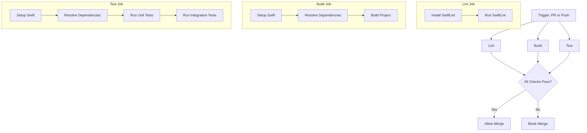

# Design Document: GitHub Actions CI/CD Pipeline

## Overview

This design document outlines the implementation of a comprehensive GitHub Actions CI/CD pipeline for the usbipd-mac project. The pipeline will automate code quality checks, build validation, and test execution to ensure code quality and prevent regressions. The design focuses on providing fast feedback to developers while maintaining compatibility with the latest Swift and macOS versions.

## Architecture

The CI/CD pipeline will be implemented using GitHub Actions, which provides a flexible, container-based execution environment for automated workflows. The architecture consists of the following components:

1. **Workflow Definitions**: YAML files stored in the `.github/workflows` directory that define the CI/CD pipeline steps and triggers.
2. **Job Definitions**: Collections of steps that run on the same runner and share data.
3. **Step Definitions**: Individual tasks that run commands or actions.
4. **Action References**: Reusable units of code that can be referenced in workflows.

The pipeline will be triggered by:
- Pull request creation or updates
- Pushes to the main branch

### Workflow Structure



## Components and Interfaces

### 1. Workflow Configuration

The primary workflow file will be located at `.github/workflows/ci.yml` and will define the overall pipeline structure:

```yaml
name: CI
on:
  push:
    branches: [ main ]
  pull_request:
    branches: [ main ]
```

### 2. Linting Component

The linting component will handle code style validation using SwiftLint:

- **Inputs**: Source code files
- **Outputs**: Lint results (pass/fail with details)
- **Dependencies**: SwiftLint

```yaml
jobs:
  lint:
    runs-on: macos-latest
    steps:
      - uses: actions/checkout@v3
      - name: Install SwiftLint
        run: brew install swiftlint
      - name: Run SwiftLint
        run: swiftlint --strict
```

### 3. Build Component

The build component will validate that the project compiles successfully:

- **Inputs**: Source code files
- **Outputs**: Build results (success/failure with details)
- **Dependencies**: Swift, Swift Package Manager

```yaml
jobs:
  build:
    runs-on: macos-latest
    steps:
      - uses: actions/checkout@v3
      - name: Setup Swift
        uses: swift-actions/setup-swift@v1
        with:
          swift-version: latest
      - name: Build
        run: swift build
```

### 4. Test Component

The test component will run unit and integration tests:

- **Inputs**: Source code files, test files
- **Outputs**: Test results (pass/fail with details)
- **Dependencies**: Swift, Swift Package Manager, QEMU (for integration tests)

```yaml
jobs:
  test:
    runs-on: macos-latest
    steps:
      - uses: actions/checkout@v3
      - name: Setup Swift
        uses: swift-actions/setup-swift@v1
        with:
          swift-version: latest
      - name: Run Tests
        run: swift test
      - name: Run Integration Tests
        run: ./Scripts/run-qemu-tests.sh
```

## Data Models

### 1. GitHub Actions Workflow Schema

The workflow will follow the GitHub Actions YAML schema, which includes:

- **name**: Workflow name
- **on**: Event triggers
- **jobs**: Collection of jobs to run
- **steps**: Sequence of steps within each job
- **env**: Environment variables
- **if**: Conditional execution

### 2. SwiftLint Configuration

SwiftLint will use the project's `.swiftlint.yml` configuration file, which defines:

- **included**: Paths to include
- **excluded**: Paths to exclude
- **disabled_rules**: Rules to disable
- **opt_in_rules**: Optional rules to enable
- **rule configurations**: Custom rule parameters

## Error Handling

### 1. Build Failures

When builds fail, the workflow will:
- Capture and display compiler errors
- Mark the GitHub check as failed
- Provide detailed error information in the job output

### 2. Test Failures

When tests fail, the workflow will:
- Capture and display test failure details
- Mark the GitHub check as failed
- Show which tests failed and why

### 3. Linting Failures

When linting fails, the workflow will:
- Display specific rule violations with file paths and line numbers
- Mark the GitHub check as failed
- Provide actionable feedback for fixing issues

### 4. Environment Failures

If the environment setup fails (e.g., Swift installation issues), the workflow will:
- Provide clear error messages
- Fail early to avoid wasting time on subsequent steps
- Include troubleshooting information in the job output

## Testing Strategy

### 1. Self-Testing

The CI pipeline itself will be tested by:
- Validating workflow syntax using GitHub's workflow validation
- Testing on a feature branch before merging to main
- Verifying that all jobs run as expected

### 2. Workflow Testing

To ensure the workflow correctly identifies issues:
- Test with intentionally broken code to verify failure detection
- Test with fixed code to verify successful execution
- Verify that status checks are properly reported to GitHub

### 3. Performance Testing

To ensure the workflow meets performance requirements:
- Monitor execution time for typical changes
- Identify and optimize slow steps
- Implement caching strategies for dependencies

## Optimization Strategies

### 1. Parallel Execution

Jobs will run in parallel to reduce total execution time:
- Lint, build, and test jobs will run concurrently
- Each job will be independent to allow parallel execution

### 2. Caching

Dependencies will be cached to speed up subsequent runs:
- Swift packages will be cached using GitHub's cache action
- SwiftLint installation will be cached
- Build artifacts may be cached when appropriate

### 3. Conditional Execution

Some steps will only run when necessary:
- Integration tests may be skipped for documentation-only changes
- Full test suite may be optimized to run only affected tests when possible

## Security Considerations

### 1. Secrets Management

Sensitive information will be stored as GitHub Secrets:
- No hardcoded credentials in workflow files
- Use of GitHub's secret management for any required tokens

### 2. Permission Management

The workflow will use the principle of least privilege:
- Minimal permissions required for each job
- No unnecessary access to sensitive resources

### 3. Third-Party Actions

When using third-party actions:
- Pin to specific versions using SHA hashes for immutability
- Review the source code of third-party actions before use
- Prefer official actions when available

## Implementation Plan

The implementation will follow these phases:

1. **Basic CI Setup**:
   - Create initial workflow file with lint, build, and test jobs
   - Configure triggers for pull requests and pushes to main

2. **Optimization**:
   - Implement caching strategies
   - Configure parallel job execution
   - Optimize execution time

3. **Integration**:
   - Add integration tests with QEMU
   - Ensure all project-specific tests are included

4. **Documentation**:
   - Document the CI pipeline in the project README
   - Provide troubleshooting guidance for common issues

5. **Maintenance**:
   - Establish a process for updating Swift and macOS versions
   - Define a schedule for reviewing and updating the workflow