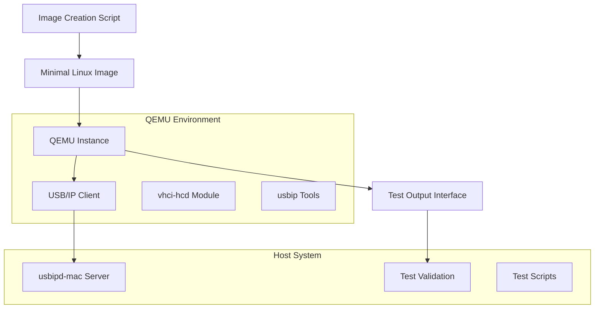

# Design Document

## Overview

The QEMU USB/IP Test Tool is designed to provide a minimal, automated testing environment for validating the usbipd-mac server implementation. The tool creates a lightweight Linux virtual machine using QEMU that acts as a USB/IP client, enabling comprehensive end-to-end testing of the USB/IP protocol implementation. The design emphasizes simplicity, automation, minimal resource usage, and seamless integration with the existing project structure and CI/CD pipeline.

## Architecture

The tool consists of three main components:

1. **Image Creation System**: Automated scripts to build minimal Linux images with USB/IP client capabilities
2. **QEMU Runtime Environment**: Configured QEMU instances that boot the minimal Linux system and provide network connectivity
3. **Test Output Interface**: Standardized mechanisms for capturing and analyzing test results from the QEMU environment



## Components and Interfaces

### Image Creation System

The image creation system builds a minimal Linux environment optimized for USB/IP client testing.

#### Key Components

1. **Base Image Builder**: Creates minimal Linux root filesystem
2. **USB/IP Client Installer**: Adds necessary USB/IP client tools and kernel modules
3. **Cloud-init Configurator**: Sets up automated initialization and configuration
4. **Image Packager**: Creates bootable disk images for QEMU

#### Implementation Approach

```bash
# Primary script: Scripts/create-qemu-image.sh
create-qemu-image.sh
├── Download minimal Linux distribution (Alpine Linux or similar)
├── Install USB/IP client tools (usbip package)
├── Configure kernel modules (vhci-hcd)
├── Set up cloud-init configuration
├── Create bootable disk image
└── Validate image integrity
```

**Key Design Decisions:**
- Use Alpine Linux for minimal footprint and fast boot times (addresses Requirement 5.1-5.3)
- Leverage cloud-init for automated configuration and customization (addresses Requirement 1.4)
- Pre-install usbip-utils package for client functionality (addresses Requirement 1.3)
- Configure automatic loading of vhci-hcd kernel module (addresses Requirement 1.2)
- Follow project directory structure conventions by placing scripts in Scripts/ (addresses Requirement 4.2)

### QEMU Runtime Environment

The runtime environment provides a controlled virtual machine environment for USB/IP client testing.

#### Key Components

1. **QEMU Launcher**: Starts QEMU instances with appropriate configuration
2. **Network Configuration**: Sets up network connectivity between client and server
3. **Serial Console Interface**: Provides access to VM output for test validation
4. **Resource Management**: Manages memory, CPU, and disk resources efficiently

#### Implementation Approach

```bash
# Primary script: Scripts/start-qemu-client.sh
start-qemu-client.sh
├── Validate image availability
├── Configure network (user mode networking with port forwarding)
├── Set up serial console output redirection
├── Launch QEMU with minimal resource allocation
├── Wait for boot completion
└── Provide connection interface for tests
```

**QEMU Configuration:**
- Memory: 256MB (minimal for USB/IP client functionality)
- CPU: 1 core (sufficient for testing workload)
- Network: User mode networking with host port forwarding
- Storage: Read-only disk image with overlay for temporary changes
- Console: Serial console redirected to file/pipe for test access

**Key Design Decisions:**
- Minimal memory allocation for CI environment compatibility (addresses Requirement 5.1)
- User mode networking for simplified configuration (addresses Requirement 2.2)
- Serial console output for programmatic test validation (addresses Requirement 3.1, 3.3)
- Error handling for common failure scenarios (addresses Requirement 2.3)

### Test Output Interface

The test output interface provides standardized mechanisms for test scripts to interact with and validate the QEMU environment.

#### Key Components

1. **Serial Console Logger**: Captures all VM output to structured log files
2. **Command Interface**: Allows test scripts to send commands to the VM
3. **Status Reporter**: Provides clear success/failure indicators for automated testing
4. **Output Parser**: Structures VM output for programmatic analysis

#### Implementation Approach

**Serial Console Integration:**
```bash
# QEMU serial console configuration
-serial file:qemu-console.log
-monitor unix:qemu-monitor.sock,server,nowait
```

**Test Interface Protocol:**
```bash
# Test scripts can:
# 1. Send commands via QEMU monitor
# 2. Read structured output from console log
# 3. Check for specific success/failure patterns
# 4. Validate USB/IP client operations
```

## Data Models

### QEMU Configuration

```bash
# Configuration structure for QEMU instances
QEMU_CONFIG = {
    memory: "256M"
    cpu_count: 1
    disk_image: "qemu-usbip-client.qcow2"
    network_mode: "user"
    console_output: "qemu-console.log"
    monitor_socket: "qemu-monitor.sock"
    boot_timeout: 30
}
```

### Cloud-init Configuration

```yaml
# Cloud-init user-data for VM initialization
#cloud-config
users:
  - name: testuser
    sudo: ALL=(ALL) NOPASSWD:ALL
    shell: /bin/sh

packages:
  - usbip

runcmd:
  - modprobe vhci-hcd
  - echo "USB/IP client ready" > /dev/console
  - usbip version > /dev/console

write_files:
  - path: /etc/modules-load.d/usbip.conf
    content: |
      vhci-hcd
```

### Test Output Format

```bash
# Structured output format for test validation
[TIMESTAMP] USBIP_CLIENT_READY
[TIMESTAMP] USBIP_VERSION: 2.0
[TIMESTAMP] VHCI_MODULE_LOADED
[TIMESTAMP] CONNECTING_TO_SERVER: <server_ip>:<port>
[TIMESTAMP] DEVICE_LIST_REQUEST: SUCCESS/FAILURE
[TIMESTAMP] DEVICE_IMPORT_REQUEST: <device_id> SUCCESS/FAILURE
[TIMESTAMP] TEST_COMPLETE: <overall_status>
```

## Error Handling

### Image Creation Errors

1. **Download Failures**: Retry mechanism with fallback mirrors
2. **Package Installation Errors**: Validate package availability and dependencies
3. **Image Corruption**: Checksum validation and rebuild capability
4. **Disk Space Issues**: Pre-flight checks and cleanup procedures

### QEMU Runtime Errors

1. **Boot Failures**: Timeout handling and diagnostic output
2. **Network Configuration Issues**: Fallback networking modes
3. **Resource Constraints**: Dynamic resource allocation based on host capabilities
4. **VM Crashes**: Automatic restart and error reporting

### Test Interface Errors

1. **Console Output Parsing**: Robust pattern matching with error recovery
2. **Command Execution Failures**: Retry mechanisms and alternative approaches
3. **Timeout Handling**: Configurable timeouts with graceful degradation
4. **Communication Errors**: Connection validation and reconnection logic

## Testing Strategy

### Unit Testing

1. **Script Validation**: Test individual script components in isolation
2. **Configuration Testing**: Validate QEMU and cloud-init configurations
3. **Output Parsing**: Test log parsing and pattern matching logic
4. **Error Handling**: Verify error conditions and recovery mechanisms

### Integration Testing

1. **End-to-End Workflow**: Test complete image creation and QEMU startup process
2. **USB/IP Protocol Testing**: Validate client-server communication
3. **Performance Testing**: Ensure minimal resource usage and fast startup
4. **Compatibility Testing**: Verify functionality across different host environments

### Automated Testing Integration

1. **CI Pipeline Integration**: Incorporate QEMU tests into GitHub Actions (addresses Requirement 4.4)
2. **Test Result Reporting**: Structured output for automated analysis (addresses Requirement 3.2, 3.4)
3. **Regression Testing**: Validate against known working configurations
4. **Performance Monitoring**: Track resource usage and execution times (addresses Requirement 5.4)

## Implementation Considerations

### Resource Optimization

- Use Alpine Linux for minimal image size (~50MB)
- Implement copy-on-write disk images for efficient storage
- Configure QEMU with minimal memory allocation
- Use headless operation to reduce resource overhead

### Security Considerations

- Run QEMU with minimal privileges
- Use read-only base images with temporary overlays
- Implement network isolation for test environments
- Validate all downloaded components with checksums

### Platform Compatibility

- Ensure compatibility with macOS QEMU installation
- Support both Intel and Apple Silicon Macs
- Provide fallback options for different QEMU versions
- Handle platform-specific networking configurations

### Maintenance and Updates

- Automated image rebuilding for security updates
- Version pinning for reproducible builds
- Documentation for manual image customization
- Monitoring for upstream package changes