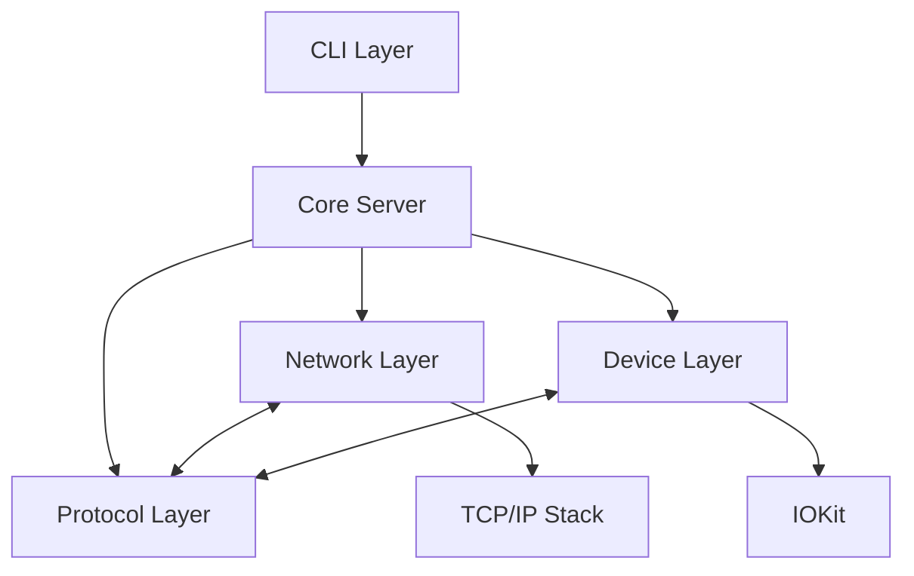
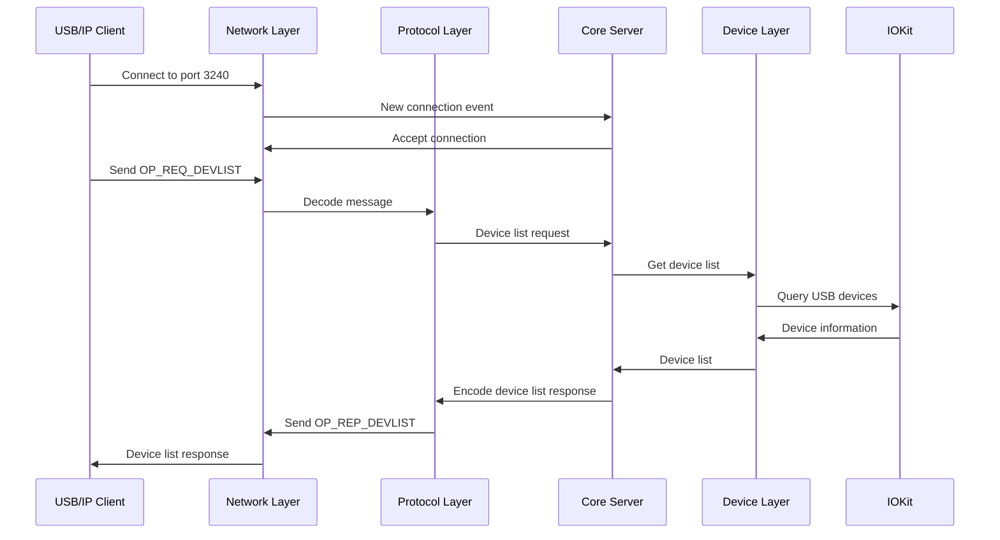

# Design Document: USB/IP Core Server MVP

## Overview

The USB/IP Core Server MVP is designed to implement the minimal viable product for a USB/IP server on macOS. This implementation will focus on establishing the core protocol communication, network handling, and device enumeration capabilities without actual USB device interaction functionality. The design follows Swift best practices and leverages macOS system frameworks like IOKit for device discovery.

This design document outlines the architecture, components, interfaces, data models, error handling, and testing strategy for the USB/IP Core Server MVP. The implementation will be compatible with the USB/IP protocol specification and will follow patterns established in the usbipd-win project where appropriate.

## Architecture

The USB/IP Core Server MVP follows a modular architecture with clear separation of concerns. The system is divided into several key components:

1. **Protocol Layer**: Handles USB/IP protocol message encoding and decoding
2. **Network Layer**: Manages TCP connections and data transfer
3. **Device Layer**: Handles USB device discovery and enumeration using IOKit
4. **CLI Layer**: Provides command-line interface following Linux usbipd conventions
5. **Core Server**: Coordinates between all layers and manages the server lifecycle

### High-Level Architecture Diagram



### Component Interaction Flow



## Components and Interfaces

### Protocol Layer

The Protocol Layer is responsible for encoding and decoding USB/IP protocol messages according to the specification.

#### Key Interfaces

```swift
protocol USBIPMessageCodable {
    func encode() throws -> Data
    static func decode(from data: Data) throws -> Self
}

protocol USBIPMessageHandler {
    func handleDeviceList() throws -> DeviceListResponse
    func handleDeviceImport(busID: String, deviceID: String) throws -> DeviceImportResponse
    // Other message handlers
}
```

#### Key Components

1. **MessageEncoder**: Handles encoding of USB/IP messages to binary format
2. **MessageDecoder**: Handles decoding of binary data to USB/IP message structures
3. **MessageRouter**: Routes decoded messages to appropriate handlers

### Network Layer

The Network Layer manages TCP connections and data transfer between clients and the server.

#### Key Interfaces

```swift
protocol NetworkService {
    func start(port: Int) throws
    func stop() throws
    func isRunning() -> Bool
    
    var onClientConnected: ((ClientConnection) -> Void)? { get set }
    var onClientDisconnected: ((ClientConnection) -> Void)? { get set }
}

protocol ClientConnection {
    var id: UUID { get }
    func send(data: Data) throws
    func close() throws
    
    var onDataReceived: ((Data) -> Void)? { get set }
    var onError: ((Error) -> Void)? { get set }
}
```

#### Key Components

1. **TCPServer**: Implements the NetworkService protocol using Network.framework
2. **TCPClientConnection**: Implements the ClientConnection protocol for TCP connections
3. **ConnectionManager**: Manages active client connections

### Device Layer

The Device Layer handles USB device discovery and enumeration using IOKit.

#### Key Interfaces

```swift
protocol DeviceDiscovery {
    func discoverDevices() throws -> [USBDevice]
    func getDevice(busID: String, deviceID: String) throws -> USBDevice?
    
    var onDeviceConnected: ((USBDevice) -> Void)? { get set }
    var onDeviceDisconnected: ((USBDevice) -> Void)? { get set }
}

protocol USBDeviceInfo {
    var busID: String { get }
    var deviceID: String { get }
    var vendorID: UInt16 { get }
    var productID: UInt16 { get }
    var deviceClass: UInt8 { get }
    var deviceSubClass: UInt8 { get }
    var deviceProtocol: UInt8 { get }
    var speed: USBSpeed { get }
    var manufacturerString: String? { get }
    var productString: String? { get }
    var serialNumberString: String? { get }
    // Other USB device properties
}
```

#### Key Components

1. **IOKitDeviceDiscovery**: Implements DeviceDiscovery using IOKit
2. **USBDevice**: Implements USBDeviceInfo with data from IOKit
3. **DeviceMonitor**: Monitors USB device connections and disconnections

### CLI Layer

The CLI Layer provides a command-line interface following Linux usbipd conventions.

#### Key Components

1. **CommandLineParser**: Parses command-line arguments
2. **CommandHandler**: Handles execution of commands
3. **OutputFormatter**: Formats output for display

### Core Server

The Core Server coordinates between all layers and manages the server lifecycle.

#### Key Interfaces

```swift
protocol USBIPServer {
    func start() throws
    func stop() throws
    func isRunning() -> Bool
    
    var onError: ((Error) -> Void)? { get set }
}
```

#### Key Components

1. **ServerCoordinator**: Implements USBIPServer and coordinates between layers
2. **RequestProcessor**: Processes incoming requests and generates responses
3. **ServerConfig**: Manages server configuration

## Data Models

### Protocol Messages

The USB/IP protocol defines several message types that need to be implemented:

1. **Common Header**: Present in all USB/IP messages
   ```swift
   struct USBIPHeader {
       let version: UInt16
       let command: UInt16
       let status: UInt32
   }
   ```

2. **Device List Request/Response**:
   ```swift
   struct DeviceListRequest {
       let header: USBIPHeader
   }
   
   struct DeviceListResponse {
       let header: USBIPHeader
       let deviceCount: UInt32
       let devices: [USBIPExportedDevice]
   }
   
   struct USBIPExportedDevice {
       let path: String
       let busID: String
       let busnum: UInt32
       let devnum: UInt32
       let speed: UInt32
       let vendorID: UInt16
       let productID: UInt16
       let deviceClass: UInt8
       let deviceSubClass: UInt8
       let deviceProtocol: UInt8
       let configurationCount: UInt8
       let configurationValue: UInt8
       let interfaceCount: UInt8
   }
   ```

3. **Device Import Request/Response**:
   ```swift
   struct DeviceImportRequest {
       let header: USBIPHeader
       let busID: String
   }
   
   struct DeviceImportResponse {
       let header: USBIPHeader
       let status: UInt32
       let deviceInfo: USBIPDeviceInfo?
   }
   ```

### Device Models

```swift
struct USBDevice {
    let busID: String
    let deviceID: String
    let vendorID: UInt16
    let productID: UInt16
    let deviceClass: UInt8
    let deviceSubClass: UInt8
    let deviceProtocol: UInt8
    let speed: USBSpeed
    let manufacturerString: String?
    let productString: String?
    let serialNumberString: String?
    let configurations: [USBConfiguration]
}

struct USBConfiguration {
    let configurationValue: UInt8
    let interfaces: [USBInterface]
}

struct USBInterface {
    let interfaceNumber: UInt8
    let alternateSettings: [USBAlternateSetting]
}

struct USBAlternateSetting {
    let interfaceClass: UInt8
    let interfaceSubClass: UInt8
    let interfaceProtocol: UInt8
    let endpoints: [USBEndpoint]
}

struct USBEndpoint {
    let address: UInt8
    let attributes: UInt8
    let maxPacketSize: UInt16
    let interval: UInt8
}

enum USBSpeed: UInt8 {
    case unknown = 0
    case low = 1
    case full = 2
    case high = 3
    case superSpeed = 4
}
```

## Error Handling

The error handling strategy follows Swift's error handling patterns with custom error types for different components:

```swift
enum USBIPProtocolError: Error {
    case invalidHeader
    case invalidMessageFormat
    case unsupportedVersion(UInt16)
    case unsupportedCommand(UInt16)
    case invalidDataLength
    // Other protocol-specific errors
}

enum NetworkError: Error {
    case connectionFailed(String)
    case connectionClosed
    case sendFailed(String)
    case receiveFailed(String)
    case bindFailed(String)
    // Other network-specific errors
}

enum DeviceError: Error {
    case deviceNotFound(String)
    case accessDenied(String)
    case ioKitError(Int32, String)
    // Other device-specific errors
}

enum ServerError: Error {
    case alreadyRunning
    case notRunning
    case initializationFailed(String)
    // Other server-specific errors
}
```

Error handling will be implemented at each layer with appropriate error propagation and logging. Critical errors will be reported to the Core Server for handling, while recoverable errors will be handled locally when possible.

## Testing Strategy

The testing strategy for the USB/IP Core Server MVP includes:

1. **Unit Tests**:
   - Protocol encoding/decoding tests
   - Network communication tests with mock connections
   - Device discovery tests with mock IOKit interfaces
   - CLI command parsing and execution tests
   - Error handling tests

2. **Integration Tests**:
   - End-to-end tests using the QEMU test server
   - Protocol compatibility tests with Linux USB/IP clients
   - Network communication tests with real TCP connections

3. **Test Fixtures**:
   - Mock USB device data
   - Sample USB/IP protocol messages
   - Network communication mocks

4. **Test Coverage Goals**:
   - Core protocol implementation: 90%+ coverage
   - Network layer: 80%+ coverage
   - Device discovery: 80%+ coverage
   - Error handling: 90%+ coverage

The QEMU test server will be used to validate the protocol implementation without requiring actual USB devices. This allows for testing the core functionality in isolation from the actual device interaction, which will be implemented in future versions.

## Security Considerations

While the MVP focuses on core functionality, several security considerations are addressed in the design:

1. **Input Validation**: All client inputs will be validated before processing
2. **Resource Management**: Proper resource cleanup for connections and device handles
3. **Error Handling**: Comprehensive error handling to prevent crashes from malformed inputs
4. **Logging**: Detailed logging for security-relevant events
5. **Access Control**: Preparation for future implementation of access control mechanisms

## Future Considerations

While not part of the MVP, the design accounts for future extensions:

1. **Actual USB Device Interaction**: The architecture is designed to easily add actual USB device interaction in future versions
2. **Authentication and Authorization**: The network layer is designed to allow adding authentication in the future
3. **Performance Optimization**: The design allows for future performance optimizations
4. **GUI Interface**: The core functionality is separated from the CLI to allow for future GUI implementations