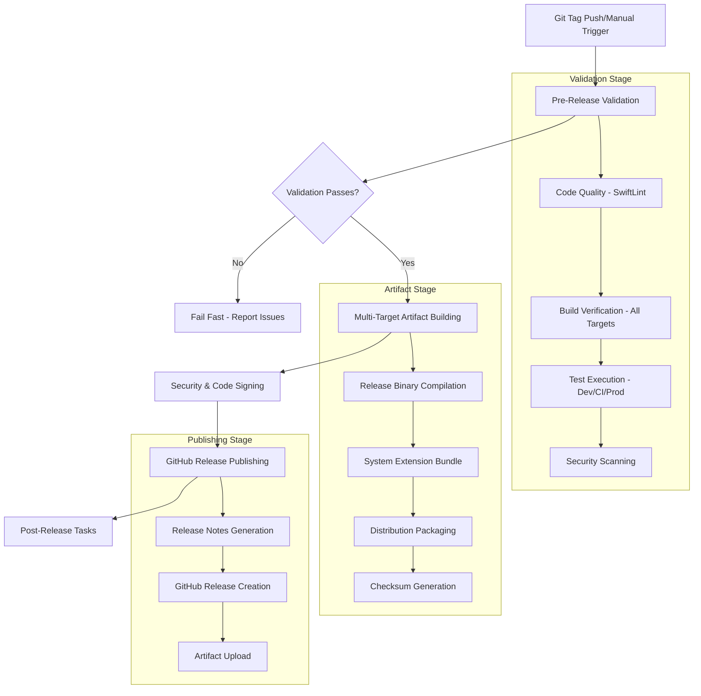

# Design Document

## Overview

The automated production release system transforms usbipd-mac from a manual release process to a fully automated GitHub Actions-based pipeline. The system leverages the existing robust test infrastructure (development, CI, and production environments) and builds upon the current CI workflow to create a comprehensive release automation solution.

The architecture follows a multi-stage pipeline approach: Pre-Release Validation → Artifact Building → Release Publishing → Post-Release Tasks. Each stage is designed to fail fast, provide clear feedback, and maintain the project's high quality standards while enabling frequent, reliable releases.

## Steering Document Alignment

### Technical Standards (tech.md)

The design follows documented technical patterns:
- **Swift Package Manager**: Leverages existing SPM build system for artifact creation
- **Multi-target Architecture**: Builds all five targets (USBIPDCore, USBIPDCLI, SystemExtension, QEMUTestServer, Common)
- **Testing Framework**: Integrates with existing three-tier test strategy (Development/CI/Production)
- **Code Quality**: Uses established SwiftLint configuration with strict enforcement

### Project Structure (structure.md)

Implementation aligns with project organization:
- **GitHub Actions**: Workflows placed in `.github/workflows/` following established patterns
- **Scripts Directory**: Release preparation scripts in `Scripts/` alongside existing automation
- **Documentation**: Release documentation follows existing `Documentation/` structure
- **Binary Distribution**: Artifacts organized following established naming conventions

## Code Reuse Analysis

### Existing Components to Leverage

- **Current CI Workflow (`.github/workflows/ci.yml`)**: Extensive validation logic, caching strategies, and environment setup patterns can be reused
- **Test Scripts (`Scripts/run-*-tests.sh`)**: Complete test execution infrastructure provides validation foundation
- **SwiftLint Configuration**: Existing strict code quality enforcement directly applicable to release validation
- **Package.swift Structure**: Multi-target build configuration enables comprehensive artifact creation
- **Test Infrastructure**: Three-tier test environments provide thorough validation without modification

### Integration Points

- **GitHub Actions Environment**: Builds on existing macOS runner configuration and caching strategies
- **Swift Package Manager**: Leverages existing dependency resolution and build optimization
- **Test Environment**: Integrates seamlessly with established test execution patterns
- **Git Workflow**: Extends current branch protection and PR validation patterns

## Architecture

The release system follows a **staged pipeline architecture** with clear separation of concerns:

### Modular Design Principles

- **Single Stage Responsibility**: Each workflow job handles one specific release phase (validation, building, publishing)
- **Component Isolation**: Workflow stages are independent and can be tested/debugged separately
- **Service Layer Separation**: Clear boundaries between validation, artifact creation, and distribution concerns
- **Utility Modularity**: Reusable workflow steps and script components for maintainability



## Components and Interfaces

### Component 1: Release Workflow Orchestrator
- **Purpose:** Main GitHub Actions workflow that coordinates the entire release process
- **File:** `.github/workflows/release.yml`
- **Interfaces:** 
  - Git tag triggers (semantic versioning pattern matching)
  - Manual workflow dispatch with version and options input
  - Job dependency management and error propagation
- **Dependencies:** GitHub Actions environment, macOS runners, Swift toolchain
- **Reuses:** Existing CI workflow patterns, caching strategies, environment setup from `ci.yml`

### Component 2: Pre-Release Validation Engine
- **Purpose:** Comprehensive validation before release artifact creation
- **File:** `.github/workflows/pre-release.yml` 
- **Interfaces:**
  - Pull request validation hooks for quick checks
  - Manual validation dispatch for comprehensive release candidate testing
  - Status reporting to GitHub checks API
- **Dependencies:** SwiftLint, Swift Package Manager, existing test scripts
- **Reuses:** Complete test infrastructure from `Scripts/run-*-tests.sh`, validation patterns from CI workflow

### Component 3: Artifact Builder and Signer
- **Purpose:** Creates, signs, and packages all release artifacts
- **Interfaces:**
  - Release configuration builds for all targets
  - Apple Developer certificate integration (when configured)
  - Artifact packaging with checksums and metadata
- **Dependencies:** Swift Package Manager, Apple Developer tools, System Extension frameworks
- **Reuses:** Existing multi-target build configuration, System Extension entitlements and bundle structure

### Component 4: Release Publisher
- **Purpose:** Publishes GitHub releases with automated documentation
- **Interfaces:**
  - GitHub Releases API integration
  - Automated release notes generation from Git history
  - Artifact attachment and distribution
- **Dependencies:** GitHub API, Git history analysis, release note templates
- **Reuses:** Existing documentation patterns, project README structure

### Component 5: Release Preparation Toolkit
- **Purpose:** Local tooling for safe release preparation and validation
- **File:** `Scripts/prepare-release.sh`
- **Interfaces:**
  - Command-line interface with version validation
  - Pre-flight checks and environment validation
  - Git tag creation with automated changelog integration
- **Dependencies:** Git, Swift toolchain, existing test scripts
- **Reuses:** Existing script patterns from `Scripts/` directory, test execution infrastructure

## Data Models

### Release Configuration Model
```swift
struct ReleaseConfig {
    let version: SemanticVersion       // Parsed from git tag or input
    let isPrerelease: Bool            // Derived from version pattern or manual flag
    let skipTests: Bool               // Emergency release option
    let codeSigningEnabled: Bool      // Apple Developer certificate availability
    let buildTargets: [BuildTarget]   // All five package targets
}

struct BuildTarget {
    let name: String                  // Target name from Package.swift
    let binaryPath: String           // Expected output path
    let requiresSigning: Bool        // System Extension requires special handling
}
```

### Artifact Package Model
```swift
struct ReleaseArtifacts {
    let version: String
    let binaries: [ReleaseArtifact]
    let systemExtensionBundle: SystemExtensionBundle
    let distributionArchive: DistributionPackage
    let checksums: ChecksumManifest
}

struct ReleaseArtifact {
    let name: String                 // Binary filename
    let path: String                 // File system path
    let checksum: String            // SHA256 hash
    let isSigned: Bool              // Code signing status
}
```

### Release Notes Model
```swift
struct ReleaseNotes {
    let version: String
    let releaseDate: Date
    let changelog: [ChangelogEntry]
    let installationInstructions: String
    let systemRequirements: [String]
    let knownIssues: [String]
}

struct ChangelogEntry {
    let type: ChangeType            // feat, fix, docs, etc.
    let description: String         // Commit message summary
    let commitHash: String         // Git commit reference
}
```

## Error Handling

### Error Scenarios

1. **Validation Failure During Release**
   - **Handling:** Immediately halt workflow, capture detailed logs, provide specific failure reason
   - **User Impact:** Clear GitHub Actions failure with actionable error messages and resolution steps

2. **Build Compilation Errors**
   - **Handling:** Fail fast on first compilation error, provide compiler output, suggest common fixes
   - **User Impact:** Detailed build logs with specific file and line error information

3. **Code Signing Certificate Issues**
   - **Handling:** Graceful fallback to development signing with clear warnings, continue release process
   - **User Impact:** Release completes with development signatures and documentation about limitations

4. **Network/GitHub API Failures**
   - **Handling:** Retry logic with exponential backoff, manual intervention instructions if retries fail
   - **User Impact:** Release may be delayed but artifacts are preserved for manual upload

5. **Git Tag Conflicts or Version Issues**
   - **Handling:** Pre-flight validation catches conflicts, provides clear resolution steps
   - **User Impact:** Early failure with specific instructions for tag management

### Recovery Mechanisms

- **Artifact Preservation:** Failed releases preserve built artifacts for manual recovery
- **Rollback Instructions:** Clear documentation for cleaning up failed release attempts
- **Manual Override Options:** Emergency release options to bypass specific validation steps
- **Status Visibility:** Comprehensive logging and status reporting for troubleshooting

## Testing Strategy

### Unit Testing

**GitHub Actions Workflow Testing:**
- **Approach:** Use act (nektos/act) for local workflow testing and validation
- **Key Components:** Individual workflow steps, job dependencies, error handling paths
- **Test Coverage:** All trigger conditions, input validation, error scenarios

**Release Script Testing:**
- **Approach:** Shell script testing with bats-core framework
- **Key Components:** Version validation, environment checks, Git operations
- **Integration:** Use existing test fixtures and mock data patterns

### Integration Testing

**End-to-End Release Testing:**
- **Approach:** Full workflow testing in GitHub Actions environment with test repositories
- **Key Flows:** Complete release pipeline from tag creation to artifact publication
- **Validation:** Artifact integrity, release notes accuracy, download functionality

**Cross-Platform Validation:**
- **Approach:** Test artifact compatibility across different macOS versions
- **Coverage:** Binary compatibility, System Extension installation, network functionality

### End-to-End Testing

**Production Release Simulation:**
- **User Scenarios:** Complete maintainer workflow from development to release publication
- **Environment:** Staging repository with full GitHub Actions setup
- **Validation:** User experience, documentation accuracy, troubleshooting procedures

**Rollback and Recovery Testing:**
- **Scenarios:** Failed releases, corrupted artifacts, network interruptions
- **Validation:** Recovery procedures, data integrity, user communication

### Security Testing

**Code Signing Validation:**
- **Approach:** Verify signature integrity and certificate chain validation
- **Tools:** Apple codesign verification, automated signature checking

**Supply Chain Security:**
- **Approach:** Dependency scanning, artifact integrity verification
- **Tools:** GitHub security scanning, checksum validation, reproducible builds

### Performance Testing

**Workflow Execution Time:**
- **Metrics:** Total pipeline duration, individual stage timing, resource utilization
- **Targets:** 15-minute total workflow, 5-minute build times, efficient caching

**Artifact Size and Performance:**
- **Metrics:** Binary size analysis, startup performance, memory usage
- **Validation:** Release builds maintain performance characteristics of development builds