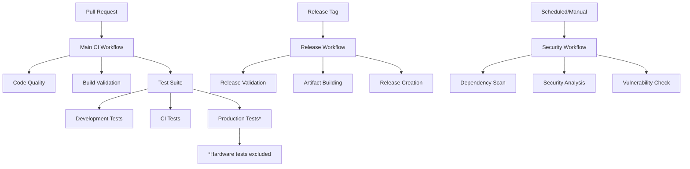

# Design Document

## Overview

This design consolidates the current 7 GitHub Actions workflows into 3 streamlined, efficient workflows with clear boundaries and optimized performance. The new architecture eliminates redundancy, improves maintainability, and ensures comprehensive coverage while maintaining all essential functionality for development, testing, and release processes.

## Steering Document Alignment

### Technical Standards (tech.md)
The design follows documented Swift development patterns and testing infrastructure:
- **Environment-based Testing**: Leverages existing development/CI/production test environments
- **Swift Package Manager Integration**: Maintains existing build system and dependency management
- **Code Quality Standards**: Integrates SwiftLint validation consistently across all workflows

### Project Structure (structure.md)
The implementation aligns with project organization:
- **Scripts Integration**: Uses existing Scripts/ directory for test execution and validation
- **Modular Architecture**: Respects target boundaries (USBIPDCore, CLI, SystemExtension, QEMUTestServer)
- **Documentation Standards**: Updates Documentation/ directory with workflow changes

## Code Reuse Analysis

### Existing Components to Leverage
- **Test Scripts**: Scripts/run-development-tests.sh, Scripts/run-ci-tests.sh, Scripts/run-production-tests.sh
- **Environment Setup**: Scripts/test-environment-setup.sh for validation and configuration
- **Release Scripts**: Scripts/prepare-release.sh and related release automation tools
- **Build Configuration**: Existing Package.swift and .swiftlint.yml configurations

### Integration Points
- **GitHub Actions Cache**: Reuse existing cache keys and patterns for Swift packages and SwiftLint
- **Secret Management**: Maintain existing secret configuration for code signing and release
- **Branch Protection**: Integrate with existing branch protection rules and status checks

## Architecture

The new CI architecture follows a **three-tier validation model** with clear separation of concerns:



### Modular Design Principles
- **Single Workflow Responsibility**: Each workflow has a distinct, non-overlapping purpose
- **Reusable Actions**: Common steps extracted into composite actions for reuse
- **Conditional Execution**: Jobs run only when needed based on triggers and conditions
- **Failure Isolation**: Job failures don't cascade unnecessarily to other independent jobs

## Components and Interfaces

### Component 1: Main CI Workflow (ci.yml)
- **Purpose:** Primary validation for all pull requests and main branch pushes
- **Triggers:** Pull requests, pushes to main, workflow_call for reuse by other workflows
- **Jobs:** 
  - code-quality (SwiftLint validation)
  - build-validation (compilation verification)
  - test-suite (development, CI, and production tests with hardware exclusions)
- **Interfaces:** Provides reusable workflow interface for release validation
- **Reuses:** Existing test scripts, caching patterns, environment setup

### Component 2: Release Workflow (release.yml)
- **Purpose:** Comprehensive release validation, artifact creation, and GitHub release publishing
- **Triggers:** Release tags (v*), manual dispatch for emergency releases
- **Jobs:**
  - release-validation (version extraction and validation)
  - ci-validation (calls main CI workflow for comprehensive testing)
  - build-artifacts (optimized builds, code signing, packaging)
  - create-release (GitHub release creation with artifacts)
- **Dependencies:** Reuses main CI workflow for validation
- **Reuses:** Main CI workflow, existing release scripts, code signing configuration

### Component 3: Security Workflow (security.yml)
- **Purpose:** Scheduled security scanning and vulnerability assessment
- **Triggers:** Scheduled (weekly), manual dispatch, security-related events
- **Jobs:**
  - dependency-scan (Swift Package Manager dependency analysis)
  - code-analysis (static security analysis)
  - vulnerability-check (CVE database checks)
- **Interfaces:** Independent operation, provides security status reporting
- **Reuses:** Existing dependency management, Swift Package Manager integration

## Data Models

### Workflow Configuration Model
```yaml
# Common workflow parameters
workflow_config:
  cache_version: "v1"
  swift_cache_paths:
    - .build
    - ~/Library/Caches/org.swift.swiftpm
    - ~/Library/org.swift.swiftpm
  swiftlint_cache_paths:
    - /usr/local/bin/swiftlint
    - /opt/homebrew/bin/swiftlint
  timeout_minutes:
    development_tests: 15
    ci_tests: 30
    production_tests: 45
    build: 20
```

### Test Environment Configuration
```yaml
# Environment-specific test configuration
test_environments:
  development:
    script: "./Scripts/run-development-tests.sh"
    timeout: 15
    required: true
  ci:
    script: "./Scripts/run-ci-tests.sh"
    timeout: 30
    required: true
  production:
    script: "./Scripts/run-production-tests.sh --no-qemu --no-system-extension --no-hardware"
    timeout: 45
    required: false  # Optional for PR validation
```

## Error Handling

### Error Scenarios
1. **SwiftLint Violations:** 
   - **Handling:** Fail fast with detailed violation reporting
   - **User Impact:** Clear guidance on specific violations and how to fix them

2. **Build Failures:**
   - **Handling:** Detailed compiler error output with context
   - **User Impact:** Actionable error messages with common resolution steps

3. **Test Failures:**
   - **Handling:** Environment-specific error reporting with fallback options
   - **User Impact:** Clear indication of which test environment failed and why

4. **Release Validation Failures:**
   - **Handling:** Comprehensive validation summary with specific failure points
   - **User Impact:** Detailed checklist of issues preventing release

5. **Cache Miss or Corruption:**
   - **Handling:** Graceful fallback to fresh installation with cache rebuild
   - **User Impact:** Minimal impact with automatic recovery

6. **Secret Access Issues:**
   - **Handling:** Clear warnings for missing secrets with fallback behavior
   - **User Impact:** Informative messages about reduced functionality (e.g., unsigned builds)

## Testing Strategy

### Unit Testing
- **Workflow Validation:** YAML syntax validation and workflow logic testing
- **Script Integration:** Validation that all referenced scripts exist and are executable
- **Cache Configuration:** Testing cache key generation and path validation

### Integration Testing
- **Cross-Workflow Integration:** Verify workflow_call interfaces work correctly
- **Environment Compatibility:** Test across different macOS runner versions
- **Secret Integration:** Validate secret access and usage patterns

### End-to-End Testing
- **Pull Request Simulation:** Complete PR validation flow testing
- **Release Process:** Full release workflow validation with test releases
- **Failure Recovery:** Testing workflow behavior under various failure conditions

## Workflow Elimination Analysis

### Workflows to Remove
1. **pre-release.yml** - Functionality consolidated into main CI workflow with conditional execution
2. **release-monitoring.yml** - Basic monitoring integrated into release workflow
3. **release-optimization.yml** - Optimization features integrated into main workflows
4. **security-scanning.yml** - Consolidated into dedicated security workflow
5. **validate-branch-protection.yml** - Functionality moved to security workflow

### Migration Strategy
- **Gradual Replacement:** New workflows deployed alongside existing ones initially
- **Feature Mapping:** Ensure all existing functionality is preserved or intentionally deprecated
- **Rollback Plan:** Maintain ability to restore original workflows if issues arise

## Performance Optimizations

### Caching Strategy
```yaml
# Optimized cache configuration
cache_optimization:
  swift_packages:
    key: ${{ runner.os }}-swift-${{ hashFiles('Package.swift', 'Package.resolved') }}-v2
    restore_keys:
      - ${{ runner.os }}-swift-${{ hashFiles('Package.swift') }}-v2
      - ${{ runner.os }}-swift-v2
  swiftlint:
    key: ${{ runner.os }}-swiftlint-${{ hashFiles('.swiftlint.yml') }}-v2
    restore_keys:
      - ${{ runner.os }}-swiftlint-v2
```

### Parallel Execution Strategy
- **Independent Jobs:** Code quality, build validation, and test setup run in parallel
- **Test Environment Parallelization:** Development and CI tests run concurrently when possible
- **Conditional Dependencies:** Jobs only wait for necessary prerequisites

### Resource Optimization
- **Shared Build Artifacts:** Build once, reuse across test jobs
- **Selective Test Execution:** Skip unnecessary tests based on file changes
- **Efficient Runners:** Use appropriate runner sizes for different job types

## Implementation Timeline

### Phase 1: Core Workflow Creation (Week 1)
- Create new main CI workflow with consolidated functionality
- Implement reusable composite actions for common steps
- Set up optimized caching configuration

### Phase 2: Release Integration (Week 2)
- Update release workflow to use new CI workflow via workflow_call
- Consolidate release validation and artifact creation
- Test complete release process with new workflows

### Phase 3: Security and Cleanup (Week 3)
- Implement dedicated security workflow
- Remove deprecated workflows
- Update documentation and migration guides

### Phase 4: Optimization and Validation (Week 4)
- Performance tuning and optimization
- Comprehensive testing across all scenarios
- Final documentation updates and team training