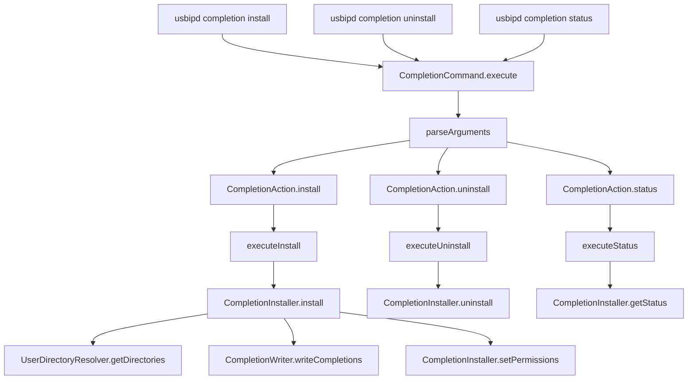

# Design Document

## Overview

This design addresses the architectural refactoring of shell completion installation from a separate `usbipd-install-completions` executable to proper subcommands within the main `usbipd` CLI. The solution extends the existing `CompletionCommand` class with new actions (`install`, `uninstall`, `status`) while leveraging the mature completion generation infrastructure already in place.

## Steering Document Alignment

### Technical Standards (tech.md)

The design follows established technical patterns:
- **Swift Package Manager Structure**: Maintains existing target organization (USBIPDCore for logic, USBIPDCLI for interface)
- **Modular Architecture**: Leverages existing `CompletionWriter`, `CompletionExtractor`, and shell formatters without modification
- **Error Handling**: Uses established error protocols and logging patterns from `Common` module
- **Testing Strategy**: Integrates with existing three-tier test environment structure

### Project Structure (structure.md)

Implementation follows project organization conventions:
- **Core Logic in USBIPDCore**: User directory resolution and installation logic will be added to `Sources/USBIPDCore/CLI/`
- **CLI Interface in USBIPDCLI**: Command parsing and user interaction remains in `Sources/USBIPDCLI/CompletionCommand.swift`
- **Shared Utilities**: Leverages existing `Common` logging and file system utilities
- **Test Organization**: Uses environment-specific test patterns already established

## Code Reuse Analysis

### Existing Components to Leverage

- **CompletionWriter**: File writing, directory validation, and script generation logic - requires no modification
- **CompletionExtractor**: Command metadata extraction for completion generation - used as-is
- **Shell Formatters**: BashCompletionFormatter, ZshCompletionFormatter, FishCompletionFormatter - no changes needed
- **CompletionCommand Architecture**: Existing action-based dispatch pattern using `CompletionAction` enum
- **Logger Infrastructure**: Established logging patterns from `Common` module
- **File System Utilities**: Permission handling and directory creation patterns from `CompletionWriter`

### Integration Points

- **Command Protocol**: `CompletionCommand` already implements the `Command` protocol used by the CLI dispatcher
- **Action Dispatch**: Existing `parseArguments()` and action switch statement provide clear integration points
- **User Directory Resolution**: New component will integrate with existing file system validation patterns
- **Shell-Specific Logic**: Leverages existing shell type detection and filename conventions from formatters

## Architecture

The solution extends the existing completion system without breaking changes, using the established command action pattern:



### Modular Design Principles

- **Single File Responsibility**: New `CompletionInstaller.swift` handles only user installation logic
- **Component Isolation**: `UserDirectoryResolver.swift` focuses solely on shell-specific directory resolution
- **Service Layer Separation**: Installation logic separated from CLI parsing and user interaction
- **Utility Modularity**: Directory resolution, permission setting, and status checking as focused utilities

## Components and Interfaces

### CompletionInstaller (New)
- **Purpose:** Manages installation, uninstallation, and status checking of completion files in user directories
- **Location:** `Sources/USBIPDCore/CLI/CompletionInstaller.swift`
- **Interfaces:** 
  - `install(shells: [String]?) throws -> CompletionInstallSummary`
  - `uninstall(shells: [String]?) throws -> CompletionUninstallSummary`
  - `getStatus(shells: [String]?) -> CompletionStatusSummary`
- **Dependencies:** CompletionWriter, CompletionExtractor, UserDirectoryResolver, Logger
- **Reuses:** Existing CompletionWriter for script generation, file system patterns for permissions

### UserDirectoryResolver (New)
- **Purpose:** Resolves appropriate user directories for each shell type and ensures they exist
- **Location:** `Sources/USBIPDCore/CLI/UserDirectoryResolver.swift`
- **Interfaces:**
  - `getUserCompletionDirectory(for shell: String) throws -> String`
  - `ensureDirectoryExists(path: String) throws`
  - `validateUserDirectory(path: String) throws -> Bool`
- **Dependencies:** FileManager, Logger
- **Reuses:** Directory validation patterns from CompletionWriter

### CompletionCommand (Extended)
- **Purpose:** Extend existing command with install/uninstall/status actions
- **Location:** `Sources/USBIPDCLI/CompletionCommand.swift`
- **Interfaces:** Existing `execute(with arguments: [String])` method extended
- **Dependencies:** Existing dependencies plus CompletionInstaller
- **Reuses:** Existing action dispatch pattern, argument parsing logic

## Data Models

### CompletionInstallSummary
```swift
public struct CompletionInstallSummary {
    public let successfulShells: [String]
    public let failedShells: [String]
    public let installedFiles: [CompletionFileInfo]
    public let errors: [String]
}
```

### CompletionUninstallSummary
```swift
public struct CompletionUninstallSummary {
    public let removedShells: [String]
    public let notFoundShells: [String]
    public let removedFiles: [CompletionFileInfo]
    public let errors: [String]
}
```

### CompletionStatusSummary
```swift
public struct CompletionStatusSummary {
    public let shellStatuses: [CompletionShellStatus]
}

public struct CompletionShellStatus {
    public let shell: String
    public let isInstalled: Bool
    public let filePath: String?
    public let isUpToDate: Bool
    public let lastModified: Date?
}
```

### CompletionFileInfo
```swift
public struct CompletionFileInfo {
    public let shell: String
    public let filePath: String
    public let size: Int64
    public let permissions: String
}
```

## Error Handling

### Error Scenarios

1. **User Directory Not Writable:**
   - **Handling:** Check parent directory permissions, create with proper permissions if needed
   - **User Impact:** Clear error message with suggested chmod commands

2. **Completion Files Already Exist (Different Version):**
   - **Handling:** Prompt for confirmation or use --force flag to overwrite
   - **User Impact:** Warning message with options to proceed or cancel

3. **Shell Not Supported:**
   - **Handling:** Validate shell against supported list, suggest alternatives
   - **User Impact:** List of supported shells (bash, zsh, fish)

4. **Disk Space Insufficient:**
   - **Handling:** Check available space before writing, rollback partial installations
   - **User Impact:** Clear error message with disk space requirements

5. **Permission Denied During Installation:**
   - **Handling:** Attempt to create parent directories with appropriate permissions
   - **User Impact:** Specific error message with directory path and suggested resolution

## Testing Strategy

### Unit Testing
- **CompletionInstaller**: Mock file system operations, test all installation scenarios
- **UserDirectoryResolver**: Test directory resolution for all supported shells, edge cases
- **Extended CompletionCommand**: Test new action parsing, integration with existing actions

### Integration Testing
- **End-to-End Installation**: Generate, install, verify, and uninstall completion files
- **Cross-Shell Compatibility**: Test installation across bash, zsh, and fish
- **Directory Creation**: Test with non-existent user directories

### End-to-End Testing
- **User Workflow Scenarios**: Complete install → use → uninstall → status workflows
- **Error Recovery**: Test rollback scenarios and partial failure handling
- **Backward Compatibility**: Verify existing completion generation still works