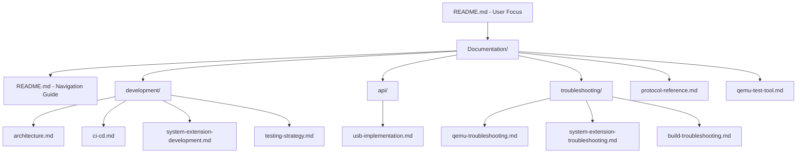

# Design Document

## Overview

This design implements a comprehensive documentation restructuring that consolidates all project documentation into a unified Documentation/ folder while refocusing the README.md for end users. The design creates clear separation between user-facing content (installation, building, basic usage) and developer-facing content (architecture, CI/CD, troubleshooting), improving documentation discoverability and maintenance.

## Steering Document Alignment

### Technical Standards (tech.md)
Since no tech.md exists, this design follows Swift/macOS project conventions with clear file organization and maintainable documentation structure.

### Project Structure (structure.md)
Since no structure.md exists, this design establishes a logical documentation hierarchy that complements the existing Swift Package Manager structure.

## Code Reuse Analysis

### Existing Components to Leverage
- **Current Documentation Files**: All existing documentation content will be preserved and reorganized
- **CLAUDE.md Instructions**: Will be updated to reference new Documentation/ structure
- **Existing README Structure**: Core build instructions and project overview will be retained

### Integration Points
- **Build System**: Documentation changes will not affect Swift Package Manager or build processes
- **CI/CD Pipeline**: Existing GitHub Actions will continue to work with updated documentation paths
- **Development Workflow**: Scripts and commands referenced in documentation will remain functional

## Architecture

The documentation restructuring follows a clear hierarchical organization with logical separation of concerns:

### Modular Design Principles
- **Single File Responsibility**: Each documentation file serves a specific purpose and audience
- **Content Separation**: Clear distinction between user and developer documentation
- **Logical Grouping**: Related documentation is organized into focused subdirectories
- **Navigation Hierarchy**: Documentation structure supports both casual browsing and targeted searches



## Components and Interfaces

### Root README.md (Refocused)
- **Purpose:** Primary entry point for end users and contributors
- **Content:** Installation, building, basic usage, quick start
- **Audience:** End users, new contributors, release builders
- **Length:** Concise, scannable sections with links to detailed documentation

### Documentation/README.md (Navigation Hub)
- **Purpose:** Central navigation guide for all documentation
- **Content:** Directory structure explanation, quick links, content organization
- **Audience:** All documentation users
- **Structure:** Categorized links with brief descriptions

### Documentation/development/ (Developer Focus)
- **Purpose:** Comprehensive developer resources
- **Components:**
  - `architecture.md`: System design, component relationships, technical decisions
  - `ci-cd.md`: GitHub Actions, testing strategy, release process
  - `system-extension-development.md`: System Extension development workflow
  - `testing-strategy.md`: Testing approaches, environments, validation

### Documentation/api/ (Technical Reference)
- **Purpose:** Technical implementation details
- **Components:**
  - `usb-implementation.md`: USB/IP protocol implementation details
  - Future API documentation as needed

### Documentation/troubleshooting/ (Problem Resolution)
- **Purpose:** Issue resolution and diagnostics
- **Components:**
  - `qemu-troubleshooting.md`: QEMU test environment issues
  - `system-extension-troubleshooting.md`: System Extension problems
  - `build-troubleshooting.md`: Build and compilation issues

## Data Models

### Documentation Structure
```
/
├── README.md                          # User-focused entry point
├── CLAUDE.md                         # Development instructions (updated references)
├── Documentation/
│   ├── README.md                     # Navigation guide
│   ├── protocol-reference.md         # Moved from Documentation/
│   ├── qemu-test-tool.md            # Moved from Documentation/
│   ├── development/
│   │   ├── architecture.md          # System design and technical decisions
│   │   ├── ci-cd.md                 # CI/CD pipeline documentation
│   │   ├── system-extension-development.md  # Moved from Sources/SystemExtension/
│   │   └── testing-strategy.md      # Testing approaches and environments
│   ├── api/
│   │   └── usb-implementation.md    # Moved from Sources/USBIPDCore/
│   └── troubleshooting/
│       ├── qemu-troubleshooting.md  # Extracted from qemu-test-tool.md
│       ├── system-extension-troubleshooting.md  # Extracted from system-extension-development.md
│       └── build-troubleshooting.md # Extracted from README.md
```

### Content Migration Map
```
Source → Destination
==================
README.md (CI section) → Documentation/development/ci-cd.md
README.md (System Extension details) → Documentation/development/system-extension-development.md
README.md (Troubleshooting) → Documentation/troubleshooting/build-troubleshooting.md
Sources/SystemExtension/SYSTEM_EXTENSION_SETUP.md → Documentation/development/system-extension-development.md
Sources/USBIPDCore/README-USB-Implementation.md → Documentation/api/usb-implementation.md
CI_TEST_SCENARIOS.md → Documentation/development/ci-cd.md (appended)
Documentation/qemu-troubleshooting.md → Documentation/troubleshooting/qemu-troubleshooting.md
```

## Error Handling

### Content Migration Errors
1. **Missing Internal Links:** 
   - **Handling:** Systematic link validation and update process
   - **Prevention:** Comprehensive search and replace with validation

2. **Broken Cross-References:**
   - **Handling:** Update all references to moved documentation
   - **Prevention:** Maintain link inventory during migration

3. **Content Duplication:**
   - **Handling:** Identify and consolidate duplicate content
   - **Prevention:** Content audit before and after migration

### Navigation Issues  
1. **Lost Documentation:**
   - **Handling:** Comprehensive content mapping and verification
   - **Prevention:** Systematic migration with checklist validation

2. **Unclear Organization:**
   - **Handling:** Clear naming conventions and navigation guide
   - **Prevention:** User-tested navigation structure

## Testing Strategy

### Content Integrity Testing
- Verify all existing content is preserved during migration
- Validate that no content is lost or corrupted
- Ensure code examples and commands remain functional

### Link Validation Testing
- Test all internal documentation links
- Verify external links remain functional  
- Validate cross-references between documentation files

### Navigation Testing
- Test documentation discoverability from README
- Verify logical progression through documentation hierarchy
- Validate search and browsing workflows

### User Experience Testing
- Test README effectiveness for new users
- Verify developer documentation accessibility
- Validate troubleshooting documentation usefulness

## Implementation Approach

### Phase 1: Structure Creation
1. Create Documentation/ folder structure
2. Create Documentation/README.md navigation guide
3. Create subdirectory structure (development/, api/, troubleshooting/)

### Phase 2: Content Migration
1. Move existing Documentation/ files to new structure
2. Extract and migrate content from README.md to appropriate Documentation/ files
3. Move Sources/SystemExtension/SYSTEM_EXTENSION_SETUP.md to Documentation/development/
4. Move Sources/USBIPDCore/README-USB-Implementation.md to Documentation/api/
5. Migrate CI_TEST_SCENARIOS.md content to Documentation/development/ci-cd.md

### Phase 3: README Refocus
1. Streamline README.md to focus on end users
2. Remove developer-specific details
3. Add clear links to detailed documentation
4. Preserve essential build and installation instructions

### Phase 4: Link Updates
1. Update all internal documentation links
2. Update CLAUDE.md references to new structure
3. Validate all cross-references work correctly
4. Update any scripts or tools that reference documentation paths

### Phase 5: Validation
1. Verify all content is accessible and properly organized
2. Test navigation flows from user and developer perspectives  
3. Validate link integrity across all documentation
4. Ensure build and development workflows remain functional