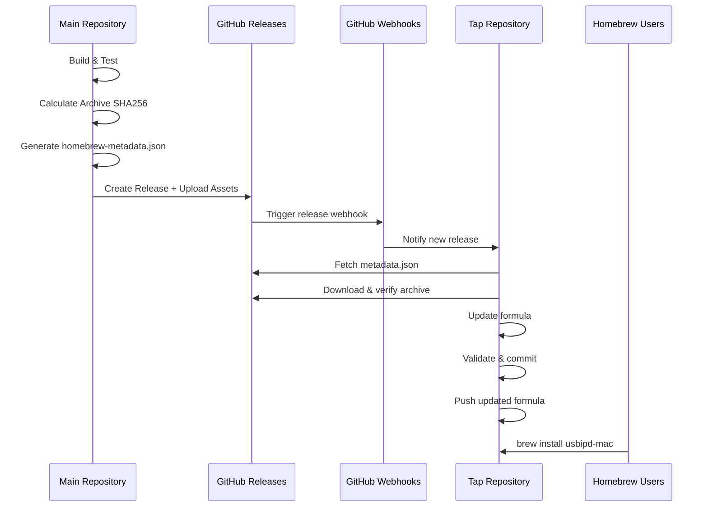

# Design Document

## Overview

This design document outlines the implementation of a pull-based external tap repository integration for usbipd-mac Homebrew distribution. The architecture separates concerns between the main repository (usbipd-mac) and the tap repository (homebrew-usbipd-mac), with the main repository publishing release metadata and the tap repository autonomously updating the formula.

The pull-based model eliminates cross-repository authentication complexity while maintaining automated formula updates through webhook-triggered workflows in the tap repository.

## Steering Document Alignment

### Technical Standards (tech.md)
The design follows documented Swift Package Manager patterns and GitHub Actions workflow standards established in the project. The pull-based architecture aligns with the project's modular design principles by creating clear boundaries between release automation and distribution management.

### Project Structure (structure.md)
The implementation maintains the existing Scripts/ directory organization while removing formula-specific components. New metadata generation follows the project's JSON-based configuration patterns and integrates cleanly with the existing release workflow structure.

## Code Reuse Analysis

The design leverages existing release workflow infrastructure while adding minimal new components:

### Existing Components to Leverage
- **Release Workflow (`.github/workflows/release.yml`)**: Extend with metadata generation step
- **Archive SHA256 Calculation**: Reuse existing checksum logic from current formula update process
- **GitHub Actions Infrastructure**: Leverage existing setup-swift-environment and validation actions
- **Release Asset Management**: Extend current artifact upload to include metadata file

### Integration Points
- **Release Creation Step**: Add metadata generation before GitHub release creation
- **Artifact Upload**: Include homebrew-metadata.json alongside existing release assets
- **Validation Pipeline**: Ensure metadata generation doesn't affect existing release validation

## Architecture

The pull-based architecture consists of two independent workflows that communicate via GitHub releases and webhook events:



### Component Architecture

#### Main Repository Components
1. **Metadata Generator**: New component to create homebrew-metadata.json
2. **Release Workflow Extension**: Integrate metadata generation into existing pipeline
3. **Archive SHA256 Calculator**: Reuse existing checksum calculation logic

#### Tap Repository Components
1. **Webhook Handler**: GitHub Action triggered by main repository releases
2. **Formula Updater**: Core logic to update formula with new version/checksum
3. **Validation Engine**: Ruby syntax and Homebrew formula validation
4. **Manual Recovery Tools**: Workflow dispatch and standalone script

## Components and Interfaces

### Component 1: Homebrew Metadata Generator

- **Purpose:** Generate structured metadata for tap repository consumption
- **Location:** `Scripts/generate-homebrew-metadata.sh`
- **Interfaces:** 
  - Input: `version`, `sha256_checksum`, `release_notes`
  - Output: `homebrew-metadata.json` file
- **Dependencies:** Standard shell tools (jq for JSON generation)
- **Reuses:** Existing release workflow variables and checksum calculation

#### Metadata JSON Schema
```json
{
  "$schema": "http://json-schema.org/draft-07/schema#",
  "type": "object",
  "required": ["version", "sha256", "timestamp"],
  "properties": {
    "version": {
      "type": "string",
      "pattern": "^v[0-9]+\\.[0-9]+\\.[0-9]+(-[a-zA-Z0-9.-]+)?$"
    },
    "sha256": {
      "type": "string", 
      "pattern": "^[a-fA-F0-9]{64}$"
    },
    "release_notes": {
      "type": "string",
      "description": "Markdown-formatted release notes"
    },
    "timestamp": {
      "type": "string",
      "format": "date-time"
    }
  }
}
```

### Component 2: Release Workflow Integration

- **Purpose:** Integrate metadata generation into existing release pipeline
- **Location:** `.github/workflows/release.yml` (modify existing)
- **Interfaces:**
  - Extends `update-homebrew-formula` job to generate metadata instead of updating formula
  - Maintains existing job dependencies and artifact patterns
- **Dependencies:** Existing release validation, build artifacts, and GitHub release creation
- **Reuses:** Current SHA256 calculation logic, release notes generation, and artifact upload patterns

#### Workflow Changes
```yaml
# Replace existing update-homebrew-formula job
generate-homebrew-metadata:
  name: Generate Homebrew Metadata
  runs-on: macos-latest
  needs: [release-validation, build-artifacts]
  steps:
    - name: Generate Metadata File
      run: |
        ./Scripts/generate-homebrew-metadata.sh \
          --version "${{ needs.release-validation.outputs.version }}" \
          --checksum "${{ steps.calculate-sha256.outputs.sha256 }}" \
          --release-notes-file release-notes.md
    
    - name: Upload Metadata Asset
      run: |
        gh release upload "$VERSION" homebrew-metadata.json
```

### Component 3: Tap Repository Webhook Handler

- **Purpose:** Receive and process release webhooks from main repository
- **Location:** `.github/workflows/formula-update.yml` (new in tap repository)
- **Interfaces:**
  - Webhook Input: GitHub release event payload
  - Manual Input: Version parameter for manual dispatch
  - Output: Updated formula committed to tap repository
- **Dependencies:** GitHub Actions environment, curl, jq, git
- **Reuses:** Standard GitHub Actions patterns from main repository

#### Webhook Workflow Structure
```yaml
name: Update Formula
on:
  release:
    types: [published]
  workflow_dispatch:
    inputs:
      version:
        description: 'Version to process (e.g., v1.2.3)'
        required: false

jobs:
  update-formula:
    runs-on: ubuntu-latest
    steps:
      - name: Checkout Tap Repository
      - name: Fetch Release Metadata
      - name: Download and Verify Archive
      - name: Update Formula
      - name: Validate Formula
      - name: Commit and Push
```

### Component 4: Formula Update Engine

- **Purpose:** Core logic to update Homebrew formula with new version and checksum
- **Location:** `Scripts/update-formula.rb` (new in tap repository)
- **Interfaces:**
  - Input: JSON metadata, current formula file
  - Output: Updated formula with new version/checksum
  - Validation: Ruby syntax check, Homebrew audit
- **Dependencies:** Ruby, Homebrew (for validation)
- **Reuses:** Formula structure from existing Formula/usbipd-mac.rb

#### Formula Template Structure
```ruby
class UsbipdMac < Formula
  desc "macOS USB/IP protocol implementation for sharing USB devices over IP"
  homepage "https://github.com/beriberikix/usbipd-mac"
  url "https://github.com/beriberikix/usbipd-mac/archive/VERSION_PLACEHOLDER.tar.gz"
  version "VERSION_PLACEHOLDER"
  sha256 "SHA256_PLACEHOLDER"
  license "MIT"
  
  # ... rest of formula preserved from current implementation
end
```

### Component 5: Standalone Recovery Script  

- **Purpose:** Manual formula update capability for testing and emergency recovery
- **Location:** `Scripts/manual-update.sh` (new in tap repository)
- **Interfaces:**
  - CLI: `--version`, `--dry-run`, `--force` parameters
  - Output: Status reporting and updated formula
  - Error Handling: Detailed troubleshooting guidance
- **Dependencies:** Standard shell tools, git, curl, jq
- **Reuses:** Same validation logic as webhook workflow

## Data Models

### Homebrew Metadata Model
```json
{
  "version": "v1.2.3",
  "sha256": "85a27f69fa9cc15228d5e440185b7b132437b7d2d5fa990873a38d1f143e36c6", 
  "release_notes": "## What's Changed\n- Feature implementation\n- Bug fixes",
  "timestamp": "2025-08-19T18:00:00Z"
}
```

### Formula Update Model  
```ruby
# Internal data structure for formula updates
{
  current_version: "v1.2.2",
  target_version: "v1.2.3", 
  current_sha256: "previous_checksum",
  target_sha256: "new_checksum",
  archive_url: "https://github.com/beriberikix/usbipd-mac/archive/v1.2.3.tar.gz",
  validation_status: "pending|success|failed"
}
```

### Workflow State Model
```yaml
# GitHub Actions workflow state
inputs:
  version: "v1.2.3"          # Manual dispatch only
  dry_run: false             # Preview mode
outputs:
  formula_updated: true      # Success indicator
  validation_passed: true   # Formula validation status
  commit_sha: "abc123..."    # Git commit hash
```

## Error Handling

### Error Scenarios

#### 1. Metadata Fetch Failure
- **Scenario:** Tap repository cannot download homebrew-metadata.json
- **Handling:** Retry 3 times with exponential backoff, fall back to manual workflow
- **User Impact:** Formula update delayed until manual intervention

#### 2. Checksum Verification Failure  
- **Scenario:** Downloaded archive SHA256 doesn't match metadata
- **Handling:** Abort update, preserve existing formula, log detailed error
- **User Impact:** Users continue with previous version until issue resolved

#### 3. Formula Validation Failure
- **Scenario:** Updated formula fails Ruby syntax or Homebrew audit
- **Handling:** Rollback changes, preserve working formula, notify maintainers
- **User Impact:** No impact to existing installations, update delayed

#### 4. Git Push Failure
- **Scenario:** Cannot push updated formula to tap repository
- **Handling:** Retry push, check for conflicts, provide manual resolution steps
- **User Impact:** Formula update delayed, manual intervention required

#### 5. Webhook Delivery Failure
- **Scenario:** GitHub webhook doesn't reach tap repository
- **Handling:** Manual workflow dispatch available, monitoring alerts
- **User Impact:** Delayed automatic updates, manual trigger available

## Testing Strategy

### Unit Testing

#### Metadata Generation Testing
- **Test Coverage:** JSON schema validation, version format validation, SHA256 format validation
- **Test Environment:** Main repository CI pipeline
- **Test Data:** Mock release data, invalid version formats, malformed checksums

#### Formula Update Testing  
- **Test Coverage:** Template substitution, validation logic, error handling
- **Test Environment:** Tap repository with test formula
- **Test Data:** Valid/invalid metadata, corrupted formula templates

### Integration Testing

#### End-to-End Workflow Testing
- **Test Coverage:** Full workflow from release creation to formula update
- **Test Environment:** Staging repositories with webhook integration
- **Test Scenarios:** 
  - Successful release → formula update
  - Failed metadata generation
  - Network failures and retries
  - Manual workflow dispatch

#### Cross-Repository Integration
- **Test Coverage:** Webhook delivery, metadata format compatibility
- **Test Environment:** Test repositories with webhook configuration
- **Test Scenarios:**
  - Release webhook triggers formula update
  - Malformed webhook payloads
  - Authentication and permissions

### Manual Testing

#### Recovery Procedures
- **Test Coverage:** Manual formula updates, rollback procedures, error recovery
- **Test Environment:** Local development environment
- **Test Scenarios:**
  - Standalone script execution
  - Manual workflow dispatch
  - Formula rollback procedures

#### User Experience Testing
- **Test Coverage:** Installation process, error messages, documentation
- **Test Environment:** Clean macOS system with Homebrew
- **Test Scenarios:**
  - `brew tap beriberikix/usbipd-mac && brew install usbipd-mac`
  - Error message clarity
  - Troubleshooting guide effectiveness

## Security Considerations

### Authentication Model
- **No Cross-Repository Secrets:** Tap repository operates independently without main repository credentials
- **GitHub Token Permissions:** Tap repository workflows use read-only access to main repository, write access to own repository
- **Webhook Validation:** Verify webhook signatures to prevent malicious payloads

### Data Validation
- **Metadata Schema Enforcement:** Strict JSON schema validation before processing
- **Checksum Verification:** Always verify downloaded archives against provided SHA256
- **Formula Sanitization:** Validate all template substitutions to prevent code injection

### Supply Chain Security
- **Immutable Releases:** Only process published releases from main repository
- **Audit Trail:** Complete Git history of all formula updates with metadata references
- **Fallback Security:** Manual workflow dispatch requires maintainer approval for sensitive operations

## Performance Optimizations

### Network Efficiency
- **Shallow Clones:** Use `--depth=1` for repository operations
- **Conditional Downloads:** Only download archives when checksum changes
- **Cached Dependencies:** Leverage GitHub Actions caching for Ruby/Homebrew setup

### Workflow Optimization  
- **Parallel Validation:** Run Ruby syntax check and Homebrew audit concurrently
- **Early Termination:** Fail fast on metadata validation errors
- **Resource Limits:** Set appropriate timeouts for all network operations

### Storage Efficiency
- **Minimal Metadata:** Keep JSON payload under 10KB
- **Cleanup Procedures:** Remove temporary files and old workflow artifacts
- **Artifact Retention:** Configure appropriate retention policies for logs and artifacts