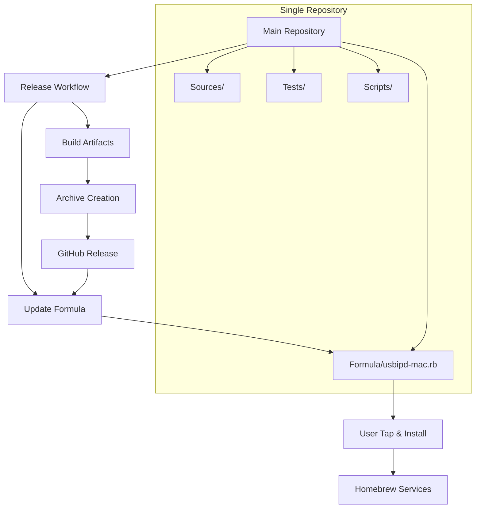

# Design Document

## Overview

This design implements Homebrew distribution for usbipd-mac through a single-repository tap approach that provides controlled distribution while maintaining accessibility. The solution integrates the Homebrew formula directly into the main project repository and uses existing GitHub Actions release automation to automatically update the formula when new versions are tagged, ensuring users receive timely access to updates without additional repository maintenance overhead.

## Steering Document Alignment

### Technical Standards (tech.md)
The design follows the established Swift Package Manager architecture and integrates with existing GitHub Actions workflows. It maintains compatibility with macOS 11+ requirements and leverages the current multi-target build system without requiring architectural changes to the core project.

### Project Structure (structure.md)
The implementation will add a `Formula/` directory to the existing project structure, following the established pattern of maintaining clean organization while keeping all project components in a single repository. This aligns with the project's preference for consolidated architecture.

## Code Reuse Analysis

### Existing Components to Leverage
- **Release Automation Scripts**: `Scripts/prepare-release.sh` and existing GitHub Actions workflows will be extended to include Homebrew formula updates
- **Build System**: Existing Swift Package Manager configuration in `Package.swift` provides the foundation for Homebrew formula build process
- **Artifact Validation**: `Scripts/validate-release-artifacts.sh` will be extended to validate Homebrew formula correctness

### Integration Points
- **GitHub Actions Release Workflow**: The existing `.github/workflows/release.yml` will be extended to automatically update the Homebrew formula in the same repository
- **Version Management**: Integration with existing Git tag-based versioning system for automatic formula version updates
- **Code Signing**: Leverages existing Apple Developer ID certificate infrastructure for signed binaries

## Architecture

The Homebrew distribution system follows a **single-repository architecture** with integrated formula management:

1. **Main Repository** (`beriberikix/usbipd-mac`): Contains source code, build scripts, release automation, AND Homebrew formula
2. **Integrated Formula**: Homebrew formula lives in `Formula/` directory within the main repository
3. **Automated Updates**: GitHub Actions workflow updates the formula file directly in the same repository

### Modular Design Principles
- **Repository Consolidation**: All project components including distribution metadata in single repository
- **Automated Synchronization**: Zero-touch formula updates triggered by release events within same repository
- **Formula Integration**: Self-contained Homebrew formula with embedded build logic leveraging existing Package.swift
- **Service Integration**: Optional launchd service configuration integrated with core installation



## Components and Interfaces

### Component 1: Homebrew Formula in Main Repository
- **Purpose:** Defines the Homebrew formula structure for installing usbipd-mac
- **Location:** `Formula/usbipd-mac.rb` in main repository
- **Interfaces:** Standard Homebrew DSL with custom build and installation logic
- **Dependencies:** Swift Package Manager, macOS system frameworks
- **Reuses:** Existing Package.swift configuration and build targets

**Repository Structure:**
```
usbipd-mac/
├── Sources/              # Existing source code
├── Tests/               # Existing test suites
├── Scripts/             # Existing automation scripts
├── Formula/             # NEW: Homebrew formula directory
│   └── usbipd-mac.rb   # Homebrew formula file
├── Documentation/       # Existing documentation
├── Package.swift        # Existing Swift package manifest
└── README.md           # Updated with tap instructions
```

**Formula Structure:**
```ruby
class UsbipDMac < Formula
  desc "macOS USB/IP protocol implementation for sharing USB devices over IP"
  homepage "https://github.com/beriberikix/usbipd-mac"
  url "https://github.com/beriberikix/usbipd-mac/archive/v#{version}.tar.gz"
  sha256 "CHECKSUM_PLACEHOLDER"
  license "MIT"
  
  depends_on :macos => :big_sur
  depends_on :xcode => ["13.0", :build]
  
  def install
    system "swift", "build", "--configuration", "release", "--disable-sandbox"
    bin.install ".build/release/usbipd"
    bin.install ".build/release/QEMUTestServer"
  end
  
  service do
    run [opt_bin/"usbipd", "--daemon"]
    require_root true
    log_path "/var/log/usbipd.log"
    error_log_path "/var/log/usbipd.error.log"
  end
end
```

### Component 2: Integrated Release Automation
- **Purpose:** Automatically updates Homebrew formula when new releases are published
- **Location:** Extension to existing `.github/workflows/release.yml`
- **Interfaces:** GitHub Actions workflow with formula update step
- **Dependencies:** GitHub API, release artifacts, checksum calculation
- **Reuses:** Existing release workflow and artifact validation scripts

**Enhanced Release Workflow Steps:**
1. Existing: Build and test project
2. Existing: Create GitHub release with artifacts
3. **NEW:** Calculate SHA256 checksum of release archive
4. **NEW:** Update `Formula/usbipd-mac.rb` with new version and checksum
5. **NEW:** Commit formula update to main repository

### Component 3: Tap Instructions and Documentation
- **Purpose:** Provides clear instructions for users to tap and install
- **Location:** Updated `README.md` and new documentation
- **Interfaces:** User-facing documentation with installation commands
- **Dependencies:** GitHub repository access
- **Reuses:** Existing documentation structure and style

**User Installation Flow:**
```bash
# Step 1: Tap the repository
brew tap beriberikix/usbipd-mac

# Step 2: Install the formula
brew install usbipd-mac

# Step 3: Manage as service (optional)
brew services start usbipd-mac
```

### Component 4: Service Management Integration
- **Purpose:** Provides launchd service configuration for daemon management
- **Location:** Embedded in Formula/usbipd-mac.rb
- **Interfaces:** Homebrew services DSL and macOS launchd
- **Dependencies:** macOS service management frameworks
- **Reuses:** Existing daemon implementation and configuration

## Data Models

### Formula Configuration Model
```ruby
# Homebrew formula metadata structure within main repository
{
  name: "usbipd-mac",
  version: "1.0.0",
  url: "https://github.com/beriberikix/usbipd-mac/archive/v1.0.0.tar.gz",
  sha256: "abc123...",
  dependencies: ["xcode"],
  build_dependencies: [],
  system_requirements: {
    macos: ":big_sur",
    architecture: ["arm64", "x86_64"]
  }
}
```

### Service Configuration Model
```ruby
# Homebrew service definition embedded in formula
{
  run_command: ["/usr/local/bin/usbipd", "--daemon"],
  require_root: true,
  log_path: "/var/log/usbipd.log",
  error_log_path: "/var/log/usbipd.error.log",
  keep_alive: true,
  launch_only_once: false
}
```

### Repository Integration Metadata
```yaml
# Integration configuration for single-repository approach
tap_structure:
  repository: "beriberikix/usbipd-mac"
  formula_path: "Formula/usbipd-mac.rb"
  tap_command: "brew tap beriberikix/usbipd-mac"
auto_update:
  enabled: true
  trigger: "release_published"
  workflow: ".github/workflows/release.yml"
validation:
  - syntax_check
  - build_test
  - integration_test
```

## Error Handling

### Error Scenarios

1. **Formula Syntax Errors**
   - **Handling:** Automated syntax validation in CI before committing formula updates
   - **User Impact:** Installation fails with clear syntax error message from Homebrew
   - **Recovery:** Automated rollback to previous working formula version in same repository

2. **Build Failures During Installation**
   - **Handling:** Comprehensive error logging with Swift compiler output
   - **User Impact:** Installation fails with detailed build error information
   - **Recovery:** Users can report issues with full build logs for debugging

3. **Checksum Mismatch**
   - **Handling:** Homebrew automatically detects and rejects invalid checksums
   - **User Impact:** Installation fails with integrity error message
   - **Recovery:** Automated re-calculation and formula update in next release

4. **Service Management Failures**
   - **Handling:** Clear error messages for permission and configuration issues
   - **User Impact:** Service commands fail with specific error guidance
   - **Recovery:** Detailed troubleshooting documentation and manual service setup options

5. **Repository Access Issues**
   - **Handling:** Standard GitHub repository access patterns with clear error messages
   - **User Impact:** Tap command fails with standard GitHub access error messages
   - **Recovery:** Standard GitHub troubleshooting and authentication documentation

6. **Formula Update Conflicts**
   - **Handling:** Automated conflict resolution and validation before committing updates
   - **User Impact:** Seamless updates without user intervention
   - **Recovery:** Manual formula correction with maintainer notification if automation fails

## Testing Strategy

### Unit Testing
- **Formula Validation:** Automated syntax checking and linting for Homebrew formula using `brew audit`
- **Template Generation:** Testing of formula template generation with various version inputs
- **Checksum Calculation:** Validation of SHA256 checksum generation and embedding

### Integration Testing
- **End-to-End Installation:** Automated testing of complete tap → install → uninstall workflow
- **Service Management:** Testing of Homebrew services integration with start/stop/restart commands
- **Version Updates:** Testing formula updates and version transitions within same repository

### End-to-End Testing
- **User Journey Testing:** Complete user experience from tap setup through daemon operation
- **Cross-Platform Testing:** Validation on Intel and Apple Silicon Macs with different macOS versions
- **Release Automation Testing:** End-to-end testing of automated formula updating workflow

### Continuous Integration Testing
```yaml
# Enhanced CI workflow for formula validation
name: CI with Homebrew Validation
on: [push, pull_request, release]
jobs:
  homebrew-validation:
    runs-on: macos-latest
    steps:
      - uses: actions/checkout@v3
      - name: Validate Formula Syntax
        run: brew audit --strict Formula/usbipd-mac.rb
      - name: Test Local Installation
        run: |
          brew install --build-from-source ./Formula/usbipd-mac.rb
          usbipd --version
      - name: Test Service Management
        run: |
          brew services start usbipd-mac
          sleep 5
          brew services stop usbipd-mac
```

## Security Considerations

### Code Signing and Notarization
- **Binary Integrity:** All distributed binaries maintain Apple Developer ID signatures
- **Notarization:** Integration with existing notarization workflow for enhanced security
- **Checksum Validation:** SHA256 checksums prevent tampering during distribution

### Repository Security
- **Branch Protection:** Main repository branch protection applies to formula updates
- **Access Control:** Standard repository access controls protect formula integrity
- **Automated Updates:** Secure token-based authentication for automated formula updates within same repository

### Installation Security
- **Privilege Separation:** Formula installation runs with minimal required permissions
- **System Extension Handling:** Clear documentation for secure System Extension approval
- **Service Permissions:** Proper privilege management for daemon service operation

## Performance Considerations

### Installation Performance
- **Build Optimization:** Leverage Swift Package Manager's optimized release builds
- **Parallel Compilation:** Utilize all available CPU cores during Swift compilation
- **Local Repository Access:** Faster tap setup since formula is in main repository

### Runtime Performance
- **Daemon Efficiency:** Maintain existing sub-5-second startup performance post-installation
- **Memory Usage:** No additional memory overhead from Homebrew integration
- **Service Management:** Efficient launchd integration with proper resource limits

### Update Performance
- **Single Repository Updates:** Simplified update process with formula and source in same repository
- **Artifact Caching:** GitHub release artifact caching for improved download performance
- **Formula Validation:** Fast syntax and audit checks integrated into existing CI pipeline

## Rollback and Recovery

### Formula Rollback Mechanisms
- **Version Pinning:** Users can pin specific formula versions to prevent unwanted updates
- **Git History:** Formula history preserved in main repository Git history
- **Emergency Rollback:** Simple Git revert capability for critical formula errors

### Release Recovery Procedures
- **Failed Release Handling:** Automated detection and handling of failed release publications
- **Manual Override:** Maintainer capability to manually update formulas via direct Git commits
- **Validation Checkpoints:** Multiple validation stages prevent publication of broken formulas

## Implementation Benefits of Single Repository

### Simplified Maintenance
- **Single Source of Truth:** All project components in one location
- **Unified Version Control:** Formula versions automatically track source code versions
- **Simplified CI/CD:** Single repository CI pipeline handles both source and distribution

### Improved Developer Experience
- **Easier Contributions:** Contributors work with single repository for both features and distribution
- **Integrated Testing:** Formula testing integrated with existing test suites
- **Consistent Versioning:** No synchronization issues between repositories

### Reduced Complexity
- **No Cross-Repository Automation:** Eliminates complex cross-repository synchronization
- **Simplified Security:** Single repository security model and access controls
- **Unified Documentation:** Installation and development documentation in same location

## Future Enhancements

### Advanced Distribution Features
- **Multiple Installation Methods:** Support for both source builds and pre-compiled binaries
- **Beta Channel Support:** Formula variants for beta releases within same repository
- **Dependency Management:** Enhanced handling of optional dependencies and features

### Integration Improvements
- **GUI Installation Support:** Potential integration with Homebrew Cask for GUI installations
- **Configuration Management:** Homebrew-integrated configuration file management
- **Monitoring Integration:** Enhanced service monitoring and health check capabilities