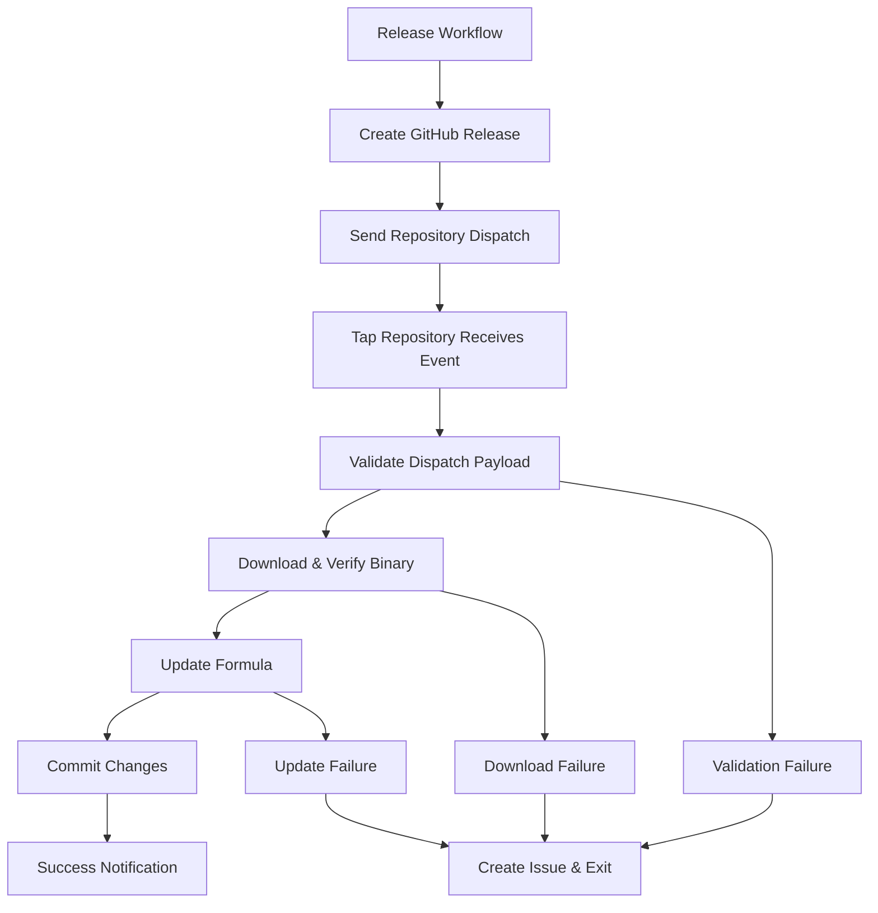

# Design Document

## Overview

This design implements a repository dispatch-based Homebrew tap update system to replace the current homebrew-releaser GitHub Action. The solution uses a two-repository architecture where the main usbipd-mac repository dispatches release events to the homebrew-usbipd-mac tap repository, which then processes the events to update the Homebrew formula with new binary releases.

The design emphasizes reliability, error handling, and maintainability while supporting the project's binary distribution model rather than source compilation.

## Steering Document Alignment

### Technical Standards (tech.md)
The design follows the project's Swift and shell scripting patterns, using existing error handling utilities and maintaining consistency with current release automation scripts in the Scripts/ directory.

### Project Structure (structure.md)
The implementation integrates with the existing .github/workflows/ structure and Scripts/ directory, maintaining separation between release workflows and tap repository management.

## Code Reuse Analysis

### Existing Components to Leverage
- **Scripts/generate-homebrew-metadata.sh**: Existing metadata generation logic for structured release information
- **.github/actions/setup-swift-environment**: Environment setup patterns for consistent workflow execution
- **Scripts/validate-homebrew-metadata.sh**: Validation patterns for metadata integrity checks
- **Error handling patterns**: From existing release scripts for consistent error reporting

### Integration Points
- **GitHub Actions workflows**: Integration with existing .github/workflows/release.yml
- **Release artifact system**: Connection to existing artifact generation and signing process
- **GitHub Secrets management**: Reuse of existing secret patterns for repository authentication

## Architecture

The system implements a distributed event-driven architecture with clear separation of concerns:

### Modular Design Principles
- **Single Repository Responsibility**: Main repository handles releases, tap repository handles formula updates
- **Event-Driven Communication**: Repository dispatch events provide loose coupling between repositories
- **Atomic Operations**: Formula updates are all-or-nothing with rollback capabilities
- **Independent Validation**: Each repository validates its own inputs and constraints



## Components and Interfaces

### Component 1: Repository Dispatch Sender (Main Repository)
- **Purpose:** Sends repository_dispatch events to tap repository after successful releases
- **Interfaces:** 
  - Input: Release metadata (version, binary URLs, checksums)
  - Output: Repository dispatch event with structured payload
- **Dependencies:** peter-evans/repository-dispatch action, GitHub API
- **Reuses:** Existing release metadata generation from Scripts/generate-homebrew-metadata.sh

### Component 2: Repository Dispatch Receiver (Tap Repository)
- **Purpose:** Processes dispatch events and updates Homebrew formula
- **Interfaces:**
  - Input: Repository dispatch event payload
  - Output: Updated formula file and commit
- **Dependencies:** GitHub CLI, curl, shasum, git
- **Reuses:** Formula update patterns from existing Scripts/manual-update.sh

### Component 3: Binary Download Validator
- **Purpose:** Downloads and validates binary artifacts before formula updates
- **Interfaces:**
  - Input: Binary download URL and expected SHA256
  - Output: Validation success/failure with detailed error information
- **Dependencies:** curl, shasum, file size validation utilities
- **Reuses:** Checksum validation patterns from existing release scripts

### Component 4: Formula Update Engine
- **Purpose:** Atomically updates formula files with new release information
- **Interfaces:**
  - Input: Validated release metadata (version, URL, SHA256)
  - Output: Updated formula file with proper Ruby syntax
- **Dependencies:** sed/awk for file manipulation, git for version control
- **Reuses:** Existing formula structure and Ruby syntax patterns

### Component 5: Error Handler and Issue Creator
- **Purpose:** Creates detailed GitHub issues for failed update attempts
- **Interfaces:**
  - Input: Error context, failure stage, release metadata
  - Output: GitHub issue with troubleshooting information
- **Dependencies:** GitHub CLI, issue template generation
- **Reuses:** Error reporting patterns from existing release workflow

## Data Models

### Repository Dispatch Payload
```json
{
  "event_type": "formula_update",
  "client_payload": {
    "version": "v1.2.3",
    "binary_download_url": "https://github.com/beriberikix/usbipd-mac/releases/download/v1.2.3/usbipd-v1.2.3-macos",
    "binary_sha256": "abc123...",
    "release_notes": "Brief summary of changes",
    "release_timestamp": "2025-08-21T20:56:33Z",
    "is_prerelease": false
  }
}
```

### Formula Update Context
```bash
# Environment variables for formula update script
RELEASE_VERSION="v1.2.3"
BINARY_URL="https://github.com/beriberikix/usbipd-mac/releases/download/v1.2.3/usbipd-v1.2.3-macos"
EXPECTED_SHA256="abc123..."
FORMULA_FILE="Formula/usbipd-mac.rb"
```

### Error Context Model
```bash
# Error reporting structure
ERROR_STAGE="binary_download|formula_update|validation"
ERROR_MESSAGE="Detailed error description"
ERROR_CODE="HTTP_404|CHECKSUM_MISMATCH|FILE_NOT_FOUND"
RELEASE_VERSION="v1.2.3"
WORKFLOW_URL="https://github.com/.../actions/runs/123"
```

## Error Handling

### Error Scenarios

1. **Repository Dispatch Failure**
   - **Handling:** Retry once with exponential backoff, create issue if both attempts fail
   - **User Impact:** Tap repository is not notified of new release, manual update required

2. **Invalid Dispatch Payload**
   - **Handling:** Validate all required fields, log detailed validation errors, exit gracefully
   - **User Impact:** Formula is not updated, GitHub issue created with payload details

3. **Binary Download Failure**
   - **Handling:** Retry download up to 3 times, verify URL accessibility, check network connectivity
   - **User Impact:** Formula update aborted, issue created with download diagnostics

4. **SHA256 Checksum Mismatch**
   - **Handling:** Re-download binary once, compare checksums again, abort if mismatch persists
   - **User Impact:** Formula update aborted to prevent corrupted binary installation

5. **Formula Update Failure**
   - **Handling:** Validate Ruby syntax after update, rollback changes if syntax is invalid
   - **User Impact:** Formula remains at previous version, issue created with syntax errors

6. **Git Commit Failure**
   - **Handling:** Check for merge conflicts, validate repository state, retry commit once
   - **User Impact:** Formula changes are lost, issue created with git diagnostics

## Testing Strategy

### Unit Testing
- **Repository Dispatch Sender**: Test payload construction, error handling, authentication
- **Binary Validator**: Test checksum calculation, download failure scenarios, timeout handling
- **Formula Updater**: Test Ruby syntax generation, version string replacement, file integrity

### Integration Testing
- **End-to-End Workflow**: Test complete dispatch → download → update → commit cycle
- **Error Recovery**: Test rollback scenarios, issue creation, state consistency
- **Network Resilience**: Test timeout handling, retry logic, connection failures

### End-to-End Testing
- **Production Simulation**: Test with real GitHub releases in development environment
- **Cross-Repository Communication**: Verify dispatch events are received and processed correctly
- **User Installation**: Test that updated formulas install correctly via Homebrew

## Security Considerations

### Token Management
- **Separation of Concerns**: Different tokens for main repository (dispatch sender) and tap repository (receiver)
- **Minimal Permissions**: Dispatch token only needs repository dispatch permissions, tap token needs content read/write
- **Token Rotation**: Regular rotation schedule for all GitHub tokens

### Binary Verification
- **Cryptographic Validation**: SHA256 checksum verification before any formula updates
- **Source Verification**: Only accept binaries from verified GitHub release assets
- **Download Security**: HTTPS-only downloads with certificate validation

### Repository Integrity
- **Atomic Updates**: All-or-nothing formula updates with rollback capabilities
- **Access Control**: Restrict formula update workflows to authorized dispatch events only
- **Audit Trail**: Comprehensive logging of all formula changes with traceability

## Implementation Details

### Phase 1: Main Repository Updates
1. Remove homebrew-releaser step from .github/workflows/release.yml
2. Add peter-evans/repository-dispatch step with structured payload
3. Configure HOMEBREW_TAP_DISPATCH_TOKEN secret for tap repository access

### Phase 2: Tap Repository Setup
1. Create .github/workflows/formula-update.yml workflow triggered by repository_dispatch
2. Implement Scripts/update-formula-from-dispatch.sh for formula processing
3. Add comprehensive error handling and issue creation logic

### Phase 3: Validation and Testing
1. Test dispatch mechanism in development environment
2. Validate error handling scenarios and issue creation
3. Perform end-to-end release testing with both repositories

### Phase 4: Migration and Monitoring
1. Deploy changes to production repositories
2. Monitor first few releases for any issues
3. Document new workflow for future maintenance