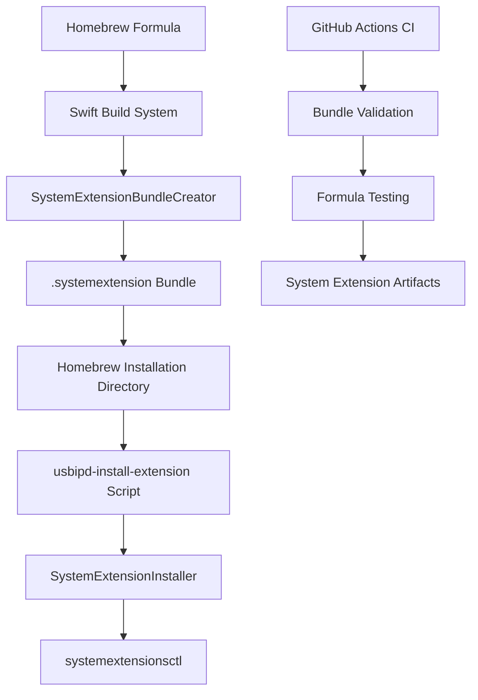

# Design Document

## Overview

This design implements a comprehensive Homebrew System Extension integration system that addresses the critical gap in usbipd-mac's current installation process. The current Homebrew formula only installs the CLI executable, leaving users without System Extension functionality that is essential for USB device claiming. This design leverages existing SystemExtensionBundleCreator infrastructure while adding Homebrew-specific packaging, installation automation, and CI validation.

The solution provides both automatic installation (when developer mode is enabled) and manual fallback installation, ensuring a smooth user experience across different system configurations while maintaining compatibility with existing development workflows.

## Steering Document Alignment

### Technical Standards (tech.md)
The design follows established Swift Package Manager patterns, leverages existing IOKit and SystemExtensions frameworks, and maintains the multi-target modular architecture. Bundle creation utilities are designed for reusability across both development and distribution scenarios.

### Project Structure (structure.md)
New components integrate cleanly with existing USBIPDCore/SystemExtension module structure, following established naming conventions and dependency patterns. Homebrew-specific logic is isolated while reusing existing bundle creation infrastructure.

## Code Reuse Analysis

### Existing Components to Leverage

- **SystemExtensionBundleCreator**: Core bundle creation logic for creating .systemextension packages with proper Info.plist and directory structure
- **SystemExtensionInstaller**: Installation workflow management and systemextensionsctl integration
- **Common/Logger**: Unified logging infrastructure for consistent error reporting and debugging
- **SystemExtensionModels**: Existing data structures for bundle configuration and installation status

### Integration Points

- **Formula/usbipd-mac.rb**: Enhanced Homebrew formula with System Extension build and packaging logic
- **Scripts/update-formula.sh**: Existing formula update automation extended to handle System Extension artifacts
- **GitHub Actions CI**: Existing workflows enhanced with System Extension build validation and testing
- **Swift Package Manager**: Leverages existing USBIPDSystemExtension product for compilation and build orchestration

## Architecture

The design implements a layered approach with clear separation between Homebrew packaging logic, System Extension bundle creation, and installation automation:

### Modular Design Principles
- **Bundle Creation Layer**: Reuses existing SystemExtensionBundleCreator for .systemextension packaging
- **Installation Layer**: Extends SystemExtensionInstaller with Homebrew-specific installation paths
- **Automation Layer**: New Homebrew-specific utilities for automatic installation and error handling
- **Validation Layer**: CI integration for comprehensive System Extension testing and validation



## Components and Interfaces

### Component 1: Enhanced Homebrew Formula
- **Purpose:** Builds both CLI executable and System Extension bundle during `brew install`
- **Interfaces:** Standard Homebrew formula install() method, enhanced caveats() for user guidance
- **Dependencies:** Swift Package Manager, existing build system
- **Reuses:** Existing swift build command structure, SystemExtensionBundleCreator for bundle packaging

### Component 2: Homebrew Bundle Creation Utility
- **Purpose:** Homebrew-specific wrapper around SystemExtensionBundleCreator for packaging
- **Interfaces:** createSystemExtensionBundle(executablePath, outputPath) -> BundleResult
- **Dependencies:** SystemExtensionBundleCreator, FileManager for bundle directory management
- **Reuses:** SystemExtensionBundleCreator.BundleCreationConfig for consistent configuration patterns

### Component 3: usbipd-install-extension Script
- **Purpose:** Homebrew-installed command for System Extension installation and developer mode detection
- **Interfaces:** Command-line script with status reporting and error handling
- **Dependencies:** systemextensionsctl, existing System Extension bundle location
- **Reuses:** SystemExtensionInstaller installation patterns, Common/Logger for consistent output formatting

### Component 4: Automatic Installation Manager
- **Purpose:** Attempts automatic System Extension installation during Homebrew installation when possible
- **Interfaces:** attemptAutomaticInstallation() -> InstallationResult, provideFallbackInstructions()
- **Dependencies:** Developer mode detection, systemextensionsctl availability
- **Reuses:** SystemExtensionInstaller workflow patterns, existing error handling infrastructure

### Component 5: CI System Extension Validation
- **Purpose:** GitHub Actions integration for System Extension build testing and validation
- **Interfaces:** CI workflow jobs for bundle creation, validation, and artifact production
- **Dependencies:** GitHub Actions environment, Swift toolchain, existing CI infrastructure
- **Reuses:** Existing setup-swift-environment action, established testing patterns

## Data Models

### SystemExtensionFormulaConfig
```swift
struct SystemExtensionFormulaConfig {
    let bundleIdentifier: String = "com.usbipd.mac.SystemExtension"
    let displayName: String = "USB/IP System Extension"
    let executableName: String = "USBIPDSystemExtension"
    let minimumSystemVersion: String = "11.0"
    let bundlePackageType: String = "SYSX"
    let installationPath: String // Homebrew-specific installation directory
    let version: String // From Homebrew formula version
}
```

### HomebrewInstallationResult
```swift
enum HomebrewInstallationResult {
    case automaticSuccess(bundlePath: String)
    case automaticFailed(reason: InstallationFailureReason, fallbackInstructions: [String])
    case manualRequired(instructions: [String])
    case developerModeRequired(enableInstructions: [String])
}

enum InstallationFailureReason {
    case developerModeDisabled
    case systemExtensionCtlUnavailable
    case permissionDenied
    case bundleValidationFailed
    case unknownError(String)
}
```

### CIValidationResult
```swift
struct CIValidationResult {
    let bundleCreated: Bool
    let bundleValid: Bool
    let executablePresent: Bool
    let infoPlistValid: Bool
    let architectureCorrect: Bool
    let validationErrors: [String]
    let artifactPath: String?
}
```

## Error Handling

### Error Scenarios
1. **System Extension Build Failure:** Build process fails during Swift compilation
   - **Handling:** Provide clear error messages about Xcode/toolchain requirements, fallback to CLI-only installation
   - **User Impact:** User gets functional CLI but must manually resolve System Extension building issues

2. **Developer Mode Detection Failure:** Cannot determine if developer mode is enabled
   - **Handling:** Assume developer mode is disabled, provide manual installation instructions
   - **User Impact:** User gets clear guidance for enabling developer mode and manual installation

3. **Automatic Installation Permission Denied:** systemextensionsctl requires elevation but fails
   - **Handling:** Gracefully fall back to manual installation with specific error context
   - **User Impact:** User receives specific instructions for manual installation with proper sudo usage

4. **Bundle Validation Failure:** Created .systemextension bundle is malformed or invalid
   - **Handling:** Log detailed validation errors, provide troubleshooting guidance, fallback to development bundle creation
   - **User Impact:** User gets diagnostic information and alternative installation approaches

5. **CI System Extension Testing Failure:** CI cannot build or validate System Extension bundles
   - **Handling:** Provide detailed CI logs, ensure CI failures don't block non-System Extension functionality
   - **User Impact:** Developers get clear feedback about System Extension integration issues before release

## Testing Strategy

### Unit Testing
- **SystemExtensionFormulaConfig**: Test configuration generation with various version inputs and path combinations
- **Bundle Creation Utilities**: Test Homebrew-specific bundle creation with mocked file system operations
- **Installation Result Processing**: Test error handling and instruction generation for different failure scenarios
- **Developer Mode Detection**: Test developer mode detection logic with mocked systemextensionsctl responses

### Integration Testing
- **Formula Installation Workflow**: Test complete Homebrew installation process including System Extension bundle creation
- **Automatic Installation Flow**: Test automatic installation with various system configurations and permission states
- **Manual Installation Fallback**: Test manual installation command with different bundle locations and system states
- **CI Bundle Validation**: Test CI validation workflow with both valid and invalid System Extension bundles

### End-to-End Testing
- **Complete Homebrew Installation**: Test full user workflow from `brew install` through working System Extension
- **Cross-Architecture Compatibility**: Test installation on both Intel and Apple Silicon systems
- **macOS Version Compatibility**: Test installation across supported macOS versions (11.0+)
- **Error Recovery Scenarios**: Test recovery from failed installations and cleanup of partial installation states

### CI Testing Strategy
- **Build Validation**: CI builds System Extension bundle and validates structure, Info.plist, and executable presence
- **Formula Testing**: CI tests Homebrew formula installation including System Extension bundle creation
- **Artifact Production**: CI produces System Extension bundle artifacts for testing and validation
- **Mock System Integration**: CI uses appropriate mocking for systemextensionsctl and privileged operations
- **Cross-Platform Testing**: CI validates bundle creation on both Intel and Apple Silicon GitHub Actions runners

## Implementation Phases

### Phase 1: Core Bundle Creation Enhancement
- Enhance Homebrew formula to build USBIPDSystemExtension product alongside CLI
- Implement Homebrew-specific bundle creation utilities leveraging existing SystemExtensionBundleCreator
- Create proper .systemextension bundle structure with correct Info.plist and executable placement

### Phase 2: Installation Automation
- Implement developer mode detection and automatic installation attempt
- Create usbipd-install-extension script for manual installation fallback
- Enhance formula caveats with clear installation instructions and troubleshooting guidance

### Phase 3: CI Integration and Validation
- Extend GitHub Actions CI workflows to build and validate System Extension bundles
- Add System Extension bundle structure validation and testing
- Implement CI artifact production for System Extension bundles

### Phase 4: Error Handling and User Experience
- Implement comprehensive error handling for all installation failure scenarios
- Add detailed troubleshooting guidance and recovery instructions
- Enhance installation feedback and progress reporting

## Security Considerations

### Privilege Management
- Clear separation between user-level and administrator-level operations
- Explicit sudo requirement for System Extension installation with clear explanations
- Proper integration with macOS security framework and System Extension approval process

### Bundle Validation
- Comprehensive validation of System Extension bundle structure and contents
- Proper Info.plist configuration with correct CFBundlePackageType and security keys
- Integration with existing code signing infrastructure for future signing support

### Installation Security
- Secure handling of System Extension installation with proper error recovery
- Protection against malformed bundles and installation state corruption
- Integration with macOS System Extension security model and approval workflows