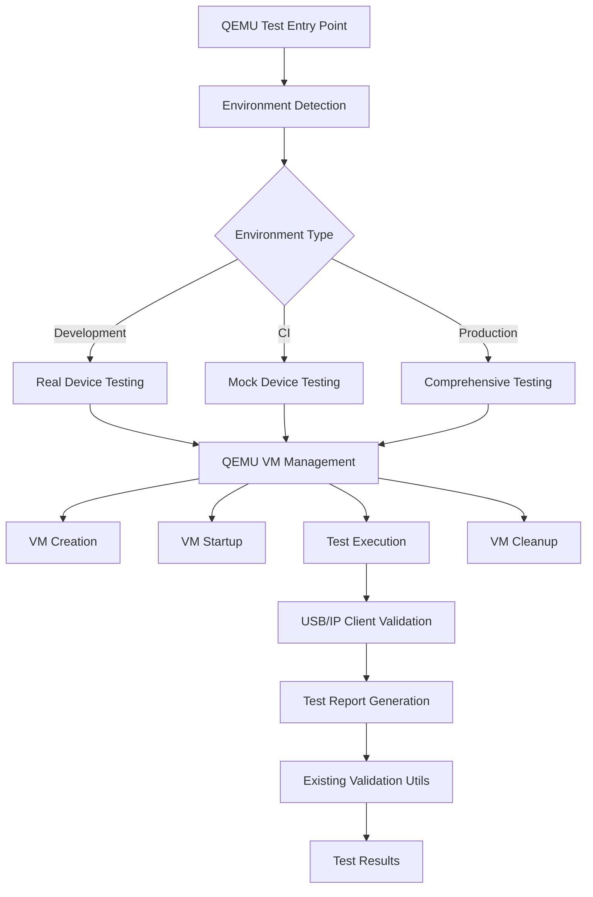

# Design Document

## Overview

The QEMU testing infrastructure will provide end-to-end validation capabilities for the usbipd-mac USB/IP protocol implementation through minimal QEMU VM management and environment-aware testing. The design builds upon the existing test validation utilities while adding VM lifecycle management and environment-specific test execution patterns.

The implementation will be lightweight, focusing on essential QEMU functionality rather than comprehensive virtualization features. It will integrate seamlessly with the existing three-tier testing strategy (development/CI/production) and leverage current Swift test infrastructure.

## Steering Document Alignment

### Technical Standards (tech.md)
The design follows the established Swift-centric development approach with bash scripting for system integration tasks. QEMU integration maintains the project's focus on macOS System Extension development while providing cross-platform testing capabilities.

### Project Structure (structure.md)
QEMU components will integrate into the existing `Scripts/` directory structure and extend the current `Sources/QEMUTestServer/` placeholder, maintaining consistency with the established project organization.

## Code Reuse Analysis

### Existing Components to Leverage
- **Scripts/qemu-test-validation.sh**: Complete environment-aware validation utilities for log parsing, readiness detection, and test reporting
- **Sources/QEMUTestServer/main.swift**: Placeholder Swift executable to be enhanced with actual USB/IP test server functionality
- **Scripts/test-environment-setup.sh**: Environment detection and configuration patterns
- **Scripts/run-*-tests.sh**: Existing test execution framework for integration

### Integration Points
- **Swift Test Framework**: QEMU tests will integrate as optional test suites with `swift test --filter QEMUIntegrationTests`
- **Environment-Based Testing**: Leverage existing TEST_ENVIRONMENT variable patterns from current test infrastructure
- **CI Pipeline**: Integrate with existing GitHub Actions workflow using established CI patterns

## Architecture

### Modular Design Principles
- **Single File Responsibility**: Each script handles one specific QEMU operation (create, start, test, cleanup)
- **Component Isolation**: VM management, test execution, and validation are separate concerns
- **Service Layer Separation**: QEMU operations, USB/IP protocol testing, and result validation remain distinct
- **Utility Modularity**: Reuse existing validation utilities rather than creating duplicates



## Components and Interfaces

### Component 1: QEMU VM Manager Script
- **Purpose:** Manages QEMU VM lifecycle (create, start, stop, cleanup)
- **Interfaces:** 
  - `create_vm()` - Creates minimal Linux image with USB/IP client
  - `start_vm()` - Boots VM with network configuration
  - `stop_vm()` - Gracefully shuts down VM
  - `cleanup_vm()` - Removes VM resources
- **Dependencies:** QEMU system tools, basic disk image utilities
- **Reuses:** Environment detection patterns from existing scripts

### Component 2: QEMU Test Server Enhancement
- **Purpose:** Provides actual USB/IP server functionality for testing
- **Interfaces:**
  - `startServer()` - Starts USB/IP server with device simulation
  - `stopServer()` - Stops server gracefully
  - `getDeviceList()` - Returns available test devices
  - `simulateDeviceOperations()` - Handles import/export requests
- **Dependencies:** USBIPDCore protocol implementation
- **Reuses:** Existing USB/IP protocol code from Sources/USBIPDCore/

### Component 3: QEMU Test Orchestrator Script
- **Purpose:** Coordinates complete QEMU test execution workflows
- **Interfaces:**
  - `run_qemu_tests()` - Main entry point for test execution
  - `validate_environment()` - Checks QEMU availability and environment
  - `execute_test_scenarios()` - Runs environment-specific test cases
- **Dependencies:** VM Manager, Test Server, Validation utilities
- **Reuses:** Scripts/qemu-test-validation.sh for all validation logic

### Component 4: Environment-Specific Test Configurations
- **Purpose:** Defines test scenarios for different environments
- **Interfaces:**
  - Development: Real device integration with short timeouts
  - CI: Mock devices with reliable automation focus
  - Production: Comprehensive validation with extended timeouts
- **Dependencies:** Environment detection from existing test infrastructure
- **Reuses:** TEST_ENVIRONMENT patterns from Scripts/run-*-tests.sh

## Data Models

### QEMU VM Configuration
```swift
struct QEMUVMConfig {
    let vmName: String
    let memoryMB: Int           // Default: 512
    let diskSizeGB: Int         // Default: 1
    let networkPort: Int        // Default: 3240
    let timeoutSeconds: Int     // Environment-specific
    let enableKVM: Bool         // Platform-dependent
}
```

### Test Scenario Definition
```swift
struct QEMUTestScenario {
    let name: String
    let environment: TestEnvironment
    let deviceCount: Int
    let operationsToTest: [USBIPOperation]
    let expectedResults: [String]
    let timeoutSeconds: Int
}
```

### VM State Tracking
```bash
# VM state file format (JSON)
{
    "vmName": "usbipd-test-vm",
    "pid": 12345,
    "status": "running",
    "ipAddress": "192.168.122.100",
    "startTime": "2025-08-13T04:30:00Z",
    "logFile": "/path/to/console.log"
}
```

## Error Handling

### Error Scenarios
1. **QEMU Not Available:** 
   - **Handling:** Graceful degradation to existing tests only
   - **User Impact:** Warning message, tests continue without QEMU validation

2. **VM Creation Failure:**
   - **Handling:** Cleanup partial resources, provide specific error details
   - **User Impact:** Clear error message with troubleshooting suggestions

3. **VM Boot Timeout:**
   - **Handling:** Force VM shutdown, cleanup resources, log diagnostic info
   - **User Impact:** Timeout message with suggested environment adjustments

4. **USB/IP Client Connection Failure:**
   - **Handling:** Retry with exponential backoff, validate network configuration
   - **User Impact:** Progressive status updates, final failure message with diagnostics

5. **Resource Cleanup Failure:**
   - **Handling:** Attempt multiple cleanup strategies, warn about remaining resources
   - **User Impact:** Warning about manual cleanup required with specific commands

## Testing Strategy

### Unit Testing
- **QEMU VM Manager**: Mock QEMU commands to test VM lifecycle logic
- **Test Server Enhancement**: Test USB/IP protocol handling using existing test patterns
- **Configuration Validation**: Test environment detection and parameter validation

### Integration Testing
- **VM to Server Communication**: End-to-end protocol validation using actual QEMU VMs
- **Environment Switching**: Verify correct behavior across development/CI/production modes
- **Existing Test Integration**: Ensure QEMU tests integrate properly with Swift test framework

### End-to-End Testing
- **Complete Test Workflows**: Full test execution from VM creation to result reporting
- **Error Recovery**: Test failure scenarios and cleanup procedures
- **Performance Validation**: Verify startup times and resource usage meet requirements

## Implementation Plan

### Phase 1: Core QEMU VM Management
- Implement basic VM creation and lifecycle management scripts
- Integrate with existing environment detection patterns
- Create minimal Linux image with USB/IP client tools

### Phase 2: Test Server Enhancement
- Extend Sources/QEMUTestServer/main.swift with actual USB/IP functionality
- Implement device simulation and protocol handling
- Integrate with existing USBIPDCore protocol implementation

### Phase 3: Test Orchestration and Integration
- Create main QEMU test orchestrator script
- Integrate with existing test execution scripts (run-*-tests.sh)
- Add QEMU test suites to Swift test framework

### Phase 4: Environment-Specific Optimization
- Implement environment-specific test scenarios
- Optimize VM configurations for different environments
- Add comprehensive error handling and recovery

## File Structure

```
Scripts/
├── qemu-test-validation.sh        # Existing - Enhanced validation utilities
├── qemu-vm-manager.sh             # New - VM lifecycle management
├── qemu-test-orchestrator.sh      # New - Main test coordination
└── qemu-images/
    ├── create-test-image.sh       # New - VM image creation
    └── test-vm-config.json        # New - VM configuration templates

Sources/
└── QEMUTestServer/
    ├── main.swift                 # Enhanced - Actual USB/IP server
    ├── TestDeviceSimulator.swift  # New - Device simulation
    └── QEMUTestConfiguration.swift # New - Test configuration

Tests/
└── QEMUIntegrationTests/
    ├── QEMUVMManagerTests.swift   # New - VM management tests
    ├── QEMUTestServerTests.swift  # New - Test server tests
    └── QEMUOrchestrationTests.swift # New - Integration tests
```

## Performance Considerations

### VM Startup Optimization
- Use minimal Linux distributions (Alpine, BusyBox-based)
- Pre-compile USB/IP client tools in base image
- Enable KVM acceleration when available on host platform

### Resource Management
- Implement VM pooling for faster test execution
- Use copy-on-write disk images to reduce storage overhead
- Automatic resource cleanup with timeout-based garbage collection

### Network Optimization
- Use user-mode networking for improved portability
- Implement connection pooling for USB/IP protocol testing
- Optimize network buffer sizes for test data throughput

## Integration Points

### Swift Test Framework Integration
```swift
// Example integration with existing test structure
class QEMUIntegrationTests: XCTestCase {
    func testQEMUEnvironmentAvailable() throws {
        let available = try QEMUEnvironment.checkAvailability()
        XCTAssertTrue(available, "QEMU should be available for integration tests")
    }
    
    func testEndToEndUSBIPProtocol() throws {
        try XCTSkipIf(!QEMUEnvironment.isAvailable, "QEMU not available")
        // Run full end-to-end test using QEMU VM
    }
}
```

### CI Pipeline Integration
```bash
# Integration with existing CI test execution
./Scripts/run-ci-tests.sh          # Existing CI tests
./Scripts/qemu-test-orchestrator.sh ci  # New QEMU CI tests
```

### Environment Variable Integration
```bash
# Reuse existing environment patterns
TEST_ENVIRONMENT=ci ./Scripts/qemu-test-orchestrator.sh
ENABLE_QEMU_TESTS=true swift test --filter QEMUIntegrationTests
```

This design provides a comprehensive but minimal QEMU testing infrastructure that integrates naturally with the existing codebase while enabling powerful end-to-end validation capabilities.