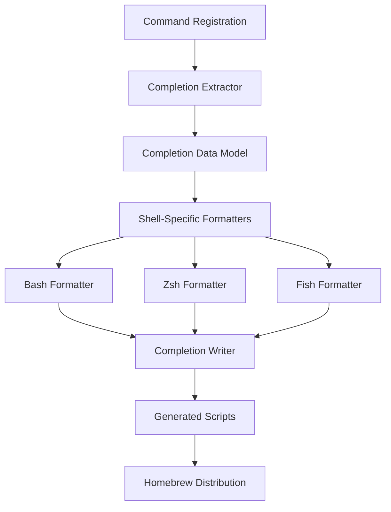

# Design Document

## Overview

The shell completions feature will add intelligent tab completion support for the usbipd CLI across bash, zsh, and fish shells. The design leverages the existing command registration system and extends it with completion generation capabilities. Completion scripts will be automatically generated during the build process and distributed via the Homebrew tap repository as part of the release workflow.

## Steering Document Alignment

### Technical Standards (tech.md)

- **Swift Language Choice**: Maintains Swift-first approach with native macOS integration
- **Modular Design**: Follows the existing multi-target architecture by adding completion generation as a separate module
- **Swift Package Manager**: Integrates completion generation into the existing SPM build system
- **Dependency Management**: Uses only system frameworks and existing project dependencies
- **Git Workflow**: Implementation will follow the mandatory feature branch workflow with incremental commits and PR creation

### Project Structure (structure.md)

- **Directory Organization**: Completion generation code will be placed in `Sources/USBIPDCore/CLI/` following existing patterns
- **File Naming**: Uses PascalCase for Swift files (`CompletionGenerator.swift`, `ShellCompletionWriter.swift`)
- **Import Patterns**: Follows established import order (Foundation, internal modules, relative imports)
- **Single Responsibility**: Each completion-related file handles one specific concern (generation, writing, shell-specific formatting)
- **Module Boundaries**: Completion functionality extends USBIPDCore without creating new target dependencies

## Code Reuse Analysis

### Existing Components to Leverage

- **CommandLineParser**: Extends the existing command registration system to extract completion metadata
- **Command Protocol**: Leverages the existing Command protocol to automatically discover available commands and options
- **Logger**: Reuses the existing logging infrastructure for completion generation debugging
- **Build System**: Integrates with existing Swift Package Manager build process
- **Release Scripts**: Extends existing release automation in `Scripts/prepare-release.sh`

### Integration Points

- **CLI Command Registration**: Hooks into the existing `registerCommands()` method to extract completion data
- **Build Process**: Integrates completion generation into the standard `swift build` workflow
- **Homebrew Formula**: Extends the existing tap repository formula to install completion scripts
- **Release Workflow**: Integrates with existing GitHub Actions release pipeline

## Architecture

The completion system follows a **layered generation pattern** with clear separation between completion logic, shell-specific formatting, and distribution:



### Modular Design Principles

- **Single File Responsibility**: Separate files for extraction, formatting, and writing concerns
- **Component Isolation**: Shell-specific formatters are independent and swappable
- **Service Layer Separation**: Clear boundaries between data extraction, transformation, and output
- **Utility Modularity**: Reusable completion data structures across all shell formats

## Components and Interfaces

### CompletionExtractor
- **Purpose:** Extracts completion metadata from registered Command instances
- **Interfaces:** 
  - `extractCompletions(from: [Command]) -> CompletionData`
  - `extractCommandOptions(from: Command) -> [CompletionOption]`
- **Dependencies:** CommandLineParser, Command protocol
- **Reuses:** Existing command registration system and Command protocol

### CompletionData (Model)
- **Purpose:** Unified data structure representing completion information
- **Interfaces:** Codable struct with commands, options, and dynamic value providers
- **Dependencies:** Foundation
- **Reuses:** Existing USBDevice models for device completion

### ShellCompletionFormatter (Protocol)
- **Purpose:** Abstract interface for shell-specific completion formatting
- **Interfaces:** `formatCompletion(data: CompletionData) -> String`
- **Dependencies:** CompletionData
- **Reuses:** Common formatting utilities from existing codebase

### BashCompletionFormatter
- **Purpose:** Generates bash-compatible completion scripts
- **Interfaces:** Implements ShellCompletionFormatter
- **Dependencies:** Foundation
- **Reuses:** Command metadata extraction patterns

### ZshCompletionFormatter  
- **Purpose:** Generates zsh-compatible completion scripts with descriptions
- **Interfaces:** Implements ShellCompletionFormatter
- **Dependencies:** Foundation
- **Reuses:** Command help text from existing Command implementations

### FishCompletionFormatter
- **Purpose:** Generates fish-compatible completion scripts with intelligent suggestions
- **Interfaces:** Implements ShellCompletionFormatter  
- **Dependencies:** Foundation
- **Reuses:** Device enumeration patterns for dynamic completion

### CompletionWriter
- **Purpose:** Writes generated completion scripts to filesystem during build
- **Interfaces:** 
  - `writeCompletions(data: CompletionData, outputDirectory: String)`
  - `validateOutputDirectory(path: String) -> Bool`
- **Dependencies:** FileManager, ShellCompletionFormatter implementations
- **Reuses:** Existing file writing patterns from configuration management

### CompletionCommand (New CLI Command)
- **Purpose:** Provides manual completion generation for development and testing
- **Interfaces:** Implements Command protocol
- **Dependencies:** CompletionExtractor, CompletionWriter
- **Reuses:** Existing command infrastructure and error handling patterns

## Data Models

### CompletionData
```swift
struct CompletionData: Codable {
    let commands: [CompletionCommand]
    let globalOptions: [CompletionOption]
    let dynamicProviders: [DynamicValueProvider]
    let metadata: CompletionMetadata
}
```

### CompletionCommand
```swift
struct CompletionCommand: Codable {
    let name: String
    let description: String
    let options: [CompletionOption]
    let arguments: [CompletionArgument]
    let subcommands: [CompletionCommand]
}
```

### CompletionOption
```swift
struct CompletionOption: Codable {
    let short: String?
    let long: String
    let description: String
    let takesValue: Bool
    let valueType: CompletionValueType
}
```

### DynamicValueProvider
```swift
struct DynamicValueProvider: Codable {
    let context: String // e.g., "device-id", "ip-address"
    let command: String // Shell command to execute for dynamic completion
    let fallback: [String] // Static fallback values
}
```

## Error Handling

### Error Scenarios

1. **Completion Generation Failure:**
   - **Handling:** Log error but don't fail build process, generate empty completion scripts
   - **User Impact:** Completions unavailable but CLI functions normally

2. **File System Write Errors:**
   - **Handling:** Use Swift Result type with detailed error context, attempt retry with temp directory
   - **User Impact:** Completions not generated but build continues successfully

3. **Shell Format Validation Errors:**
   - **Handling:** Skip invalid shell formats, continue with valid ones
   - **User Impact:** Some shells may not have completions but others will work

4. **Dynamic Value Provider Failures:**
   - **Handling:** Fall back to static completion values, log failure context
   - **User Impact:** Less intelligent completion but basic functionality remains

## Testing Strategy

### Unit Testing

- **CompletionExtractor Tests:** Verify extraction of commands and options from mock Command implementations
- **Shell Formatter Tests:** Validate generated completion script syntax for each shell type
- **CompletionData Model Tests:** Test serialization, validation, and data integrity
- **Dynamic Provider Tests:** Test fallback behavior and error handling

### Integration Testing

- **End-to-End Generation:** Test complete workflow from command registration to file output
- **Shell Validation:** Execute generated scripts in actual shell environments to verify syntax
- **Homebrew Integration:** Test installation of completion scripts through formula
- **Release Workflow:** Validate completion generation during automated release process

### End-to-End Testing

- **User Workflow Simulation:** Test actual tab completion in live shell environments
- **Cross-Shell Compatibility:** Verify consistent behavior across bash, zsh, and fish
- **Dynamic Completion:** Test device ID and IP address completion with live system data
- **Installation Verification:** Test completion availability after Homebrew installation