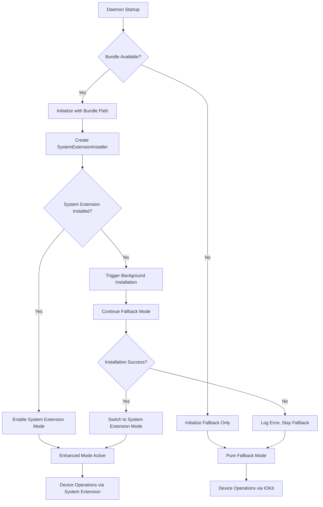

# Design Document

## Overview

The System Extension Activation design implements automatic, transparent System Extension installation and activation by connecting the existing sophisticated installation infrastructure to the runtime daemon initialization. The design leverages the comprehensive `SystemExtensionInstaller`, `SystemExtensionBundleCreator`, and `SystemExtensionLifecycleManager` components already built into the USBIPDCore library, requiring minimal new code while enabling the dormant System Extension capabilities.

The approach transforms the current "compatibility mode" operation into a seamless hybrid system that begins with immediate fallback functionality and automatically upgrades to System Extension mode when available, providing enhanced USB device control without any user intervention or workflow disruption.

## Steering Document Alignment

### Technical Standards (tech.md)
- **Swift Package Manager Integration**: Bundle creation integrated into existing SPM build process
- **IOKit Framework Utilization**: Maintains existing IOKit-based fallback while adding System Extension enhancement layer
- **Modular Architecture**: Reuses existing USBIPDCore components with clear separation between fallback and enhanced modes
- **Dependency Injection Pattern**: Extends existing ServerCoordinator initialization to inject bundle parameters

### Project Structure (structure.md)
- **Target Separation**: SystemExtension target remains isolated, USBIPDCore provides installation infrastructure
- **CLI Command Pattern**: Minimal changes to USBIPDCLI, leveraging existing ServerCoordinator dependency injection
- **Sources Organization**: No new directories required, extends existing SystemExtension/ infrastructure
- **Testing Integration**: Builds on existing IntegrationTests for System Extension installation workflows

## Code Reuse Analysis

### Existing Components to Leverage
- **SystemExtensionInstaller**: Complete installation workflow with OSSystemExtensionManager integration, bundle validation, and error handling
- **SystemExtensionBundleCreator**: Comprehensive bundle creation with Info.plist generation, executable copying, and validation
- **SystemExtensionLifecycleManager**: Health monitoring, recovery management, and status tracking
- **CodeSigningManager**: Certificate detection, bundle signing, and development mode handling
- **ServerCoordinator**: Existing infrastructure for conditional System Extension enablement (lines 344-364)

### Integration Points
- **main.swift**: Extend ServerCoordinator initialization to provide bundle path and identifier parameters
- **ServerConfig**: Add System Extension bundle configuration storage for persistence across restarts
- **SystemExtensionManager**: Existing device claiming coordinator that bridges fallback and System Extension modes
- **StatusCommand**: Extend existing status reporting to distinguish between fallback and System Extension modes

## Architecture

The design implements a **Hybrid Initialization Pattern** where the system begins in fallback mode and automatically transitions to System Extension mode when installation completes. This ensures immediate functionality while enabling enhanced capabilities transparently.

### Modular Design Principles
- **Zero-Disruption Activation**: Current operations continue uninterrupted during System Extension installation
- **Automatic Detection**: Bundle availability detected at build time and communicated to runtime
- **Graceful Fallback**: Installation failures result in continued fallback operation without error states
- **State Persistence**: Installation attempts and status persisted to avoid repeated failures



## Components and Interfaces

### Bundle Detection and Build Integration

**Purpose:** Automatically create System Extension bundle during build and make location available to runtime
**Interfaces:** Swift Package Manager build process extension, bundle path detection utility
**Dependencies:** Existing SystemExtension target build, SystemExtensionBundleCreator
**Reuses:** Package.swift target configuration, existing bundle creation infrastructure

```swift
// New: Bundle path detection utility
public struct SystemExtensionBundleDetector {
    public static func detectBundlePath() -> String? {
        // Search for .systemextension bundle in .build directory
        // Return standardized path if found
    }
    
    public static let bundleIdentifier = "com.github.usbipd-mac.systemextension"
}
```

### Enhanced ServerCoordinator Initialization

**Purpose:** Extend existing ServerCoordinator to automatically provide bundle parameters when available
**Interfaces:** Backward-compatible constructor overload, automatic bundle detection
**Dependencies:** SystemExtensionBundleDetector, existing ServerCoordinator infrastructure
**Reuses:** Existing conditional System Extension enablement logic (lines 344-364)

```swift
// Enhanced: Automatic bundle detection in main.swift
let bundlePath = SystemExtensionBundleDetector.detectBundlePath()
let bundleIdentifier = SystemExtensionBundleDetector.bundleIdentifier

let server = ServerCoordinator(
    networkService: networkService,
    deviceDiscovery: deviceDiscovery,
    deviceClaimManager: deviceClaimManager,
    config: serverConfig,
    systemExtensionBundlePath: bundlePath,  // Automatically detected
    systemExtensionBundleIdentifier: bundleIdentifier  // Static identifier
)
```

### Automatic Installation Manager

**Purpose:** Coordinate automatic System Extension installation without blocking operations
**Interfaces:** Background installation coordination, fallback continuity management
**Dependencies:** SystemExtensionInstaller, SystemExtensionLifecycleManager
**Reuses:** Complete existing installation infrastructure, requires no modifications

```swift
// New: Automatic installation coordinator
public class AutomaticInstallationManager {
    private let installer: SystemExtensionInstaller
    private let lifecycleManager: SystemExtensionLifecycleManager
    
    public func attemptAutomaticInstallation() async {
        // Use existing SystemExtensionInstaller.installSystemExtension()
        // Handle success/failure without breaking current operations
        // Update internal state for status reporting
    }
}
```

### Enhanced Status Reporting

**Purpose:** Provide clear visibility into System Extension status and automatic installation progress
**Interfaces:** Extended StatusCommand output, installation progress indication
**Dependencies:** Existing SystemExtensionStatus models, StatusCommand infrastructure
**Reuses:** SystemExtensionStatus, SystemExtensionInstallationStatus, existing status formatting

```swift
// Enhanced: Status command with System Extension awareness
extension StatusCommand {
    private func formatSystemExtensionStatus() -> String {
        // Leverage existing SystemExtensionStatus model
        // Add automatic installation status indicators
        // Provide clear user guidance when needed
    }
}
```

## Data Models

### Installation State Model
```swift
// Extend existing SystemExtensionStatus model
public enum AutomaticInstallationStatus {
    case notAttempted           // Bundle not available or not tried yet
    case inProgress             // Background installation active
    case completed              // Installation succeeded, System Extension active
    case failed(Error)          // Installation failed, using fallback mode
    case userApprovalRequired   // Waiting for System Preferences approval
}
```

### Bundle Configuration Model
```swift
// New: Persistent bundle configuration
public struct SystemExtensionBundleConfig: Codable {
    public let bundlePath: String
    public let bundleIdentifier: String
    public let detectedAt: Date
    public let lastInstallationAttempt: Date?
    public let installationStatus: AutomaticInstallationStatus
}
```

## Error Handling

### Error Scenarios

1. **Bundle Creation Failure During Build**
   - **Handling:** Log warning, continue build without System Extension capability
   - **User Impact:** System operates in fallback mode only, status indicates bundle unavailable

2. **System Extension Installation Failure**
   - **Handling:** Log specific error, persist failure state, continue fallback operation
   - **User Impact:** Seamless operation continues, status shows installation failed with troubleshooting link

3. **User Approval Required**
   - **Handling:** Display approval message once, continue fallback mode, retry on next startup
   - **User Impact:** Single notification about System Preferences, immediate functionality maintained

4. **Code Signing Issues in Development**
   - **Handling:** Attempt unsigned installation if development mode enabled, log certificate status
   - **User Impact:** Transparent operation, status indicates development mode usage

5. **System Extension Load Failure**
   - **Handling:** Detect loading failure, fall back to IOKit mode, mark installation as failed
   - **User Impact:** No functional impact, enhanced features unavailable but basic functionality preserved

## Testing Strategy

### Unit Testing
- **Bundle Detection Logic**: Test bundle path discovery in various build configurations
- **Installation State Management**: Test automatic installation state transitions and persistence
- **Status Reporting**: Test status output formatting for all installation states
- **Error Handling**: Test graceful fallback behavior for all failure scenarios

### Integration Testing
- **End-to-End Installation**: Test complete automatic installation workflow with mock System Extension
- **Fallback Continuity**: Test seamless operation during installation and after installation failure
- **Status Accuracy**: Test status reporting accuracy across installation lifecycle
- **Configuration Persistence**: Test bundle configuration storage and restoration

### End-to-End Testing
- **User Scenarios**: Test complete workflows from fresh installation through device operations
- **Development Mode**: Test installation behavior with and without development certificates
- **System Extension Lifecycle**: Test installation, activation, and recovery scenarios
- **Performance Impact**: Test that automatic installation doesn't affect operation performance