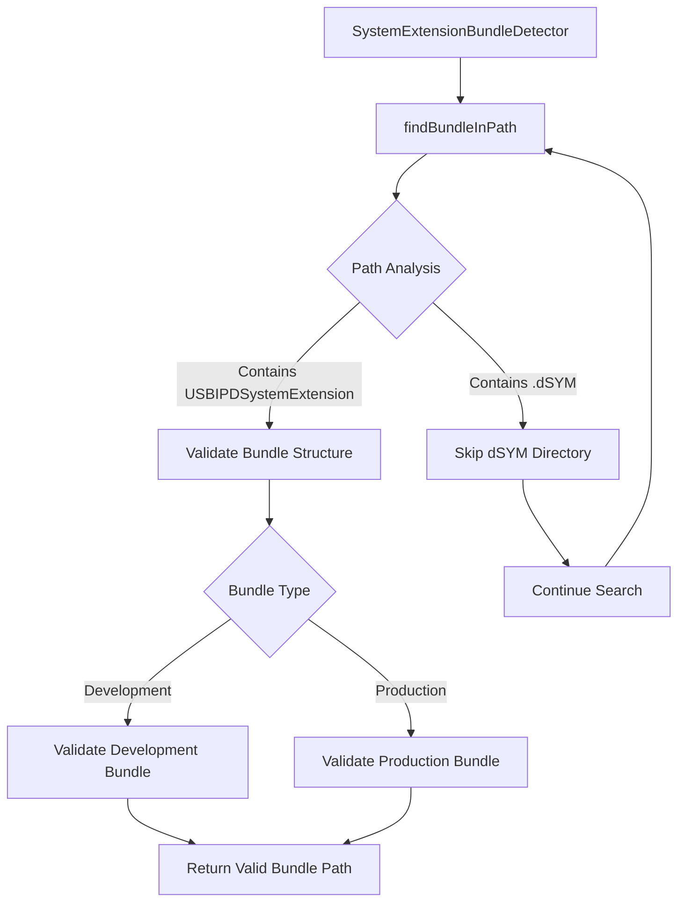

# Design Document

## Overview

This design addresses critical bugs in the System Extension bundle detection and validation system in usbipd-mac. The current implementation incorrectly identifies debug symbols (dSYM directories) as valid System Extension bundles, causing installation failures with `SystemExtensionSubmissionError error 1`.

The solution involves modifying the `SystemExtensionBundleDetector` to exclude dSYM paths from detection and improving bundle validation to properly handle development vs production bundle structures.

## Steering Document Alignment

### Technical Standards (tech.md)
- **Swift Language Choice**: Maintain existing Swift implementation with IOKit integration
- **Error Recovery**: Implement graceful handling of detection failures and invalid bundle paths
- **Modular Architecture**: Keep bundle detection isolated within existing USBIPDCore target structure

### Project Structure (structure.md)
- **File Organization**: Modifications contained within existing `SystemExtension/BundleDetection/` directory structure
- **Module Boundaries**: Changes isolated to USBIPDCore without affecting CLI or other targets
- **Naming Conventions**: Follow existing `PascalCase` patterns for Swift source files

## Code Reuse Analysis

### Existing Components to Leverage
- **SystemExtensionBundleDetector.swift**: Core detection logic will be enhanced rather than replaced
- **SystemExtensionSubmissionManager.swift**: Bundle validation integration points remain unchanged
- **Logger**: Existing logging infrastructure for enhanced error reporting and diagnostics
- **FileManager**: Continue using Foundation FileManager for file system operations

### Integration Points
- **main.swift**: Bundle detection calls remain the same, improved error handling through existing interfaces
- **Commands.swift**: Diagnostic command integration continues to use existing bundle detector APIs
- **InstallationOrchestrator.swift**: Bundle validation workflows integrate with enhanced detection results

## Architecture

The fix maintains the existing modular design while enhancing the bundle detection and validation logic:

### Core Design Principles
- **Backward Compatibility**: All existing public APIs remain unchanged
- **Enhanced Validation**: Improve detection accuracy without breaking existing workflows
- **Error Transparency**: Provide clear diagnostic information for troubleshooting



### Modular Design Principles
- **Single File Responsibility**: Bundle detection logic remains isolated in `SystemExtensionBundleDetector.swift`
- **Component Isolation**: Detection and validation functions separated for independent testing
- **Service Layer Separation**: Bundle detection continues to serve higher-level installation orchestration
- **Utility Modularity**: Enhanced path filtering and validation utilities remain internal to detector

## Components and Interfaces

### Enhanced SystemExtensionBundleDetector

**Purpose:** Detect valid System Extension bundles while excluding debug symbols and invalid paths

**Enhanced Methods:**
- `findBundleInPath(_ path: URL) -> URL?` - Modified to exclude dSYM paths
- `validateBundle(at bundlePath: URL) -> BundleValidationResult` - Enhanced development bundle support
- `isDSYMPath(_ path: URL) -> Bool` - New utility method for dSYM detection

**Dependencies:** Foundation.FileManager, existing validation utilities

**Reuses:** Existing recursive search logic, bundle validation framework, path utilities

### Enhanced Bundle Validation Logic

**Purpose:** Properly validate both development and production bundle structures

**New Validation Rules:**
- Development bundles: Validate presence of USBIPDSystemExtension executable
- Production bundles: Validate .systemextension structure with Info.plist
- Path exclusions: Reject any paths containing .dSYM components

**Interfaces:** 
- Input: Bundle path URL and environment context
- Output: BundleValidationResult with enhanced error information

**Dependencies:** Existing PropertyListSerialization, file system checks

**Reuses:** Current validation framework with enhanced rules

### Enhanced Error Reporting

**Purpose:** Provide clear diagnostic information for bundle detection failures

**Enhanced Logging:**
- Specific warnings when dSYM paths are encountered and skipped
- Clear error messages distinguishing detection vs validation failures
- Detailed path information in diagnostic output

**Interfaces:** Leverages existing Logger infrastructure

**Dependencies:** Common/Logger.swift

**Reuses:** Existing logging patterns with enhanced context information

## Data Models

### Enhanced BundleValidationResult
```swift
struct BundleValidationResult {
    let isValid: Bool
    let issues: [String]
    let bundleType: BundleType // New: .development or .production
    let rejectionReason: RejectionReason? // New: .dSYMPath, .missingExecutable, etc.
}

enum BundleType {
    case development
    case production
}

enum RejectionReason {
    case dSYMPath
    case missingExecutable  
    case invalidBundleStructure
    case missingInfoPlist
}
```

### Enhanced DetectionResult
```swift
// Existing DetectionResult structure extended with:
struct DetectionResult {
    // ... existing properties ...
    let skippedPaths: [String] // New: paths that were skipped during detection
    let rejectionReasons: [String: RejectionReason] // New: reasons for path rejections
}
```

## Error Handling

### Error Scenarios

1. **dSYM Path Detection**
   - **Handling:** Skip dSYM directories during recursive search, log as debug information
   - **User Impact:** No visible impact, improved reliability

2. **Missing Development Bundle**
   - **Handling:** Clear error message indicating no valid bundle found in build directory  
   - **User Impact:** Actionable error message suggesting `swift build` command

3. **Bundle Validation Failure**
   - **Handling:** Detailed validation errors with specific missing components identified
   - **User Impact:** Clear indication of whether issue is development setup or production deployment

4. **File System Access Errors**
   - **Handling:** Graceful degradation with clear error reporting
   - **User Impact:** Permission or access issues clearly identified

### Error Recovery Strategies
- **Detection Failures:** Continue searching other paths, aggregate all issues for final reporting
- **Validation Failures:** Provide specific remediation steps based on bundle type and missing components
- **Installation Failures:** Enhanced error context to distinguish bundle detection vs macOS System Extension submission issues

## Testing Strategy

### Unit Testing

**Enhanced Test Coverage:**
- `testDSYMPathExclusion()` - Verify dSYM directories are properly excluded
- `testDevelopmentBundleValidation()` - Test development bundle structure validation
- `testProductionBundleValidation()` - Test production bundle structure validation
- `testErrorReporting()` - Verify enhanced error messages and diagnostic information

**Key Components to Test:**
- Bundle detection logic with mock file systems including dSYM directories
- Validation logic for both development and production bundle structures
- Error reporting and diagnostic output formatting

### Integration Testing

**Enhanced Integration Flows:**
- End-to-end bundle detection in development environment with actual build artifacts
- System Extension installation workflow with corrected bundle detection
- Diagnostic command output verification with enhanced error reporting

**Key Flows to Test:**
- `usbipd install-system-extension` with corrected bundle detection
- `usbipd diagnose` with enhanced diagnostic information
- Bundle detection across different build configurations (debug/release, architecture variations)

### End-to-End Testing

**User Scenarios to Test:**
- Developer workflow: Build project, install System Extension, verify functionality
- Troubleshooting workflow: Diagnose installation failures, interpret error messages
- Production deployment: Verify Homebrew-installed bundles work correctly

**Test Environment Coverage:**
- Development environment with .build directory structure
- Production environment with Homebrew installation paths
- Error scenarios with missing or corrupted bundle structures