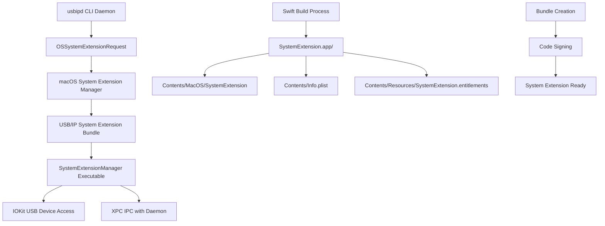

# Design Document

## Overview

This design document specifies the implementation of System Extension bundle creation and macOS registration for usbipd-mac. The current implementation has complete System Extension functionality implemented as Swift library code, but lacks the proper macOS bundle structure and installation mechanisms needed for deployment.

The solution involves:
1. Converting the existing SystemExtension library target to an executable target
2. Creating proper System Extension bundle structure during build
3. Implementing System Extension installation and lifecycle management
4. Integrating with the existing USB/IP daemon for seamless operation

## Steering Document Alignment

### Technical Standards (tech.md)
The implementation follows established Swift Package Manager patterns and leverages existing IOKit integration. The modular architecture maintains clear separation between the System Extension executable and the main daemon, following the dependency injection patterns already established in the codebase.

### Project Structure (structure.md)
The System Extension bundle will be created within the existing `.build/` directory structure, maintaining consistency with current build outputs. The SystemExtension source directory structure remains unchanged, with only build configuration modifications required.

## Code Reuse Analysis

The design leverages extensive existing functionality:

### Existing Components to Leverage
- **SystemExtensionManager**: Complete System Extension coordination logic already implemented
- **IOKitDeviceClaimer**: USB device claiming functionality through IOKit interfaces
- **XPCIPCHandler**: IPC communication between daemon and System Extension
- **DeviceHealthTracker**: Device monitoring and status tracking
- **Logger**: Unified logging system with proper subsystem categorization

### Integration Points
- **USBIPDCLI**: Main daemon will trigger System Extension installation via OSSystemExtensionRequest
- **Build System**: Swift Package Manager will be extended to generate System Extension bundles
- **Configuration**: Existing ServerConfig and SystemExtensionManagerConfig provide configuration management
- **Testing**: Integration tests already exist and will be extended for bundle installation testing

## Architecture

The System Extension bundle architecture follows Apple's prescribed structure with these key components:



### Modular Design Principles
- **Single Executable Responsibility**: System Extension executable focuses solely on USB device claiming and IPC communication
- **Process Separation**: System Extension runs in separate process with restricted permissions
- **State Synchronization**: Device claim state synchronized between daemon and extension via IPC
- **Error Isolation**: System Extension failures don't crash main daemon

## Components and Interfaces

### Component 1: System Extension Executable Target

- **Purpose:** Standalone executable that serves as the System Extension entry point
- **Interfaces:** 
  - `main()` function that initializes SystemExtensionManager
  - NSSystemExtension protocol conformance for lifecycle management
  - XPC service registration for IPC communication
- **Dependencies:** SystemExtension library, Common utilities, IOKit
- **Reuses:** Complete SystemExtensionManager implementation, existing logging and error handling

### Component 2: Bundle Builder

- **Purpose:** Swift Package Manager plugin/script to create System Extension bundle structure
- **Interfaces:**
  - Build phase integration with SPM
  - Bundle generation with proper directory structure
  - Info.plist template processing and customization
- **Dependencies:** Swift Package Manager build system, file system operations
- **Reuses:** Existing build configuration, entitlements file, version information

### Component 3: System Extension Installer

- **Purpose:** Handles OSSystemExtensionRequest lifecycle and user interaction
- **Interfaces:**
  - `OSSystemExtensionRequestDelegate` protocol implementation
  - Installation progress and status reporting
  - Error handling and user messaging
- **Dependencies:** SystemExtensions framework, existing daemon architecture
- **Reuses:** Logger for status reporting, existing error handling patterns

### Component 4: Lifecycle Manager

- **Purpose:** Manages System Extension activation, monitoring, and deactivation
- **Interfaces:**
  - System Extension health monitoring
  - Automatic restart on failure
  - Clean shutdown and resource cleanup
- **Dependencies:** Existing SystemExtensionManager, status monitoring components
- **Reuses:** ComprehensiveStatusMonitor, existing health check infrastructure

## Data Models

### SystemExtensionBundle Model
```swift
struct SystemExtensionBundle {
    let bundleIdentifier: String = "com.usbipd.mac.system-extension"
    let executableName: String = "SystemExtension"
    let bundlePath: URL
    let infoPropertyList: SystemExtensionInfoPlist
    let entitlements: SystemExtensionEntitlements
    let codeSigningIdentity: String?
}
```

### SystemExtensionInfoPlist Model
```swift
struct SystemExtensionInfoPlist: Codable {
    let bundleIdentifier: String
    let bundleName: String = "USB/IP System Extension"
    let bundleVersion: String
    let executableName: String
    let minimumSystemVersion: String = "11.0"
    let extensionPointIdentifier: String = "com.apple.system-extension.driver-extension"
    let principalClass: String = "SystemExtensionManager"
    let iokitPersonalities: [String: Any]
    let userEntitlements: [String]
}
```

### SystemExtensionInstallationState Model
```swift
enum SystemExtensionInstallationState {
    case notInstalled
    case installing
    case installed
    case activating
    case activated
    case failed(Error)
    case deactivating
    case deactivated
}
```

## Error Handling

### Error Scenarios

1. **Bundle Creation Failure**
   - **Handling:** Detailed build error reporting with specific failure reasons
   - **User Impact:** Clear build failure messages with remediation steps
   - **Recovery:** Build system retries with cleaned intermediate files

2. **System Extension Installation Denied**
   - **Handling:** OSSystemExtensionRequest failure handling with user-friendly messages
   - **User Impact:** Clear instructions to approve extension in System Preferences
   - **Recovery:** Automatic retry after user approval detected

3. **System Extension Crash/Termination**
   - **Handling:** Automatic restart through SystemExtensions framework
   - **User Impact:** Transparent recovery with temporary device claim suspension
   - **Recovery:** Device claims restored after successful restart

4. **IPC Communication Failure**
   - **Handling:** Connection retry logic with exponential backoff
   - **User Impact:** Status reporting indicates System Extension connectivity issues
   - **Recovery:** Fallback to direct IOKit access where possible

5. **Code Signing Issues**
   - **Handling:** Clear error messages about missing certificates or provisioning
   - **User Impact:** Development vs. production specific guidance
   - **Recovery:** Instructions for setting up development mode or proper certificates

## Testing Strategy

### Unit Testing
- **SystemExtensionBundleBuilder**: Test bundle creation with mock file systems
- **SystemExtensionInstaller**: Test OSSystemExtensionRequest handling with mock delegates
- **Info.plist Generation**: Validate generated plist structure and required keys
- **Entitlements Processing**: Verify entitlements file inclusion and validation

### Integration Testing
- **End-to-End Bundle Creation**: Build System Extension bundle and verify structure
- **Installation Workflow**: Test complete installation flow in development environment
- **IPC Communication**: Verify daemon-to-extension communication after installation
- **Device Claiming**: Test USB device claiming through installed System Extension

### End-to-End Testing
- **Real Device Installation**: Install System Extension on clean macOS system
- **User Approval Workflow**: Test complete user approval and activation process
- **Production Code Signing**: Verify notarized System Extension installation
- **Update Scenarios**: Test System Extension updates and version migrations

## Implementation Details

### Build System Integration

The Swift Package Manager will be extended with a custom build tool plugin that:

1. **Creates Bundle Directory Structure**:
   ```
   SystemExtension.systemextension/
   ├── Contents/
   │   ├── Info.plist
   │   ├── MacOS/
   │   │   └── SystemExtension (executable)
   │   └── Resources/
   │       └── SystemExtension.entitlements
   ```

2. **Generates Info.plist**: Template-based generation with build-time variable substitution
3. **Code Signing Integration**: Automatic code signing if certificates are available
4. **Development Mode Support**: Bundle creation without full signing for development testing

### Package.swift Modifications

```swift
// Convert SystemExtension from library to executable target
.executableTarget(
    name: "SystemExtension",
    dependencies: ["Common", "USBIPDCore"],
    resources: [
        .copy("SystemExtension.entitlements"),
        .copy("Info.plist.template")
    ],
    plugins: ["SystemExtensionBundleBuilder"]
)

// Add bundle builder plugin
.plugin(
    name: "SystemExtensionBundleBuilder",
    capability: .buildTool(),
    dependencies: ["SystemExtensionBundleBuilderTool"]
)
```

### SystemExtension main.swift

```swift
import Foundation
import SystemExtensions
import Common

@main
struct SystemExtensionMain {
    static func main() {
        let logger = Logger(
            config: LoggerConfig(level: .info),
            subsystem: "com.usbipd.mac.system-extension",
            category: "main"
        )
        
        logger.info("System Extension starting")
        
        let manager = SystemExtensionManager()
        
        // Register for system extension lifecycle events
        let delegate = SystemExtensionDelegate(manager: manager)
        
        // Start the extension
        do {
            try manager.start()
            logger.info("System Extension started successfully")
            
            // Keep running until terminated
            RunLoop.current.run()
        } catch {
            logger.error("Failed to start System Extension", context: [
                "error": error.localizedDescription
            ])
            exit(1)
        }
    }
}
```

### System Extension Installation API

```swift
public class SystemExtensionInstaller: NSObject, OSSystemExtensionRequestDelegate {
    private let logger: Logger
    private let bundlePath: URL
    private var installationRequest: OSSystemExtensionRequest?
    
    public func installSystemExtension() {
        logger.info("Starting System Extension installation")
        
        let request = OSSystemExtensionRequest.activationRequest(
            forExtensionWithIdentifier: "com.usbipd.mac.system-extension",
            queue: DispatchQueue.main
        )
        
        request.delegate = self
        self.installationRequest = request
        
        OSSystemExtensionManager.shared.submitRequest(request)
    }
    
    // MARK: - OSSystemExtensionRequestDelegate
    
    public func request(_ request: OSSystemExtensionRequest, 
                       actionForReplacingExtension existing: OSSystemExtensionProperties, 
                       withExtension ext: OSSystemExtensionProperties) -> OSSystemExtensionRequest.ReplacementAction {
        logger.info("System Extension replacement requested")
        return .replace
    }
    
    public func requestNeedsUserApproval(_ request: OSSystemExtensionRequest) {
        logger.info("System Extension requires user approval")
        // Provide user guidance for approval process
    }
    
    public func request(_ request: OSSystemExtensionRequest, 
                       didCompleteWithResult result: OSSystemExtensionRequest.Result) {
        switch result {
        case .completed:
            logger.info("System Extension installation completed successfully")
        case .willCompleteAfterReboot:
            logger.info("System Extension installation will complete after reboot")
        @unknown default:
            logger.warning("Unknown System Extension installation result")
        }
    }
    
    public func request(_ request: OSSystemExtensionRequest, 
                       didFailWithError error: Error) {
        logger.error("System Extension installation failed", context: [
            "error": error.localizedDescription
        ])
    }
}
```

### Development Workflow Support

For development and testing, the system includes:

1. **Development Mode Detection**: Automatic detection of `systemextensionsctl developer on`
2. **Unsigned Bundle Support**: Bundle creation without code signing for development
3. **Quick Rebuilds**: Efficient bundle rebuilding during development iterations
4. **Test Integration**: Integration with existing test suite for System Extension functionality

This comprehensive design ensures that the existing System Extension functionality can be properly packaged and deployed as a legitimate macOS System Extension, bridging the gap between the current library implementation and a production-ready System Extension bundle.