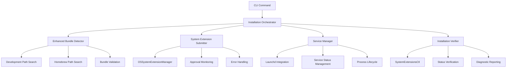

# Design Document

## Overview

This design addresses the critical System Extension installation failures in production Homebrew environments by implementing a comprehensive fix across four key areas: bundle detection, System Extension registration, service management, and installation verification. The solution maintains compatibility with existing development workflows while adding robust production environment support.

The design follows the project's established patterns of modular architecture with clear separation between detection, installation, and verification layers, while leveraging existing components like `SystemExtensionInstaller`, `EnvironmentSetupManager`, and the service coordination infrastructure.

## Steering Document Alignment

### Technical Standards (tech.md)

The design follows the established Swift Package Manager multi-target architecture, using dependency injection patterns and protocol-oriented design. All new components integrate with the existing IOKit-based device management and Network framework patterns while maintaining strict compatibility with USB/IP protocol specifications.

### Project Structure (structure.md)

New components follow the established directory organization within `Sources/USBIPDCore/SystemExtension/` with clear separation between:
- **BundleDetection/**: Enhanced bundle detection with production environment support
- **Installation/**: Orchestration of System Extension submission and verification
- **ServiceManagement/**: Integration with launchd and service lifecycle management
- **Verification/**: Status monitoring and diagnostic capabilities

## Code Reuse Analysis

### Existing Components to Leverage

- **SystemExtensionBundleDetector**: Extend existing detection logic to support Homebrew installation paths
- **SystemExtensionInstaller**: Enhance to actually perform OSSystemExtensionManager submission calls
- **EnvironmentSetupManager**: Integrate for development environment validation
- **SystemExtensionDiagnostics**: Extend diagnostic capabilities for production installation scenarios
- **Logger from Common**: Unified logging across all new components
- **ServerCoordinator**: Service lifecycle management integration

### Integration Points

- **USBIPDCLI main.swift**: Daemon startup sequence integration for System Extension coordination
- **ServerConfig**: Configuration management for bundle paths and installation preferences  
- **SystemExtensionManager**: Enhanced device claiming coordination with verified System Extension installation
- **Homebrew service scripts**: Integration with launchd service management lifecycle

## Architecture

The solution implements a **four-layer architecture** addressing each critical failure mode:

1. **Detection Layer**: Multi-environment bundle detection (development + production)
2. **Registration Layer**: Actual System Extension submission to macOS with OSSystemExtensionManager
3. **Service Layer**: Proper launchd integration and service lifecycle management
4. **Verification Layer**: Installation status monitoring and comprehensive diagnostics



### Modular Design Principles

- **Single File Responsibility**: Each component handles one aspect of installation (detection, submission, verification, etc.)
- **Component Isolation**: Bundle detection can be tested independently of System Extension submission
- **Service Layer Separation**: Installation orchestration separate from service management and status verification
- **Utility Modularity**: Shared utilities for path resolution, status checking, and error handling

## Components and Interfaces

### Component 1: ProductionBundleDetector

- **Purpose:** Extends SystemExtensionBundleDetector to support Homebrew installation paths
- **Interfaces:** 
  - `detectBundle() -> DetectionResult` - Enhanced detection with multi-environment support
  - `searchHomebrewPaths() -> [URL]` - Homebrew-specific path resolution
  - `validateProductionBundle(at: URL) -> ValidationResult` - Production bundle validation
- **Dependencies:** FileManager, SystemExtensionBundleDetector (existing)
- **Reuses:** Existing bundle validation logic from SystemExtensionBundleDetector

### Component 2: SystemExtensionSubmissionManager  

- **Purpose:** Orchestrates actual System Extension submission to macOS via OSSystemExtensionManager
- **Interfaces:**
  - `submitExtension(bundlePath: String) -> InstallationResult` - Submit extension with approval monitoring
  - `monitorApprovalStatus(completion: @escaping (ApprovalStatus) -> Void)` - Track approval progress
  - `handleSubmissionDelegate(_:)` - OSSystemExtensionRequestDelegate implementation
- **Dependencies:** SystemExtensions framework, SystemExtensionInstaller (existing)
- **Reuses:** Error handling patterns from SystemExtensionInstaller, Logger from Common

### Component 3: ServiceLifecycleManager

- **Purpose:** Coordinates System Extension installation with launchd service management
- **Interfaces:**
  - `integrateWithLaunchd() -> ServiceResult` - Ensure proper launchd registration  
  - `coordinateInstallationWithService() -> CoordinationResult` - Sync installation with service lifecycle
  - `verifyServiceManagement() -> ServiceStatus` - Validate brew services integration
- **Dependencies:** Process, ServiceManagement framework
- **Reuses:** Signal handling patterns from main.swift, ServerCoordinator integration

### Component 4: InstallationVerificationManager

- **Purpose:** Comprehensive verification of System Extension installation status
- **Interfaces:**
  - `verifyInstallation() -> VerificationResult` - Check systemextensionsctl status
  - `generateDiagnosticReport() -> DiagnosticReport` - Comprehensive status reporting
  - `detectInstallationIssues() -> [InstallationIssue]` - Issue identification and remediation
- **Dependencies:** Process (for systemextensionsctl), SystemExtensionDiagnostics (existing)
- **Reuses:** Existing diagnostic patterns from SystemExtensionDiagnostics

### Component 5: InstallationOrchestrator

- **Purpose:** Main coordinator integrating all installation components with proper error handling
- **Interfaces:**
  - `performCompleteInstallation() -> OrchestrationResult` - End-to-end installation workflow
  - `handleInstallationFailure(_:) -> RecoveryPlan` - Error recovery and rollback
  - `reportInstallationProgress(_:)` - Progress reporting to CLI/user
- **Dependencies:** All above components
- **Reuses:** Coordination patterns from ServerCoordinator, logging from Common

## Data Models

### ProductionDetectionResult

```swift
public struct ProductionDetectionResult {
    let found: Bool
    let bundlePath: String?
    let bundleIdentifier: String?
    let detectionEnvironment: DetectionEnvironment // .development, .homebrew, .manual
    let homebrewVersion: String?
    let installationMetadata: HomebrewMetadata?
    let issues: [String]
    let detectionTime: Date
}

enum DetectionEnvironment {
    case development(buildPath: String)
    case homebrew(cellarPath: String, version: String)  
    case manual(bundlePath: String)
}
```

### SystemExtensionSubmissionStatus

```swift
public enum SystemExtensionSubmissionStatus {
    case notSubmitted
    case submitting
    case pendingApproval(requestID: UUID)
    case approved(extensionID: String)
    case failed(error: OSSystemExtensionError)
    case requiresUserAction(instructions: String)
}

public struct SubmissionResult {
    let status: SystemExtensionSubmissionStatus
    let submissionTime: Date
    let approvalTime: Date?
    let userInstructions: [String]
    let errorDetails: String?
}
```

### ServiceIntegrationStatus

```swift
public struct ServiceIntegrationStatus {
    let launchdRegistered: Bool
    let brewServicesManaged: Bool
    let processRunning: Bool
    let serviceLabel: String
    let processID: pid_t?
    let lastServiceStartTime: Date?
    let integrationIssues: [ServiceIssue]
}

public enum ServiceIssue {
    case launchdMismatch(expected: String, actual: String)
    case brewServicesDisconnected
    case orphanedProcess(pid: pid_t)
    case privilegeEscalationFailure(reason: String)
}
```

### InstallationVerificationResult

```swift
public struct InstallationVerificationResult {
    let overallStatus: InstallationStatus
    let systemExtensionActive: Bool
    let systemExtensionEnabled: Bool  
    let deviceClaimingFunctional: Bool
    let verificationChecks: [VerificationCheck]
    let detectedIssues: [InstallationIssue]
    let recommendedActions: [String]
    let verificationTime: Date
}

public enum InstallationStatus {
    case fullyFunctional
    case partiallyFunctional(limitations: [String])
    case nonFunctional(reason: String)
    case unknown(diagnosticFailure: String)
}
```

## Error Handling

### Error Scenarios

1. **Bundle Detection Failure**
   - **Handling:** Try multiple search paths, provide detailed path information in error messages
   - **User Impact:** Clear guidance on installation verification and potential re-installation

2. **System Extension Submission Timeout**  
   - **Handling:** Implement timeout detection, provide instructions for manual approval
   - **User Impact:** Specific instructions for System Preferences navigation and extension approval

3. **Service Management Conflicts**
   - **Handling:** Detect orphaned processes, provide cleanup commands, coordinate with brew services
   - **User Impact:** Clear commands for service restart and conflict resolution

4. **Installation Verification Failures**
   - **Handling:** Distinguish between different failure modes, provide targeted diagnostics
   - **User Impact:** Specific troubleshooting steps based on detected failure type

5. **Permission and Privilege Issues**
   - **Handling:** Detect SIP restrictions, developer mode requirements, certificate issues
   - **User Impact:** Step-by-step guidance for system configuration and privilege resolution

## Testing Strategy

### Unit Testing

- **ProductionBundleDetector**: Mock file system for Homebrew path testing, bundle validation testing
- **SystemExtensionSubmissionManager**: Mock OSSystemExtensionManager for submission flow testing  
- **ServiceLifecycleManager**: Mock Process and launchd integration for service management testing
- **InstallationVerificationManager**: Mock systemextensionsctl output for status verification testing

### Integration Testing

- **End-to-End Installation Flow**: Test complete installation workflow in development environment
- **Homebrew Environment Simulation**: Test bundle detection with simulated Homebrew directory structure
- **Service Management Integration**: Test coordination between installation process and service lifecycle
- **Error Recovery Testing**: Test rollback and recovery from partial installation failures

### End-to-End Testing

- **Production Environment Testing**: Validate installation in actual Homebrew environment
- **User Approval Flow Testing**: Test System Extension approval process with user interaction simulation  
- **Service Lifecycle Testing**: Validate brew services integration with start/stop/restart workflows
- **Diagnostic Accuracy Testing**: Ensure diagnostic reports accurately reflect system state and provide useful guidance

## Implementation Phases

### Phase 1: Enhanced Bundle Detection
- Extend SystemExtensionBundleDetector with Homebrew path support
- Add production environment validation capabilities
- Integrate with existing bundle detection workflows

### Phase 2: System Extension Submission Implementation  
- Implement actual OSSystemExtensionManager.shared.submitRequest() calls
- Add approval monitoring and user guidance
- Integrate submission with existing installer framework

### Phase 3: Service Management Integration
- Coordinate installation with launchd service lifecycle
- Ensure proper brew services integration
- Implement service status verification

### Phase 4: Verification and Diagnostics
- Implement comprehensive installation verification
- Add detailed diagnostic reporting capabilities  
- Integrate verification with existing diagnostic systems

### Phase 5: Integration and Testing
- End-to-end integration testing
- Production environment validation
- Documentation and user guidance updates