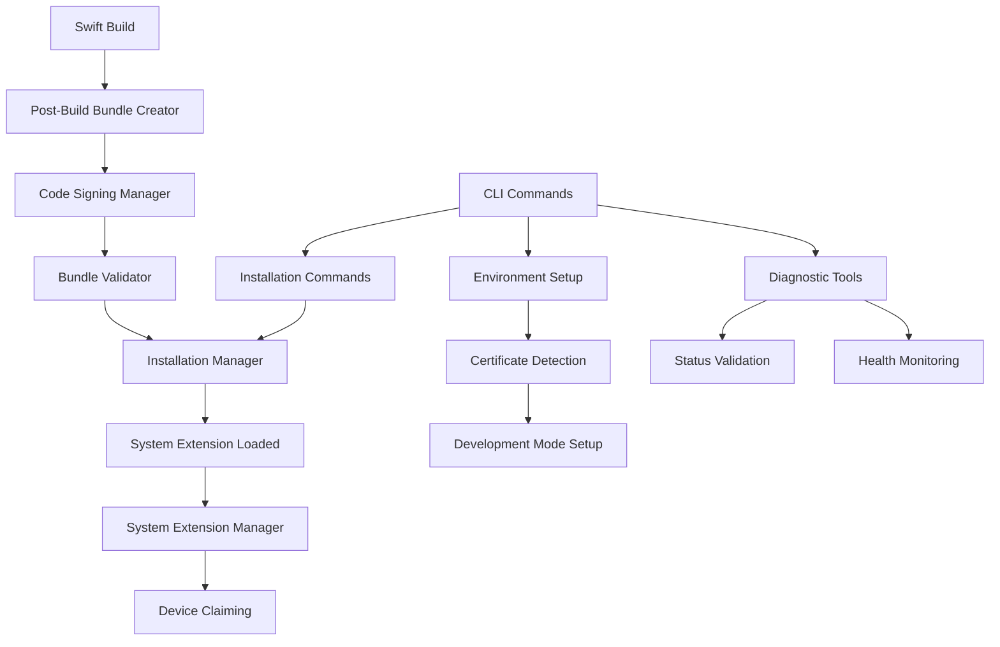

# Design Document

## Overview

This design implements a comprehensive System Extension installation system for usbipd-mac that addresses critical flaws in the current build process. The current implementation has fundamental issues: it creates incomplete bundle directories instead of proper .systemextension bundles, has broken Swift Package Manager plugin integration, and provides no automated installation mechanism.

The new design provides a complete solution with proper bundle creation, automated code signing for development and production environments, streamlined installation workflows, and comprehensive diagnostic tools. The system integrates seamlessly with Swift Package Manager while supporting both signed and unsigned development workflows.

## Steering Document Alignment

### Technical Standards (tech.md)
The design follows Swift Package Manager integration patterns, uses Foundation and system frameworks exclusively, maintains the multi-target modular architecture, and implements proper protocol-oriented design with dependency injection patterns consistent with the existing codebase.

### Project Structure (structure.md)
Implementation follows the established directory organization with new components in Sources/USBIPDCore/SystemExtension/ for core functionality, additional CLI commands in Sources/USBIPDCLI/, and comprehensive test coverage in Tests/. All naming conventions use PascalCase for types and camelCase for functions, maintaining consistency with existing code patterns.

## Code Reuse Analysis

The design leverages extensive existing infrastructure while addressing fundamental architectural flaws in the current System Extension bundle creation process.

### Existing Components to Leverage
- **Common/Logger.swift**: Extend logging system with System Extension specific log categories and diagnostic output formatting
- **Common/Errors.swift**: Extend error definitions with new System Extension installation and code signing error types
- **USBIPDCore/SystemExtension/SystemExtensionManager.swift**: Enhance existing manager with installation workflow integration and health monitoring capabilities
- **USBIPDCLI command structure**: Extend existing command pattern with new installation, validation, and diagnostic commands

### Integration Points
- **Swift Package Manager Plugin System**: Replace broken plugin implementation with functional bundle creation and post-build integration
- **macOS Security Framework**: Integrate certificate detection, code signing workflows, and keychain access for automated signing
- **System Extension Framework**: Enhance installation and lifecycle management with proper error handling and status monitoring
- **IOKit Integration**: Leverage existing device discovery for System Extension health validation and device claim verification

### Critical Issues with Current Implementation
The existing Plugins/SystemExtensionBundleBuilder implementation has several fatal flaws that prevent proper System Extension creation:

1. **Incomplete Bundle Creation**: Creates bundle directory structure but fails to copy the actual executable into the bundle
2. **Broken Plugin Integration**: Plugin runs during prebuild but executable isn't available yet, creating empty placeholder files
3. **No Post-Build Integration**: No mechanism to copy the compiled executable into the created bundle structure
4. **Incorrect Bundle Format**: Output directory contains separate bundle directory instead of proper .systemextension bundle
5. **Signing Timing Issues**: Attempts to sign non-existent or placeholder executables

## Architecture

The new architecture replaces the broken plugin-based approach with a comprehensive post-build bundle creation and installation system that integrates properly with Swift Package Manager's build lifecycle.

### Modular Design Principles
- **Build Integration Module**: Handles post-build bundle creation with proper executable integration
- **Code Signing Module**: Manages certificate detection, signing workflows, and verification for both development and production
- **Installation Management Module**: Automates System Extension installation, loading, and lifecycle management
- **Diagnostic and Validation Module**: Provides comprehensive health checking, bundle validation, and troubleshooting capabilities



## Components and Interfaces

### SystemExtensionBundleCreator
- **Purpose:** Handles complete System Extension bundle creation post-build with proper executable integration
- **Interfaces:** 
  - `createBundle(executablePath: String, outputPath: String) throws -> SystemExtensionBundle`
  - `validateBundleStructure(bundlePath: String) throws -> ValidationResult`
- **Dependencies:** Foundation, FileManager, PropertyList processing
- **Reuses:** Common/Logger for build process logging, existing template processing patterns

### CodeSigningManager
- **Purpose:** Manages automated code signing for development and production environments with certificate detection
- **Interfaces:**
  - `detectAvailableCertificates() -> [CodeSigningCertificate]`
  - `signBundle(bundlePath: String, certificateIdentity: String?) throws -> SigningResult`
  - `verifyBundleSignature(bundlePath: String) -> SignatureValidationResult`
- **Dependencies:** Security framework, subprocess execution for codesign commands
- **Reuses:** Common/Errors for signing error handling, existing subprocess utilities if available

### SystemExtensionInstaller
- **Purpose:** Automates System Extension installation, loading, and lifecycle management
- **Interfaces:**
  - `installExtension(bundlePath: String, forceReinstall: Bool) throws -> InstallationResult`
  - `getExtensionStatus() -> SystemExtensionStatus`
  - `enableDeveloperMode() throws`
- **Dependencies:** SystemExtensions framework, subprocess execution for systemextensionsctl
- **Reuses:** Common/Logger for installation logging, existing error handling patterns

### EnvironmentSetupManager  
- **Purpose:** Handles automated development environment configuration and validation
- **Interfaces:**
  - `validateDevelopmentEnvironment() -> EnvironmentValidationResult`
  - `setupDevelopmentEnvironment() throws`
  - `provideDiagnostics() -> [DiagnosticResult]`
- **Dependencies:** System framework calls, subprocess execution
- **Reuses:** Common error handling, existing CLI command patterns

### SystemExtensionDiagnostics
- **Purpose:** Comprehensive diagnostic and troubleshooting capabilities for System Extension issues
- **Interfaces:**
  - `performHealthCheck() -> SystemExtensionHealthReport`
  - `validateBundleIntegrity(bundlePath: String) -> BundleValidationReport`
  - `analyzeInstallationIssues() -> [InstallationIssue]`
- **Dependencies:** System log parsing, IOKit status checking
- **Reuses:** Existing device discovery patterns, common logging infrastructure

## Data Models

### SystemExtensionBundle
```swift
struct SystemExtensionBundle: Codable {
    let bundlePath: String
    let bundleIdentifier: String
    let version: String
    let isSigned: Bool
    let signingIdentity: String?
    let createdAt: Date
    let bundleContents: BundleContents
}

struct BundleContents {
    let infoPlistPath: String
    let executablePath: String
    let entitlementsPath: String
    let resourcesPath: String
}
```

### CodeSigningCertificate
```swift
struct CodeSigningCertificate: Codable, Identifiable {
    let id: String
    let name: String
    let type: CertificateType
    let expirationDate: Date?
    let isValid: Bool
    let keychain: String
}

enum CertificateType: String, Codable, CaseIterable {
    case developerIDApplication = "Developer ID Application"
    case macDeveloper = "Mac Developer"
    case appleDevelopment = "Apple Development"
    case developerIDKernelExtension = "Developer ID Kernel Extension"
}
```

### SystemExtensionStatus
```swift
struct SystemExtensionStatus: Codable {
    let bundleIdentifier: String
    let isLoaded: Bool
    let isActive: Bool
    let version: String
    let loadState: SystemExtensionLoadState
    let lastError: String?
    let healthStatus: HealthStatus
}

enum SystemExtensionLoadState: String, Codable {
    case notLoaded = "not_loaded"
    case loading = "loading"  
    case loaded = "loaded"
    case active = "active"
    case failed = "failed"
}

enum HealthStatus: String, Codable {
    case healthy = "healthy"
    case warning = "warning"
    case error = "error"
    case unknown = "unknown"
}
```

### InstallationResult
```swift
struct InstallationResult: Codable {
    let success: Bool
    let bundlePath: String
    let installationMethod: InstallationMethod
    let userApprovalRequired: Bool
    let installedAt: Date
    let errors: [InstallationError]
    let warnings: [String]
}

enum InstallationMethod: String, Codable {
    case automatic = "automatic"
    case manual = "manual"
    case developmentMode = "development_mode"
}

struct InstallationError: Codable, Error {
    let code: String
    let description: String
    let recoverySuggestion: String
    let technicalDetails: String?
}
```

## Error Handling

### Error Scenarios

1. **Bundle Creation Failures**
   - **Handling:** Comprehensive error reporting with specific failure points (executable copy, template processing, directory creation)
   - **User Impact:** Clear diagnostic messages identifying which step failed with specific remediation steps

2. **Code Signing Issues**
   - **Handling:** Certificate detection failures, signing process errors, verification failures with detailed error parsing
   - **User Impact:** Specific instructions for certificate installation, keychain issues, or fallback to unsigned development mode

3. **Installation Permission Errors**
   - **Handling:** Privilege escalation failures, System Extension approval rejections, developer mode requirement issues
   - **User Impact:** Step-by-step privilege setup instructions, System Preferences navigation guidance, developer mode enablement

4. **System Extension Loading Failures**  
   - **Handling:** Parse system logs for specific failure reasons, detect conflicting extensions, identify permission issues
   - **User Impact:** Targeted troubleshooting based on specific failure mode with automated recovery options

5. **Environment Configuration Issues**
   - **Handling:** SIP status validation, Xcode Command Line Tools detection, macOS version compatibility checking
   - **User Impact:** Guided setup instructions with automated detection and configuration where possible

## Testing Strategy

### Unit Testing
- **Bundle Creation Testing:** Mock file system operations, template processing validation, bundle structure verification
- **Code Signing Testing:** Mock security framework calls, certificate detection simulation, signing workflow validation
- **Installation Testing:** Mock systemextensionsctl commands, state management validation, error handling verification

### Integration Testing  
- **End-to-End Build Testing:** Complete build-to-installation workflow validation in controlled development environment
- **Certificate Integration:** Real certificate detection and signing workflow testing with various certificate types
- **System Extension Lifecycle:** Installation, activation, health monitoring, and uninstallation workflow testing

### Development Environment Testing
- **Multi-Environment Support:** Testing across different macOS versions, SIP configurations, and certificate availability scenarios
- **Error Recovery Testing:** Comprehensive testing of failure scenarios and recovery workflows
- **Performance Testing:** Build time impact measurement, installation speed validation, diagnostic tool responsiveness

## Installation and CLI Integration

### New CLI Commands

```bash
# Environment setup and validation
usbipd setup-dev-environment    # Automated development setup
usbipd validate-environment     # Environment validation and diagnostics

# System Extension management  
usbipd install-extension        # Install System Extension with automated signing
usbipd reinstall-extension      # Force reinstallation of System Extension
usbipd extension-status         # Detailed System Extension status and health

# Development workflow commands
usbipd build-extension          # Build and create System Extension bundle
usbipd sign-extension [bundle]  # Sign existing bundle with available certificates
usbipd validate-bundle [bundle] # Comprehensive bundle validation

# Diagnostic and troubleshooting
usbipd diagnose-extension       # Complete diagnostic analysis
usbipd fix-permissions          # Automated permission and setup fixes
usbipd system-requirements      # System requirements validation
```

### Build Integration

The new system replaces the broken plugin approach with post-build integration:

1. **Swift Build Integration:** Post-build script automatically creates .systemextension bundle from compiled executable
2. **Automatic Signing:** Detects available certificates and signs bundle appropriately for development or production
3. **Validation Pipeline:** Comprehensive bundle validation before installation attempt
4. **Error Recovery:** Detailed error reporting with specific remediation steps for each failure mode

This design addresses all identified flaws in the current implementation while providing a comprehensive, automated solution for System Extension development and deployment on macOS.