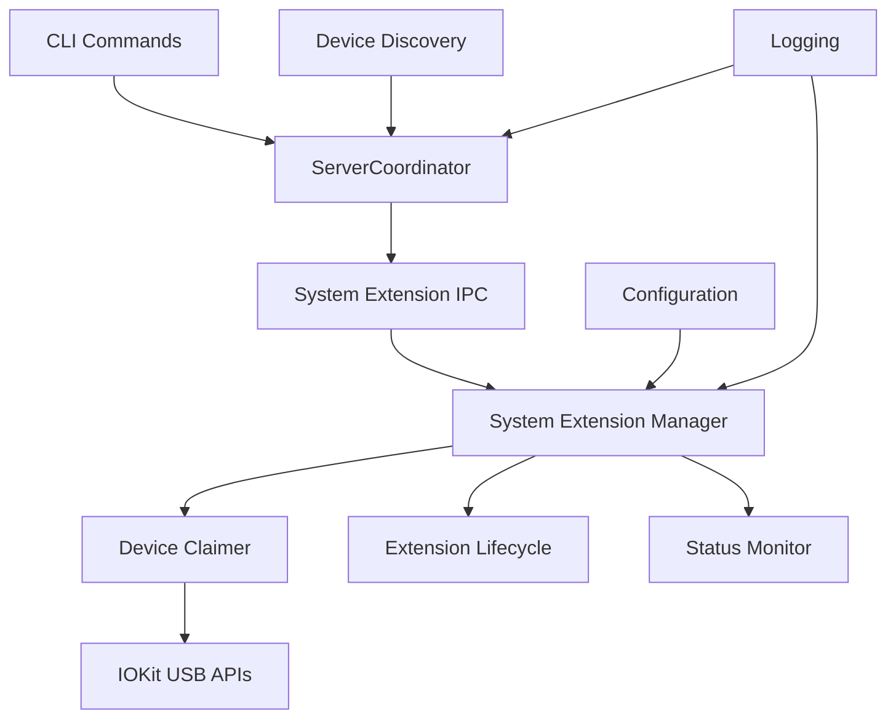

# Design Document

## Overview

The System Extension Integration feature transforms the existing SystemExtension placeholder into a fully functional macOS System Extension that provides privileged USB device access for the usbipd-mac USB/IP server. The design implements a secure, reliable device claiming mechanism that integrates with the existing USBIPDCore architecture while maintaining clear separation of concerns between unprivileged and privileged operations.

The System Extension operates as a separate privileged process that communicates with the main daemon through secure IPC, enabling exclusive USB device access while adhering to macOS security requirements and sandboxing restrictions.

## Steering Document Alignment

### Technical Standards (tech.md)

The design follows documented technical patterns:
- **Swift Language Integration**: Leverages Swift's memory safety and modern concurrency for privileged operations
- **IOKit Direct Integration**: Utilizes IOKit USB device claiming APIs for maximum compatibility and control
- **System Extension Architecture**: Implements the documented requirement for reliable USB device claiming through macOS System Extensions
- **Modular Design**: Maintains clear separation between device claiming, IPC communication, and error handling concerns
- **Logging Integration**: Extends the existing Common/Logger.swift system for consistent log formatting across privileged and unprivileged components

### Project Structure (structure.md)

The implementation follows established project organization:
- **Target Boundaries**: SystemExtension remains a separate target with dependencies only on Common for shared utilities
- **Naming Conventions**: Swift files use PascalCase with descriptive suffixes (SystemExtensionManager.swift, DeviceClaimer.swift)
- **Module Organization**: Core functionality separated into focused classes following single responsibility principle
- **Test Structure**: SystemExtension functionality will be tested through integration tests and mock IOKit interfaces
- **Import Patterns**: Follows documented import order with Foundation/IOKit system frameworks first, then Common module imports

## Code Reuse Analysis

The System Extension design maximizes reuse of existing project components while maintaining security boundaries:

### Existing Components to Leverage

- **Common/Logger.swift**: Extended for privileged logging with secure log file handling and IPC communication with main daemon
- **Common/Errors.swift**: Base error protocols extended with SystemExtension-specific error types for device claiming failures
- **USBIPDCore/Device/DeviceDiscovery.swift**: Device identification patterns and data structures reused for consistent device referencing
- **USBIPDCore/ServerConfig.swift**: Configuration patterns adapted for System Extension settings and device binding state
- **Tests/USBIPDCoreTests/Mocks/**: Mock interfaces extended with IOKit device claiming mocks for testing privileged operations

### Integration Points

- **ServerCoordinator Integration**: The existing ServerCoordinator will be extended to communicate with the System Extension for device claiming operations
- **CLI Commands Integration**: The bind/unbind commands will be enhanced to request device claiming through the System Extension
- **Device Discovery Coordination**: System Extension will coordinate with existing device discovery to claim only bound devices
- **Configuration Management**: System Extension will share device binding state through the existing ServerConfig architecture
- **Error Handling Flow**: Existing error handling patterns extended to handle System Extension-specific failures and recovery scenarios

## Architecture

The System Extension uses a **layered service architecture** with secure IPC communication:



### Modular Design Principles

- **Single File Responsibility**: Each Swift file handles one specific domain (device claiming, IPC, lifecycle management, status monitoring)
- **Component Isolation**: Device claiming logic isolated from IPC communication to enable independent testing and error handling
- **Service Layer Separation**: Clear separation between System Extension management (privileged) and client communication (unprivileged)  
- **Utility Modularity**: Focused, single-purpose utilities for IOKit integration, permission validation, and secure IPC handling

## Components and Interfaces

### SystemExtensionManager
- **Purpose:** Main coordination component managing System Extension lifecycle and client communication
- **Interfaces:** 
  - `start()` - Initialize extension and IPC listener
  - `claimDevice(deviceID:)` - Request device claiming through secure IPC
  - `releaseDevice(deviceID:)` - Release device claim
  - `getClaimedDevices()` - Query current device claim status
- **Dependencies:** DeviceClaimer, IPCHandler, StatusMonitor
- **Reuses:** Common/Logger for consistent logging patterns, Common/Errors for base error handling

### DeviceClaimer  
- **Purpose:** Core component responsible for IOKit-based USB device claiming and release operations
- **Interfaces:**
  - `claimDevice(device: USBDevice)` - Claim exclusive device access
  - `releaseDevice(device: USBDevice)` - Release device claim
  - `isDeviceClaimed(deviceID: String)` - Check claim status
  - `restoreClaimedDevices()` - Restore claims after restart
- **Dependencies:** IOKit USB APIs, device state persistence
- **Reuses:** USBIPDCore device identification patterns, Common error handling protocols

### IPCHandler
- **Purpose:** Secure inter-process communication between main daemon and System Extension  
- **Interfaces:**
  - `startListener()` - Begin listening for IPC requests
  - `sendResponse(to: IPCRequest, response: IPCResponse)` - Send response to client
  - `authenticateClient(clientID: String)` - Validate client authorization
- **Dependencies:** Foundation XPC or NSMachPort for secure IPC
- **Reuses:** Common/Logger for IPC event logging, existing authentication patterns

### StatusMonitor
- **Purpose:** Health monitoring, device state tracking, and diagnostic information collection
- **Interfaces:**
  - `getCurrentStatus()` - Return extension health and device status
  - `getClaimHistory()` - Retrieve device claim/release history
  - `performHealthCheck()` - Validate extension functionality
- **Dependencies:** DeviceClaimer for device state, SystemExtensionManager for overall health
- **Reuses:** Common/Logger for status event logging, existing diagnostic patterns

## Data Models

### SystemExtensionStatus
```swift
struct SystemExtensionStatus: Codable {
    let isRunning: Bool
    let claimedDevices: [ClaimedDevice]
    let lastStartTime: Date
    let errorCount: Int
    let memoryUsage: Int
}
```

### ClaimedDevice
```swift
struct ClaimedDevice: Codable {
    let deviceID: String
    let busID: String  
    let vendorID: UInt16
    let productID: UInt16
    let productString: String?
    let claimTime: Date
    let claimMethod: DeviceClaimMethod
}
```

### IPCRequest
```swift
struct IPCRequest: Codable {
    let requestID: UUID
    let clientID: String
    let command: IPCCommand
    let parameters: [String: String]
    let timestamp: Date
}
```

### IPCResponse
```swift  
struct IPCResponse: Codable {
    let requestID: UUID
    let success: Bool
    let result: IPCResult?
    let error: SystemExtensionError?
    let timestamp: Date
}
```

## Error Handling

### Error Scenarios

1. **Device Claiming Failure:**
   - **Handling:** Retry with exponential backoff, attempt driver unbinding, log specific IOKit error codes
   - **User Impact:** Clear error message indicating device cannot be claimed, suggestions for resolution

2. **System Extension Authorization Denied:**
   - **Handling:** Provide step-by-step instructions for enabling extension in System Preferences
   - **User Impact:** Guided troubleshooting flow with screenshots and exact steps for authorization

3. **IPC Communication Failure:**
   - **Handling:** Automatic reconnection attempts, fallback to polling status, detailed logging of communication errors
   - **User Impact:** Graceful degradation with status polling, clear indication of communication issues

4. **Device Disconnection During Claim:**
   - **Handling:** Clean up device claim state, notify main daemon of device removal, update internal device lists
   - **User Impact:** Automatic cleanup with informational logging, seamless handling of device reconnection

5. **System Extension Crash/Restart:**
   - **Handling:** Automatic restart by macOS, restoration of device claims from persistent state, notification to main daemon
   - **User Impact:** Transparent recovery with brief interruption, restoration of all previous device claims

## Testing Strategy

### Unit Testing
- **Mock IOKit Interfaces:** Create comprehensive mocks for USB device claiming operations enabling isolated testing
- **IPC Communication Testing:** Mock XPC/Mach port communication for testing message handling without privileged access
- **Device State Management:** Test device claim/release cycles, state persistence, and error recovery scenarios
- **Error Handling Validation:** Comprehensive testing of all error scenarios with expected recovery behaviors

### Integration Testing  
- **System Extension Lifecycle:** Test installation, authorization, startup, and shutdown flows in controlled environment
- **End-to-End Device Claiming:** Validate complete device bind → claim → share → release flow with actual USB devices
- **Multi-Client Scenarios:** Test concurrent access requests, exclusive access enforcement, and proper client isolation
- **Configuration Integration:** Validate configuration sharing between main daemon and System Extension across restarts

### End-to-End Testing
- **USB/IP Protocol Validation:** Extend existing QEMU test infrastructure to validate device claiming integration
- **Error Recovery Testing:** Test system behavior during extension crashes, permission changes, and device hotplug scenarios
- **Client Connection Testing:** Validate device sharing functionality with USB/IP clients after successful device claiming