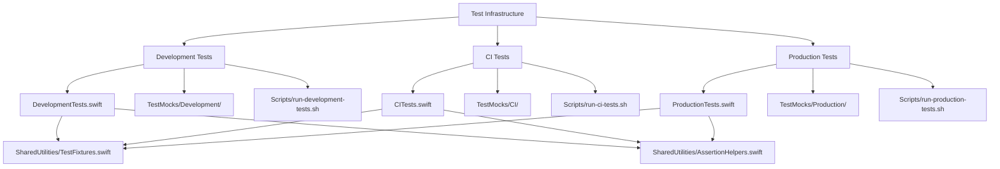

# Design Document

## Overview

This design transforms the current complex test infrastructure with 15+ test files and 16+ scripts into a streamlined, environment-based testing system. The new architecture organizes tests into three execution environments (Development, CI, Production/Release) with clear boundaries, appropriate mocking strategies, and optimized execution paths for each context.

## Steering Document Alignment

### Technical Standards (tech.md)
The design follows Swift Package Manager conventions and maintains consistency with existing SwiftLint configuration and CI/CD pipeline patterns established in the project.

### Project Structure (structure.md)
The implementation will maintain the existing `Tests/` directory structure while reorganizing content into environment-specific files and consolidating redundant functionality.

## Code Reuse Analysis

### Existing Components to Leverage
- **TestUtilities.swift**: Existing test utilities will be extended and consolidated into environment-specific modules
- **Mock Infrastructure**: Current mock objects will be reorganized into environment-specific mock libraries
- **CI Pipeline Configuration**: Existing GitHub Actions workflow will be enhanced to use new environment-specific test execution

### Integration Points
- **Swift Package Manager**: Test targets will be reorganized to support environment-specific execution
- **SwiftLint Configuration**: Existing linting rules will apply to the new test structure
- **Build System**: Integration with existing build scripts and CI validation processes

## Architecture

The new test infrastructure uses a three-tier architecture based on execution environments, with each tier having distinct characteristics, dependencies, and execution strategies.

### Modular Design Principles
- **Environment Isolation**: Each test environment has isolated dependencies and execution paths
- **Component Reusability**: Shared utilities within environments while maintaining clear boundaries
- **Service Layer Separation**: Test utilities separated by responsibility (mocks, fixtures, assertions)
- **Utility Modularity**: Environment-specific test utilities focused on single responsibilities



## Components and Interfaces

### Development Test Environment
- **Purpose:** Fast feedback during feature development with comprehensive mocking
- **Interfaces:** 
  - `DevelopmentTestSuite` protocol for standardized test execution
  - `MockProvider` interface for dependency injection
- **Dependencies:** All external dependencies mocked (IOKit, System Extension, network)
- **Reuses:** Existing unit test patterns and mock object infrastructure

### CI Test Environment  
- **Purpose:** Automated validation without hardware dependencies
- **Interfaces:**
  - `CITestSuite` protocol for automated execution
  - `ProtocolValidator` interface for USB/IP compliance testing
- **Dependencies:** Network and system mocked, protocol logic real
- **Reuses:** Existing CI pipeline configuration and GitHub Actions setup

### Production Test Environment
- **Purpose:** Comprehensive validation with real hardware when available
- **Interfaces:**
  - `ProductionTestSuite` protocol for comprehensive validation
  - `HardwareDetector` interface for conditional test execution
- **Dependencies:** Minimal mocking, real system integration testing
- **Reuses:** Existing QEMU integration and end-to-end test workflows

### Shared Test Utilities
- **Purpose:** Common functionality across all test environments
- **Interfaces:**
  - `TestFixtures` for standardized test data creation
  - `AssertionHelpers` for common validation patterns
- **Dependencies:** Environment-agnostic utilities
- **Reuses:** Consolidated from existing scattered utility functions

## Data Models

### TestEnvironment Configuration
```swift
struct TestEnvironmentConfig {
    let executionTimeout: TimeInterval
    let mockingStrategy: MockingStrategy
    let requiredCapabilities: [TestCapability]
    let allowedDependencies: [DependencyType]
}

enum MockingStrategy {
    case comprehensive  // Development: Mock everything
    case selective      // CI: Mock hardware, allow protocol
    case minimal        // Production: Mock only when necessary
}

enum TestCapability {
    case hardwareAccess
    case systemExtension
    case networkAccess
    case adminPrivileges
}
```

### Test Suite Organization
```swift
protocol TestSuite {
    var environment: TestEnvironment { get }
    var executionTimeout: TimeInterval { get }
    func runTests() async throws
    func validateEnvironment() -> Bool
}

struct TestResult {
    let environment: TestEnvironment
    let testsExecuted: Int
    let testsPassed: Int
    let executionTime: TimeInterval
    let errors: [TestError]
}
```

## Error Handling

### Error Scenarios
1. **Environment Validation Failure:**
   - **Handling:** Skip environment with clear messaging
   - **User Impact:** Developer sees which tests were skipped and why

2. **Hardware Unavailability in Production Tests:**
   - **Handling:** Graceful degradation to available test subset
   - **User Impact:** Clear indication of hardware-dependent tests skipped

3. **Mock Configuration Error:**
   - **Handling:** Fail fast with specific mock setup error
   - **User Impact:** Clear error message indicating which mock failed setup

4. **Timeout in Environment-Specific Tests:**
   - **Handling:** Environment-appropriate timeout handling
   - **User Impact:** Different timeout expectations per environment clearly communicated

## Testing Strategy

### Development Environment Testing Strategy
- **Focus Areas:** Business logic validation, component interfaces, mock behavior verification
- **Test Types:** Unit tests with comprehensive mocking
- **Execution Pattern:** Fast, frequent execution during development
- **Mock Strategy:** Mock all external dependencies for predictable, fast execution

### CI Environment Testing Strategy
- **Focus Areas:** Protocol compliance, integration without hardware, build validation
- **Test Types:** Integration tests with selective mocking
- **Execution Pattern:** Automated execution on every PR and commit
- **Mock Strategy:** Mock hardware dependencies, test real protocol logic

### Production Environment Testing Strategy
- **Focus Areas:** End-to-end workflows, hardware integration, system validation
- **Test Types:** System tests with minimal mocking
- **Execution Pattern:** Pre-release validation and developer verification
- **Mock Strategy:** Minimal mocking, real system integration where possible

### Test File Consolidation Plan

#### Files to Consolidate
1. **QEMU Test Consolidation:**
   - Merge `QEMUTestValidationTests.swift` and `QEMUToolComprehensiveTests.swift`
   - Extract validation logic to `ProductionTests.swift`
   - Create QEMU mock for `DevelopmentTests.swift` and `CITests.swift`

2. **Integration Test Consolidation:**
   - Consolidate multiple integration test files into environment-specific tests
   - Move hardware-dependent tests to `ProductionTests.swift`
   - Move CI-compatible integration tests to `CITests.swift`

3. **Mock Object Consolidation:**
   - Merge duplicate mock implementations across test directories
   - Organize mocks by environment in `TestMocks/Development/`, `TestMocks/CI/`, `TestMocks/Production/`
   - Create shared mock interfaces for cross-environment consistency

#### Script Consolidation Plan
1. **Primary Execution Scripts:**
   - `run-development-tests.sh`: Fast unit tests with mocks
   - `run-ci-tests.sh`: CI-compatible tests for GitHub Actions
   - `run-production-tests.sh`: Comprehensive validation including QEMU

2. **Utility Scripts (Maximum 3):**
   - `qemu-test-validation.sh`: Enhanced with environment awareness
   - `test-environment-setup.sh`: Environment detection and setup
   - `generate-test-report.sh`: Environment-specific reporting

#### Expected Outcomes
- **Test Files:** Reduced from 15+ to 6 primary files (3 environment + 3 shared utilities)
- **Scripts:** Reduced from 16+ to 6 total scripts (3 primary + 3 utilities)
- **Execution Time:** Development (<1min), CI (<3min), Production (<10min)
- **Maintainability:** Clear ownership, no duplication, environment-appropriate testing

### Implementation Phases
1. **Phase 1:** Create new environment-specific test structure
2. **Phase 2:** Consolidate and migrate existing tests to appropriate environments
3. **Phase 3:** Update scripts and CI configuration
4. **Phase 4:** Remove redundant files and validate new structure