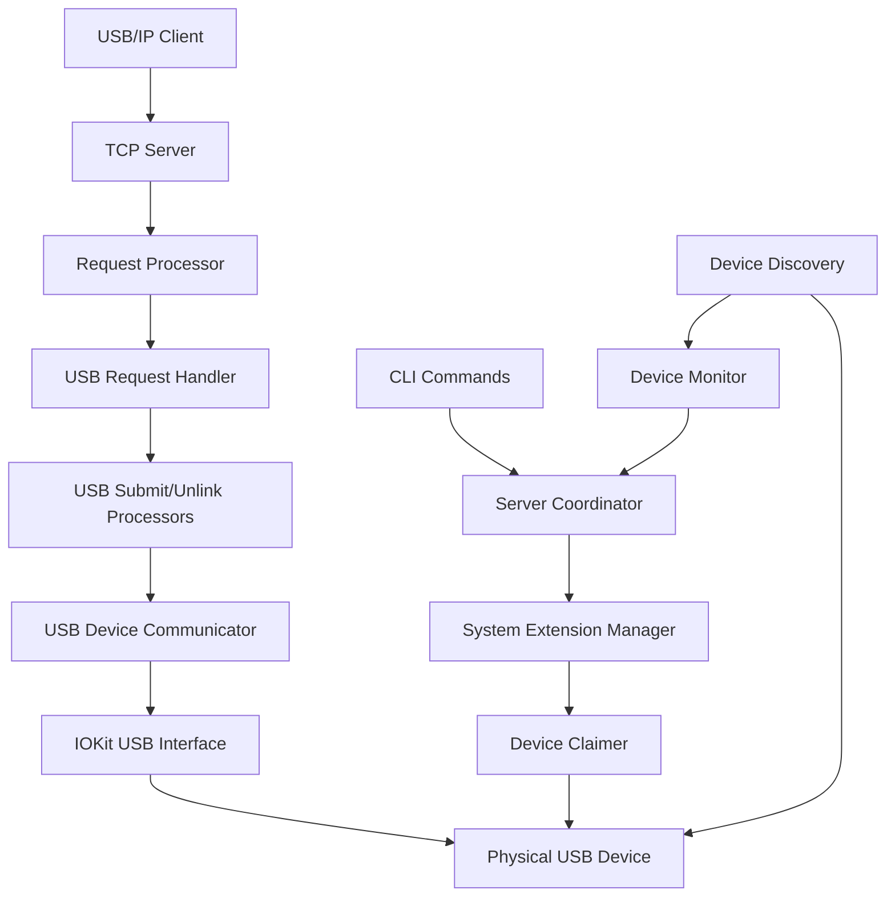

# Design Document

## Overview

The USB Device Communication feature implements the missing core functionality that transforms usbipd-mac from a protocol-only implementation to a fully functional USB device sharing system. This design replaces placeholder implementations in IOKit integration, USB transfer operations, device claiming, and request processing with complete, production-ready code that enables actual USB device communication over USB/IP networks.

The design builds upon the existing architectural foundation, leveraging completed System Extension infrastructure, protocol implementations, and testing frameworks while maintaining strict compatibility with existing interfaces and patterns.

## Steering Document Alignment

### Technical Standards (tech.md)

The design follows established Swift architectural patterns:
- **Protocol-Oriented Design**: Extends existing USBDeviceCommunicator protocol without breaking changes
- **Dependency Injection**: Integrates with established DI patterns for testing and modularity
- **Swift Concurrency**: Uses async/await for IOKit operations and USB transfer management
- **Error Handling**: Follows Swift Result/throws patterns with comprehensive error mapping
- **Memory Management**: Implements RAII patterns for IOKit resource cleanup

### Project Structure (structure.md)

Implementation follows the established target organization:
- **USBIPDCore/Device/**: IOKit integration and USB interface implementation
- **USBIPDCore/Protocol/**: USB request processing and message handling
- **Common/**: Shared error types and device models
- **SystemExtension/**: Device claiming integration points
- **USBIPDCLI/**: Command implementation enhancements

## Code Reuse Analysis

### Existing Components to Leverage

- **USBDeviceCommunicator Protocol**: Complete interface definition for USB operations - will be implemented fully
- **USBRequestBlock & USBTransferResult**: Comprehensive data models for USB transfer parameters and results
- **USBSubmitProcessor & USBUnlinkProcessor**: Framework for request processing - will be enhanced with real operations
- **DeviceDiscovery Protocol**: IOKit device enumeration - completed implementation will be integrated
- **DeviceClaimManager Protocol**: Device claiming interface - will be connected to System Extension
- **SystemExtensionManager**: Device claiming infrastructure - will be utilized for exclusive access
- **Error Handling Framework**: USBRequestError, DeviceDiscoveryError types - will be extended with IOKit error mapping

### Integration Points

- **System Extension Communication**: Leverage existing IPC for device claiming operations
- **Protocol Message Processing**: Integrate with existing USBIPHeader and message encoding/decoding
- **CLI Command Structure**: Enhance existing Commands.swift bind/unbind implementations
- **Logger System**: Utilize established logging infrastructure for diagnostic information
- **Testing Framework**: Build upon existing test utilities and mock implementations

## Architecture

The implementation follows a layered architecture that integrates seamlessly with existing patterns:



### Modular Design Principles

- **IOKit Abstraction Layer**: `IOKitUSBInterface` encapsulates all IOKit-specific operations with clean Swift interfaces
- **Transfer Type Specialization**: Separate implementations for control, bulk, interrupt, and isochronous transfers
- **Request Processing Pipeline**: Clear separation between protocol parsing, validation, execution, and response encoding
- **Device State Management**: Centralized tracking of device claiming status and interface states
- **Error Boundary Definition**: Comprehensive error mapping from IOKit codes to application-specific error types

## Components and Interfaces

### IOKitUSBInterface (Enhanced Implementation)

**Purpose:** Provides real IOKit integration replacing placeholder implementations
**File:** `Sources/USBIPDCore/Device/IOKitUSBInterface.swift`

```swift
public class IOKitUSBInterface {
    // MARK: - Real IOKit Integration (replacing placeholders)
    
    /// Initialize IOKit device references with actual IOKit calls
    private func initializeIOKitReferences() throws {
        // Replace placeholder with real IOKit device plugin creation
        // IOServiceMatching, IOServiceGetMatchingService, IOCreatePlugInInterfaceForService
    }
    
    /// Open USB interface with real IOKit operations  
    public func open() throws {
        // Replace placeholder with actual IOUSBDeviceInterface methods
        // (*deviceInterface)->USBDeviceOpen, (*deviceInterface)->CreateDeviceAsyncEventSource
    }
    
    /// Execute control transfer with real IOKit calls
    public func executeControlTransfer(_ request: USBControlRequest) async throws -> USBTransferResult {
        // Replace placeholder with actual IOUSBDeviceInterface->DeviceRequest
    }
    
    /// Execute bulk transfer with real IOKit calls  
    public func executeBulkTransfer(_ request: USBBulkRequest) async throws -> USBTransferResult {
        // Replace placeholder with actual IOUSBInterfaceInterface->WritePipe/ReadPipe
    }
}
```

**Interfaces:**
- Implements all transfer methods from USBDeviceCommunicatorProtocol
- Provides IOKit resource management (open/close/cleanup)
- Handles IOKit error code mapping to USBRequestError types

**Dependencies:** IOKit.usb framework, USBDevice models, Logger
**Reuses:** Existing USBRequestBlock, USBTransferResult, error handling patterns

### USBDeviceCommunicatorImplementation (New Component)

**Purpose:** Production implementation of USBDeviceCommunicator protocol
**File:** `Sources/USBIPDCore/Device/USBDeviceCommunicatorImplementation.swift`

```swift
public class USBDeviceCommunicatorImplementation: USBDeviceCommunicatorProtocol {
    private var deviceInterfaces: [String: IOKitUSBInterface] = [:]
    private let deviceClaimManager: DeviceClaimManager
    
    public func executeControlTransfer(device: USBDevice, request: USBRequestBlock) async throws -> USBTransferResult {
        // Validate device is claimed
        // Get or create IOKitUSBInterface for device
        // Execute transfer through IOKit interface
        // Return actual results
    }
    
    // Similar implementations for bulk, interrupt, isochronous transfers
}
```

**Interfaces:** Full USBDeviceCommunicatorProtocol implementation
**Dependencies:** IOKitUSBInterface, DeviceClaimManager, device models
**Reuses:** USB request/response models, error handling, logging infrastructure

### Enhanced USB Request Processing

**Purpose:** Replace placeholder responses with real USB operation execution
**Files:** 
- `Sources/USBIPDCore/Protocol/USBRequestHandler.swift` (enhanced)
- `Sources/USBIPDCore/Protocol/USBSubmitProcessor.swift` (enhanced) 
- `Sources/USBIPDCore/Protocol/USBUnlinkProcessor.swift` (enhanced)

```swift
// USBRequestHandler enhancement
public func handleSubmitRequest(_ data: Data) throws -> Data {
    // Remove placeholder response code
    let request = try USBIPMessageDecoder.decodeUSBSubmitRequest(from: data)
    let result = try await submitProcessor.processSubmitRequest(data)
    return result // Real USB operation results
}

// USBSubmitProcessor enhancement  
public func processSubmitRequest(_ data: Data) async throws -> Data {
    // Use real USBDeviceCommunicatorImplementation instead of placeholder
    let transferResult = try await deviceCommunicator.executeControlTransfer(device: device, request: urbRequest)
    // Encode actual transfer results into USB/IP response
}
```

**Reuses:** Existing message encoding/decoding, URB tracking, protocol structures

### System Extension Device Claiming Integration

**Purpose:** Connect CLI bind/unbind commands to actual device claiming
**Files:**
- `Sources/USBIPDCLI/Commands.swift` (enhanced bind/unbind methods)
- Integration with existing SystemExtensionManager

```swift
// Enhanced bind command implementation
public func handleBindCommand(busID: String, deviceID: String) throws {
    // Remove placeholder logging
    let device = try deviceDiscovery.getDevice(busID: busID, deviceID: deviceID)
    guard let device = device else {
        throw CommandHandlerError.deviceNotFound("\(busID)-\(deviceID)")
    }
    
    // Use real System Extension claiming
    let success = try systemExtensionManager.requestDeviceClaim(device)
    if success {
        print("Successfully bound device \(device.busID)-\(device.deviceID)")
    }
}
```

**Reuses:** Existing SystemExtensionManager, DeviceDiscovery, CLI output formatting

## Data Models

### Enhanced USB Request Models

Building upon existing `USBRequestBlock` and `USBTransferResult`:

```swift
// Extensions to existing models for IOKit integration
extension USBRequestBlock {
    /// Convert to IOKit control request structure
    func toIOKitControlRequest() -> IOUSBDevRequestTO {
        // Convert USB/IP request to IOKit format
    }
}

extension USBTransferResult {
    /// Create from IOKit operation result
    static func fromIOKitResult(kr: kern_return_t, bytesTransferred: UInt32, data: Data?) -> USBTransferResult {
        // Map IOKit results to USB/IP format
    }
}
```

### IOKit Error Mapping

```swift
/// Maps IOKit return codes to USB request errors
public struct IOKitErrorMapper {
    static func mapIOKitError(_ kr: kern_return_t, operation: String) -> USBRequestError {
        switch kr {
        case kIOReturnSuccess: return .none
        case kIOReturnNotOpen: return .deviceNotAvailable
        case kIOReturnTimeout: return .transferTimeout
        case kIOReturnAborted: return .transferCancelled
        // ... comprehensive mapping
        }
    }
}
```

## Error Handling

### Error Scenarios

1. **IOKit Interface Creation Failure**
   - **Handling:** Map IOKit errors to USBRequestError.deviceNotAvailable with detailed context
   - **User Impact:** CLI shows "Device not accessible" with System Extension status information

2. **USB Transfer Timeout**
   - **Handling:** Cancel IOKit operation, return USBRequestError.transferTimeout
   - **User Impact:** USB/IP client receives timeout status in response message

3. **Device Not Claimed**
   - **Handling:** Check device claim status, return USBRequestError.deviceNotClaimed
   - **User Impact:** Clear error message indicating device needs to be bound first

4. **System Extension Communication Failure**
   - **Handling:** Detect System Extension status, return SystemExtensionError types
   - **User Impact:** Guidance on System Extension installation and approval process

### Error Recovery Mechanisms

- **Automatic Interface Recreation**: Retry IOKit interface creation on transient failures
- **Device Reconnection Handling**: Detect device disconnection and clean up resources gracefully
- **Concurrent Request Management**: Handle request cancellation and cleanup for pending operations

## Testing Strategy

### Unit Testing

Building upon existing test infrastructure:

- **IOKit Interface Mocking**: Extend existing MockIOKitUSBInterface with real operation simulation
- **USB Transfer Testing**: Comprehensive test cases for all transfer types using test fixtures
- **Error Condition Testing**: Systematic testing of all IOKit error code mappings
- **Device State Testing**: Validation of device claiming and interface lifecycle management

**Files:** `Tests/USBIPDCoreTests/Device/USBDeviceCommunicatorImplementationTests.swift`

### Integration Testing

- **System Extension Integration**: Test device claiming workflows using existing SystemExtension test infrastructure
- **End-to-End USB Operations**: Complete USB/IP request/response cycle testing with mock devices
- **CLI Command Testing**: Enhanced tests for functional bind/unbind operations

**Leverage:** Existing `Tests/IntegrationTests/` framework, QEMU testing infrastructure

### Production Testing

- **QEMU VM Integration**: Use completed QEMU testing infrastructure for protocol validation
- **Hardware Device Testing**: Optional testing with real USB devices in development environment
- **Performance Benchmarking**: Latency and throughput measurement for transfer operations

**Reuses:** Existing `Scripts/run-production-tests.sh`, QEMU test orchestration