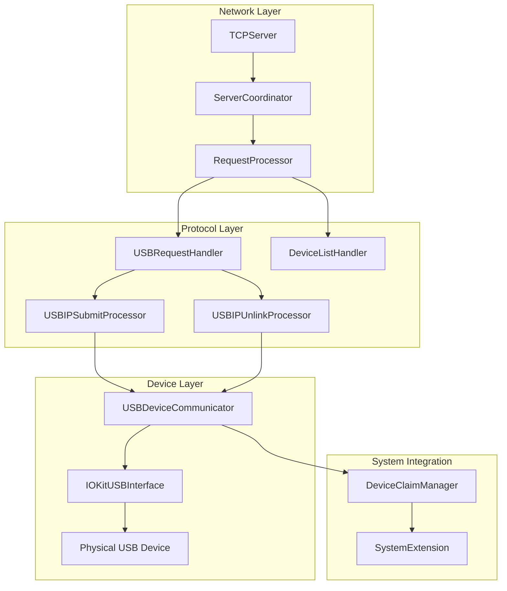

# Design Document: USB Request/Response Protocol Implementation

## Overview

The USB Request/Response Protocol Implementation extends the current usbipd-mac architecture from device enumeration to full USB I/O forwarding. The design builds upon the existing modular architecture, adding USB request processing capabilities to the protocol layer, IOKit-based device communication to the device layer, and enhanced message handling for the complete USB/IP protocol specification.

The implementation transforms the current `RequestProcessor` from handling only device list and import requests to processing `USBIP_CMD_SUBMIT` and `USBIP_CMD_UNLINK` operations. It integrates with the existing `DeviceDiscovery` and `DeviceClaimManager` systems while adding new USB communication interfaces for actual device I/O operations.

This design maintains compatibility with the existing CLI, configuration, and System Extension architecture while adding the core functionality needed to enable real USB device sharing over the network.

## Steering Document Alignment

### Technical Standards (tech.md)

The design follows established Swift and macOS development patterns:

- **Swift Language Features**: Leverages Swift's Result types, async/await concurrency, and protocol-oriented design
- **IOKit Integration**: Extends existing IOKit device discovery patterns to include USB interface communication
- **Error Handling**: Builds on existing error handling patterns with USB-specific error types and IOKit error mapping
- **Modular Architecture**: Maintains clear separation between protocol processing, device communication, and system integration layers
- **Performance Optimization**: Uses Swift's efficient memory management and IOKit's asynchronous operation patterns

### Project Structure (structure.md)

The implementation follows established directory organization:

- **Sources/USBIPDCore/Protocol/**: Enhanced with USB request processors and new protocol message types
- **Sources/USBIPDCore/Device/**: Extended with IOKit USB interface communication classes
- **Sources/Common/**: Addition of USB-specific error types and transfer utilities
- **Tests/**: Comprehensive test coverage following existing patterns with mock IOKit interfaces and protocol message fixtures

## Code Reuse Analysis

### Existing Components to Leverage

- **RequestProcessor**: Extended to handle SUBMIT/UNLINK requests in addition to current LIST/IMPORT operations
- **USBIPProtocol/USBIPMessages**: Enhanced with new message types while maintaining existing protocol implementation
- **EndiannessConverter/StringEncodingUtilities**: Reused for new binary message encoding/decoding
- **DeviceDiscovery/IOKitDeviceDiscovery**: Extended to provide USB interface access alongside current device enumeration
- **DeviceClaimManager/SystemExtensionManager**: Integrated for device access validation during USB operations
- **TCPServer/ServerCoordinator**: Enhanced to handle higher message volume and concurrent USB request processing

### Integration Points

- **Protocol Layer**: New USB request handlers integrate with existing message routing and client connection management
- **Device Layer**: USB communication interfaces extend current IOKit device discovery with actual device I/O capabilities  
- **System Extension**: Device claiming verification extended to validate USB operation permissions
- **Configuration Management**: Enhanced ServerConfig with USB operation timeout and buffer size settings
- **Logging System**: Extended with USB-specific debug information and performance metrics

## Architecture

### Enhanced Modular Design Principles

The design maintains the existing layered architecture while adding USB I/O processing capabilities:



### Key Architectural Changes

1. **RequestProcessor Enhancement**: Extended with USB request routing and concurrent processing capabilities
2. **USB Communication Layer**: New layer between protocol processing and IOKit for USB transfer management
3. **Message Type Expansion**: Enhanced protocol message system with SUBMIT/UNLINK operations
4. **Concurrent Processing Model**: Async/await-based processing for handling multiple concurrent USB operations
5. **Error Mapping Layer**: Translation between IOKit errors, USB errors, and USB/IP protocol status codes

## Components and Interfaces

### Component 1: USBRequestHandler

- **Purpose:** Route and coordinate USB/IP SUBMIT and UNLINK requests within the enhanced RequestProcessor
- **Interfaces:** 
  ```swift
  protocol USBRequestHandler {
      func handleSubmitRequest(_ data: Data) async throws -> Data
      func handleUnlinkRequest(_ data: Data) async throws -> Data
      func validateDeviceAccess(_ busID: String) throws -> Bool
  }
  ```
- **Dependencies:** DeviceClaimManager, USBDeviceCommunicator, logging system
- **Reuses:** Existing RequestProcessor error handling patterns, logging infrastructure, device validation logic

### Component 2: USBIPSubmitProcessor

- **Purpose:** Process USBIP_CMD_SUBMIT messages, execute USB transfers, and generate USBIP_RET_SUBMIT responses
- **Interfaces:**
  ```swift
  protocol USBSubmitProcessor {
      func processSubmitRequest(_ request: USBIPSubmitRequest) async throws -> USBIPSubmitResponse
      func executeUSBTransfer(_ urb: USBRequestBlock, device: USBDevice) async throws -> USBTransferResult
  }
  ```
- **Dependencies:** IOKitUSBInterface, EndiannessConverter for message encoding/decoding
- **Reuses:** Existing USBIPMessageCodable protocols, binary encoding utilities, error handling patterns

### Component 3: USBIPUnlinkProcessor

- **Purpose:** Process USBIP_CMD_UNLINK messages to cancel pending USB operations and generate responses
- **Interfaces:**
  ```swift
  protocol USBUnlinkProcessor {
      func processUnlinkRequest(_ request: USBIPUnlinkRequest) async throws -> USBIPUnlinkResponse
      func cancelPendingURB(_ seqnum: UInt32) async throws -> Bool
  }
  ```
- **Dependencies:** URB tracking system, USBDeviceCommunicator for operation cancellation
- **Reuses:** Existing protocol message patterns, async operation management from ServerCoordinator

### Component 4: USBDeviceCommunicator

- **Purpose:** Manage USB device communication through IOKit interfaces, handling different transfer types and device state
- **Interfaces:**
  ```swift
  protocol USBDeviceCommunicator {
      func openUSBInterface(for device: USBDevice) throws -> IOKitUSBInterface
      func performControlTransfer(_ transfer: USBControlTransfer) async throws -> USBTransferResult
      func performBulkTransfer(_ transfer: USBBulkTransfer) async throws -> USBTransferResult
      func performInterruptTransfer(_ transfer: USBInterruptTransfer) async throws -> USBTransferResult
      func performIsochronousTransfer(_ transfer: USBIsochronousTransfer) async throws -> USBTransferResult
      func closeUSBInterface(_ interface: IOKitUSBInterface)
  }
  ```
- **Dependencies:** IOKit framework, device claiming validation
- **Reuses:** Existing IOKitDeviceDiscovery patterns, USB device enumeration, System Extension integration

### Component 5: IOKitUSBInterface

- **Purpose:** Low-level IOKit USB interface wrapper for executing USB operations on physical devices
- **Interfaces:**
  ```swift
  protocol IOKitUSBInterface {
      func controlRequest(bmRequestType: UInt8, bRequest: UInt8, wValue: UInt16, wIndex: UInt16, data: Data?) async throws -> Data
      func bulkWrite(endpoint: UInt8, data: Data, timeout: UInt32) async throws -> Int
      func bulkRead(endpoint: UInt8, length: Int, timeout: UInt32) async throws -> Data
      func interruptWrite(endpoint: UInt8, data: Data) async throws -> Int
      func interruptRead(endpoint: UInt8, length: Int) async throws -> Data
  }
  ```
- **Dependencies:** IOKit USB family APIs, device claiming through System Extension
- **Reuses:** Existing IOKit error handling, device state management, logging patterns

## Data Models

### USBRequestBlock (URB)

```swift
struct USBRequestBlock {
    let seqnum: UInt32                    // Unique request identifier
    let endpoint: UInt8                   // USB endpoint address
    let transferType: USBTransferType     // Control, bulk, interrupt, isochronous
    let transferFlags: UInt32             // USB transfer flags
    let bufferLength: UInt32              // Expected transfer length
    let setupPacket: Data?                // Control transfer setup packet
    let transferBuffer: Data?             // Data to send (OUT transfers)
    let timeout: UInt32                   // Operation timeout in milliseconds
}
```

### USBTransferResult

```swift
struct USBTransferResult {
    let status: Int32                     // USB completion status
    let actualLength: UInt32              // Actual bytes transferred
    let errorCount: UInt32                // Error count for isochronous transfers
    let data: Data?                       // Received data (IN transfers)
    let completionTime: TimeInterval      // Transfer completion timestamp
}
```

### Enhanced USB/IP Protocol Messages

```swift
// USBIP_CMD_SUBMIT request message
struct USBIPSubmitRequest: USBIPMessageCodable {
    let header: USBIPHeader
    let seqnum: UInt32
    let devid: UInt32
    let direction: UInt32
    let ep: UInt32
    let transferFlags: UInt32
    let transferBufferLength: UInt32
    let startFrame: UInt32
    let numberOfPackets: UInt32
    let interval: UInt32
    let setup: Data                       // 8 bytes setup packet
    let transferBuffer: Data?             // Variable length data
}

// USBIP_RET_SUBMIT response message
struct USBIPSubmitResponse: USBIPMessageCodable {
    let header: USBIPHeader
    let seqnum: UInt32
    let devid: UInt32
    let direction: UInt32
    let ep: UInt32
    let status: Int32
    let actualLength: UInt32
    let startFrame: UInt32
    let numberOfPackets: UInt32
    let errorCount: UInt32
    let transferBuffer: Data?             // Variable length response data
}
```

## Error Handling

### Error Scenarios

1. **USB Device Communication Errors**
   - **Handling:** Map IOKit error codes to USB status codes (USBD_STATUS_STALL_PID, USBD_STATUS_TIMEOUT, etc.)
   - **User Impact:** Client receives appropriate USB error status in USBIP_RET_SUBMIT response

2. **Device Claiming Validation Failures**
   - **Handling:** Check device claim status before allowing USB operations, return device access error
   - **User Impact:** Clear error message indicating device is not properly claimed for sharing

3. **Protocol Message Parsing Errors**
   - **Handling:** Validate message format and content, close client connection on critical errors
   - **User Impact:** Client connection terminates with appropriate error logging for debugging

4. **USB Transfer Timeout/Cancellation**
   - **Handling:** Implement proper URB cancellation through USBIP_CMD_UNLINK processing
   - **User Impact:** Timely response to client with cancellation status and resource cleanup

5. **IOKit Interface Access Failures**
   - **Handling:** Graceful handling of device disconnection, interface conflicts, or permission issues
   - **User Impact:** Appropriate error responses with diagnostic information for troubleshooting

### Error Code Mapping

```swift
enum USBErrorMapping {
    static func mapIOKitError(_ ioKitError: IOReturn) -> Int32 {
        switch ioKitError {
        case kIOReturnTimeout: return USBD_STATUS_TIMEOUT
        case kIOReturnAborted: return USBD_STATUS_CANCELLED
        case kIOUSBPipeStalled: return USBD_STATUS_STALL_PID
        case kIOReturnNoDevice: return USBD_STATUS_DEVICE_GONE
        default: return USBD_STATUS_REQUEST_FAILED
        }
    }
}
```

## Testing Strategy

### Unit Testing

- **USBRequestHandler Testing:** Mock device communicators and protocol message validation
- **Protocol Message Testing:** Comprehensive encoding/decoding tests for new SUBMIT/UNLINK message types  
- **Error Mapping Testing:** Validation of IOKit to USB error code translation accuracy
- **Transfer Type Testing:** Individual test suites for control, bulk, interrupt, and isochronous transfer handling
- **URB Lifecycle Testing:** Request tracking, completion, and cancellation scenarios

### Integration Testing

- **End-to-End USB Operations:** Test complete USB request flow from protocol message to IOKit execution
- **Device Claiming Integration:** Validate USB operations respect device claiming status through System Extension
- **Concurrent Request Processing:** Test multiple simultaneous USB operations without interference
- **Error Recovery Integration:** Test system behavior under various failure conditions (device disconnect, timeout, etc.)
- **Performance Integration:** Validate latency and throughput requirements under realistic load conditions

### End-to-End Testing

- **USB Device Type Scenarios:** Test with different USB device classes (HID, mass storage, communication devices)
- **Client Compatibility Testing:** Validate compatibility with Linux vhci-hcd.ko driver and other USB/IP clients  
- **Protocol Compliance Testing:** Comprehensive validation against USB/IP protocol specification requirements
- **System Resource Testing:** Long-running tests to validate memory usage, connection handling, and resource cleanup
- **Production Scenario Testing:** Test realistic development workflows (Docker container USB access, VM integration)

### Mock Testing Infrastructure

```swift
// Mock IOKit interface for testing USB operations
class MockIOKitUSBInterface: IOKitUSBInterface {
    var controlRequests: [(bmRequestType: UInt8, bRequest: UInt8, wValue: UInt16, wIndex: UInt16, data: Data?)] = []
    var mockControlResponse: Data = Data()
    var mockError: IOReturn = kIOReturnSuccess
    
    func controlRequest(bmRequestType: UInt8, bRequest: UInt8, wValue: UInt16, wIndex: UInt16, data: Data?) async throws -> Data {
        controlRequests.append((bmRequestType, bRequest, wValue, wIndex, data))
        if mockError != kIOReturnSuccess {
            throw IOError.ioKitError(mockError)
        }
        return mockControlResponse
    }
}
```

## Performance Considerations

### Concurrent Processing Design

- **Async/Await Architecture:** All USB operations use Swift's async/await for non-blocking concurrent processing
- **Request Queuing:** Implement per-device request queues to prevent endpoint conflicts while maximizing throughput
- **Buffer Management:** Efficient buffer allocation and reuse for USB transfer data to minimize memory allocation overhead
- **Connection Multiplexing:** Enhanced TCPServer to handle increased message volume from concurrent USB operations

### Memory Optimization

- **Buffer Pooling:** Reuse transfer buffers for common USB operation sizes to reduce allocation overhead
- **Streaming Support:** Handle large bulk transfers without loading entire payloads into memory simultaneously
- **Resource Cleanup:** Prompt cleanup of completed URBs and associated resources to prevent memory leaks
- **IOKit Resource Management:** Proper management of IOKit interface references and USB device handles

### Latency Minimization  

- **Fast Path Processing:** Optimize common USB operation types (control transfers, small bulk operations) for minimal processing overhead
- **Protocol Overhead Reduction:** Efficient binary message encoding/decoding with minimal data copying
- **System Call Optimization:** Batch IOKit operations where possible to reduce system call overhead
- **Network Optimization:** TCP socket configuration for low-latency USB operation transmission

## Security Considerations

### Input Validation

- **Protocol Message Validation:** Comprehensive validation of all USB/IP message fields to prevent buffer overflows and protocol attacks
- **USB Parameter Validation:** Validate USB request parameters (endpoint addresses, transfer lengths, timeout values) against device capabilities
- **Buffer Size Limits:** Enforce maximum buffer sizes for USB transfers to prevent memory exhaustion attacks
- **Setup Packet Validation:** Validate USB control transfer setup packets for standard compliance and security

### Device Access Control

- **Claim Status Enforcement:** All USB operations must validate device claim status through System Extension before execution
- **Endpoint Access Validation:** Verify requested USB endpoints are available and accessible on claimed devices
- **Transfer Type Validation:** Ensure requested transfer types are supported by target endpoints
- **Client Authentication:** Maintain existing client connection validation while adding USB operation-specific authorization

### Resource Protection

- **URB Tracking Limits:** Limit number of concurrent pending URBs per client to prevent resource exhaustion
- **Timeout Enforcement:** Enforce reasonable timeout limits on USB operations to prevent indefinite resource consumption
- **Error Information Filtering:** Ensure error messages don't leak sensitive system information or memory contents
- **System Extension Integration:** Leverage System Extension security model for privileged USB device access

## Implementation Phases

### Phase 1: Core Infrastructure
- Extend RequestProcessor with USB request routing capabilities
- Implement basic USBRequestBlock and USBTransferResult data structures
- Add USB-specific error types and IOKit error mapping utilities

### Phase 2: Protocol Message Support
- Implement USBIPSubmitRequest/Response and USBIPUnlinkRequest/Response message types
- Extend protocol message encoding/decoding with new message formats
- Add protocol message validation and error handling for new message types

### Phase 3: IOKit USB Interface Implementation
- Develop IOKitUSBInterface wrapper for USB device communication
- Implement control, bulk, interrupt, and isochronous transfer support
- Add USB transfer timeout and cancellation capabilities

### Phase 4: Integration and Testing
- Integrate USB request processing with existing server architecture
- Implement comprehensive test coverage for all USB operation types
- Add performance optimization and concurrent processing capabilities

This design provides a comprehensive foundation for transforming usbipd-mac from device enumeration to full USB device functionality while maintaining compatibility with existing architecture and following established project patterns.