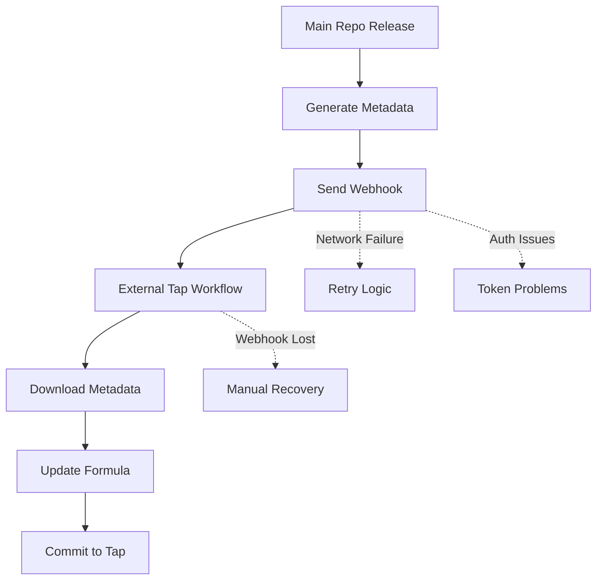
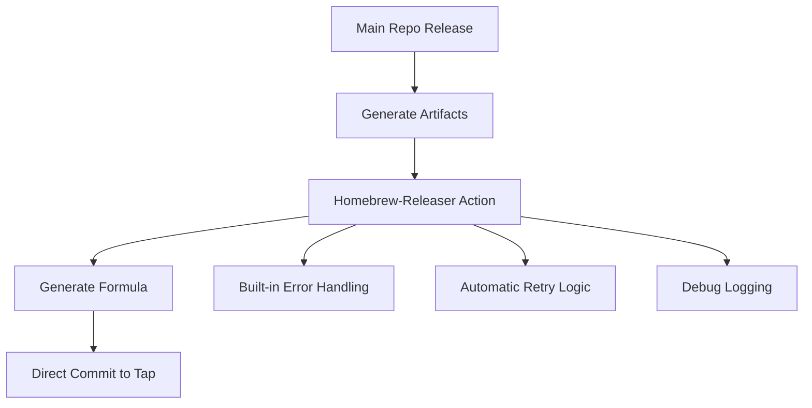

# Design Document

## Overview

This design implements the migration from webhook-based Homebrew formula updates to using the Justintime50/homebrew-releaser GitHub Action. The solution replaces the complex cross-repository webhook communication with a direct, single-workflow approach that eliminates reliability issues while maintaining full compatibility with the existing external tap repository structure.

The homebrew-releaser action will execute within the main repository's release workflow and directly commit formula updates to the `beriberikix/homebrew-usbipd-mac` tap repository, removing the need for webhook infrastructure while preserving the existing user experience.

## Steering Document Alignment

### Technical Standards (tech.md)
The design follows established technical patterns by:
- Maintaining Swift Package Manager build system compatibility
- Preserving existing GitHub Actions workflow architecture
- Following security best practices with proper secret management
- Continuing support for macOS 11+ deployment targets

### Project Structure (structure.md)
The implementation aligns with project organization by:
- Keeping release automation within `Scripts/` directory for consistency
- Following established GitHub Actions workflow patterns in `.github/workflows/`
- Maintaining modular approach with clear separation of concerns
- Preserving existing documentation structure for troubleshooting guides

## Code Reuse Analysis

### Existing Components to Leverage
- **Release Workflow**: Extend the existing `.github/workflows/release.yml` without disrupting current functionality
- **GitHub Actions Infrastructure**: Reuse established CI/CD patterns and secret management
- **Artifact Generation**: Continue using existing build artifacts and checksum generation
- **Version Management**: Leverage existing semantic versioning and tag-based release triggers

### Integration Points
- **GitHub Actions Release Workflow**: Integrate homebrew-releaser as a new step in the existing release job
- **Secret Management**: Utilize GitHub Secrets infrastructure for HOMEBREW_TAP_TOKEN
- **External Tap Repository**: Maintain compatibility with existing `beriberikix/homebrew-usbipd-mac` structure
- **User Installation Flow**: Preserve existing `brew tap` and `brew install` command patterns

## Architecture

The architecture shifts from a distributed webhook-based approach to a centralized direct-commit approach, eliminating cross-repository communication complexity while maintaining all existing functionality.

### Current Architecture (To Be Replaced)


### New Architecture (Homebrew-Releaser)


### Modular Design Principles
- **Single File Responsibility**: Homebrew-releaser configuration isolated to release workflow
- **Component Isolation**: Formula update logic encapsulated within the action
- **Service Layer Separation**: Clear boundary between main release and tap update processes
- **Utility Modularity**: Reusable configuration patterns for future tap integrations

## Components and Interfaces

### Homebrew-Releaser Action Step
- **Purpose:** Direct integration with external tap repository for formula updates
- **Interfaces:** 
  - Input: Release artifacts, version tags, repository configuration
  - Output: Updated formula in tap repository, commit confirmations
- **Dependencies:** GitHub token, release artifacts, semantic version tags
- **Reuses:** Existing release workflow infrastructure, GitHub Actions environment

### Configuration Component
- **Purpose:** Centralized configuration for homebrew-releaser parameters
- **Interfaces:** YAML configuration within release workflow
- **Dependencies:** GitHub Secrets (HOMEBREW_TAP_TOKEN)
- **Reuses:** Existing secret management patterns, workflow configuration structure

### Cleanup Component
- **Purpose:** Remove deprecated webhook infrastructure
- **Interfaces:** Workflow file removal, secret cleanup documentation
- **Dependencies:** Repository administration access
- **Reuses:** Existing documentation patterns for migration guides

## Data Models

### Homebrew-Releaser Configuration
```yaml
# Configuration structure for the homebrew-releaser action
homebrew_owner: "beriberikix"                    # Tap repository owner
homebrew_tap: "homebrew-usbipd-mac"             # Tap repository name
github_token: "${{ secrets.HOMEBREW_TAP_TOKEN }}" # Authentication token
install: 'bin.install "usbipd" => "usbipd"'     # Installation command
test: 'system "#{bin}/usbipd", "--version"'     # Test command
commit_owner: "github-actions[bot]"              # Commit author name
commit_email: "github-actions[bot]@users.noreply.github.com" # Commit email
formula_folder: "Formula"                        # Target folder in tap
skip_commit: false                               # Enable actual commits
debug: false                                     # Debug logging level
```

### Secret Configuration
```yaml
# Required secret for tap repository access
HOMEBREW_TAP_TOKEN:
  description: "Personal Access Token with repo permissions for homebrew-usbipd-mac"
  scope: "repo"
  target_repository: "beriberikix/homebrew-usbipd-mac"
  required_permissions: ["contents:write", "metadata:read"]
```

### Formula Output Structure
```ruby
# Generated formula structure (maintained compatibility)
class UsbiprdMac < Formula
  desc "macOS USB/IP protocol implementation"
  homepage "https://github.com/beriberikix/usbipd-mac"
  version "vX.X.X"                               # Auto-populated from release
  url "https://github.com/beriberikix/usbipd-mac/archive/vX.X.X.tar.gz"
  sha256 "auto-generated-checksum"               # Auto-calculated by action
  
  def install
    bin.install "usbipd" => "usbipd"           # From install parameter
  end
  
  test do
    system "#{bin}/usbipd", "--version"        # From test parameter
  end
end
```

## Error Handling

### Error Scenarios

1. **Authentication Failure**
   - **Handling:** Homebrew-releaser validates token before proceeding
   - **User Impact:** Clear error message about HOMEBREW_TAP_TOKEN configuration
   - **Recovery:** Update token with proper repo permissions

2. **Tap Repository Access Issues**
   - **Handling:** Built-in retry logic within homebrew-releaser action
   - **User Impact:** Detailed logging about repository access problems
   - **Recovery:** Verify repository exists and token has write access

3. **Formula Generation Errors**
   - **Handling:** Action validates artifacts and version information
   - **User Impact:** Specific error messages about missing or invalid artifacts
   - **Recovery:** Ensure release artifacts are properly generated

4. **Network/GitHub API Failures**
   - **Handling:** Automatic retry with exponential backoff (built into action)
   - **User Impact:** Temporary delays in formula updates
   - **Recovery:** Action automatically retries failed operations

5. **Version Conflicts or Invalid Formats**
   - **Handling:** Semantic version validation within action
   - **User Impact:** Clear error about version format requirements
   - **Recovery:** Use proper semantic versioning for releases

## Testing Strategy

### Unit Testing
- **Dry-run Validation**: Use `skip_commit: true` to test formula generation without committing
- **Configuration Testing**: Validate homebrew-releaser parameters in test environment
- **Token Validation**: Test authentication without affecting production tap repository

### Integration Testing
- **End-to-End Flow**: Test complete release workflow with homebrew-releaser integration
- **Tap Repository Validation**: Verify formula updates appear correctly in external repository
- **User Installation Testing**: Confirm `brew tap` and `brew install` commands work after updates

### Migration Testing
- **Parallel Validation**: Compare webhook-generated formulas with homebrew-releaser output
- **Rollback Testing**: Verify ability to revert to webhook approach if needed
- **User Experience Testing**: Ensure no user-visible changes during migration

### Production Validation
- **Release Candidate Testing**: Use beta releases to validate homebrew-releaser in production
- **Performance Monitoring**: Track formula update times and success rates
- **User Feedback Collection**: Monitor for installation issues post-migration

## Implementation Phases

### Phase 1: Preparation and Configuration
- Configure HOMEBREW_TAP_TOKEN secret in main repository
- Add homebrew-releaser action to release workflow with `skip_commit: true`
- Validate formula generation without committing changes

### Phase 2: Parallel Operation
- Enable homebrew-releaser with actual commits to tap repository
- Maintain webhook system as backup during validation period
- Monitor both systems for consistency and reliability

### Phase 3: Migration Completion
- Disable webhook system after confirming homebrew-releaser reliability
- Remove webhook-related code and configuration
- Update documentation to reflect new architecture

### Phase 4: Cleanup and Optimization
- Remove external tap repository's formula-update.yml workflow
- Clean up unused webhook secrets and configuration
- Optimize homebrew-releaser configuration based on production experience